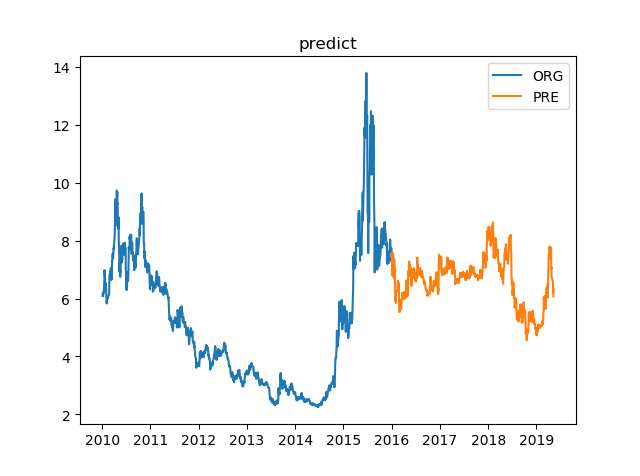

## 第七章 自回归

### 案例

给出一股票自2020年1月4日至2019年5月10日每天的开盘价、收盘价、最高价、最低价，利用其他指标预测收盘价。

### 步骤

#### 获取数据

```python
import pandas as pd
import numpy as np
import matplotlib
import matplotlib.pyplot as plt

data = pd.read_csv('unit7.csv', index_col='Date')
data.index = pd.to_datetime(data.index)
ts = data['Close']
from statsmodels.tsa.arima_model import ARMA, ARIMA
from pandas.plotting import register_matplotlib_converters
register_matplotlib_converters()
```

```python
print(ts.describe())
```

运行结果:


#### 确定阶数

```python
from statsmodels.tsa.arima_model import ARMA
from itertools import product
ps = range(0, 6)
qs = range(0, 6)
parameters = product(ps, qs)
parameters_list = list(parameters)

best_aic = float('inf')
results = []
for param in parameters_list:
    try:
        model = ARMA(ts, order=(param[0], param[1])).fit()
    except ValueError:
        print("参数错误：", param)
        continue
    aic = model.aic
    if aic < best_aic:
        best_model = model
        best_aic = model.aic
        best_param = param
    results.append([param, model.aic])
results_table = pd.DataFrame(results)
results_table.columns = ['parameters', 'aic']
print("最优模型", best_model.summary())
```

运行结果:


#### 运行及预测

```python
from pandas.plotting import register_matplotlib_converters
register_matplotlib_converters()

plt.plot(ts['2010':'2015'],label = 'ORG')
arma = ARMA(ts, order=(3, 5)).fit(disp = -1)
ts_predict_arma = arma.predict()
plt.plot(ts_predict_arma['2016':'2019'],label = 'PRE')
plt.title("ARMA(3,5)")
plt.legend()
plt.show()
```

