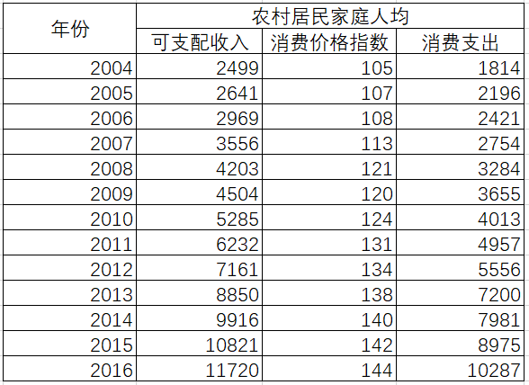
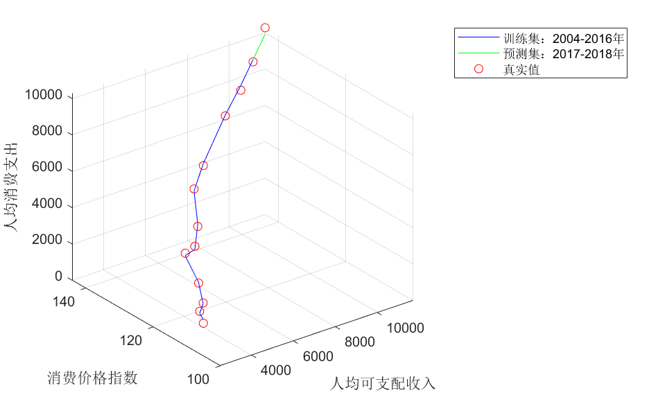

# 三. 多元线性回归

## 1. 选取数据

安徽省2004-2016年农村居民人均可支配收入（元/人，自变量，用 $x_1$ 表示）

人均消费支出（元/人，响应变量，用 $y$ 示）

消费价格指数（以2003基准为100，自变量，用 $x_2$ 表示)



```matlab
data=xlsread('data.xlsx');
```

## 2. ols估计

```matlab
[n,m]=size(data);
Y=data(:,end);
X=data(:,1:(end-1));
X=[ones(n,1),X];
beta=inv(X'*X)*(X'*Y);
```

beta为计算出的系数的最小二乘估计，包括常数项

## 3. 假设检验

对方程整体进行显著性检验（F检验）,同时计算可决系数。p为存放方程整体检验和每个自变量显著性检验的检验p值的向量,F为方程整体显著性检验的检验统计量,R为回归方程的可决系数，表示方程的拟合情况，一般对于时间序列数据来说，大于0.9即可

```matlab
p=zeros(m,1);
tss=(Y-mean(Y))'*(Y-mean(Y));
rss=Y'*Y-beta'*X'*Y;
R=(tss-rss)/tss;
F=((tss-rss)/(m-1))/(rss/(n-m));
p(1)=1-fcdf(F,m-1,n-m);
```

每个自变量的显著性检验（t检验)，t为存放方程每个自变量t检验统计量的向量

```matlab
C=diag(inv(X'*X));
sigma=sqrt(rss/(n-m));
t=zeros(m-1,1);
for i=1:(m-1)
    t(i)=beta(i+1)/(sqrt(C(i+1))*sigma);
    p(i+1)=2*(1-tcdf(abs(t(i)),n-m));
end
```

如果方程整体和每个自变量均通过显著性检验（p值小于给定的显著性水平），估计的经验回归方程如下：
$$
y=3370+1.0164x_1-37.1176x_2\quad R^2=0.9962\\
\qquad\qquad\quad(15.66*)\quad(-2.48*)\quad F=1307.59
$$
回归系数下方括号内为该系数对应的t检验统计量，表示在给定的显著性水平下（一般是0.05）显著

## 4. 预测

已知安徽省2017-2018年农村居民的人均可支配收入和消费价格指数，预测其人均消费支出，同时与真实的人均消费支出比较

```matlab
X1=[10821,142;11720,144];Y1=[8975;10287];
plot3(X(:,2),X(:,3),X*beta,'b');hold on;
plot3(X1(:,1),X1(:,2),[ones(2,1),X1]*beta,'g');hold on;
plot3([X(:,2);X1(:,1)],[X(:,3);X1(:,2)],[Y;Y1],'ro');grid on
legend('训练集：2004-2016年','预测集：2017-2018年','真实值');
ylabel('消费价格指数');
xlabel('人均可支配收入');
zlabel('人均消费支出');
```

