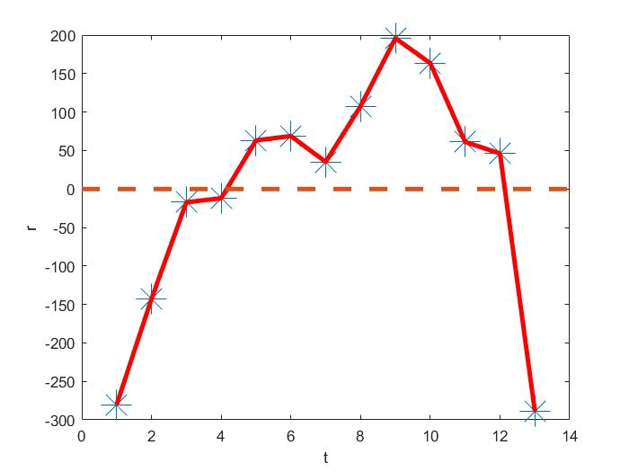

# 六. 自相关（Matlab）

## 1. 读取数据

 

```matlab
x=[3624.1; 4517.8; 8989.1; 11954.5; 14922.3; 16918; 18598; 21662.5; 26652; 34561; 46670; 57494.9; 67560]; 
y=[206.4; 381.4; 696; 826.5; 1027.1; 1117; 1154.4; 1356.3; 1655.3; 1957; 2366.2; 2808.6; 2899];
```

## 2. 自相关性判断

### 2.1 图解法

按时间顺序会制残差图

- 若多个点连续在 t 轴上方，或多个点连续位于 t 轴下方，则模型可能存在正相关；
- 若相邻的散点总是倾向于分布在 t 轴的上下两侧，则模型可能存在负相关。 

```matlab
stats=regstats(y,x,'linear',{'r'}); 
plot(stats.r,'*','markersize',20); 
hold on; 
line([1:length(stats.r)]',stats.r,'color','r','linewidth',3); 
plot([0,14],[0,0],'--','linewidth',3); 
xlabel('t');
ylabel('r');
```



### 2.1 DW检验

```matlab
dw= (norm(diff(stats.r))).^2/(norm(stats.r)).^2;
```

求解可得dw = 0.64811814206819 可知模型存在一阶正相关自相关的处理：

## 3. 自相关的处理

杜宾两步法

```matlab
b=regress(y,[ones(13,1) lagmatrix(y,1) x lagmatrix(x,1)]); 
stats3=regstats(y-b(2)*lagmatrix(y,1),x-b(2)*lagmatrix(x,1),'linear',{'tstat','beta','r'}); stats3.tstat.se;
stats3.tstat.pval; 
stats3.tstat.beta; 
rr=stats3.r(2:13,:); 
dw=(norm(diff(rr)))^2/(norm(rr))^2;
```

查表得dw= 1.331，因此不存在自相关。 

由135.6720/(1-b(2))＝2440.4 得，处理自相关的模型为： y=2440.4+0.0245x