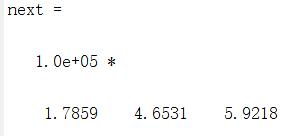
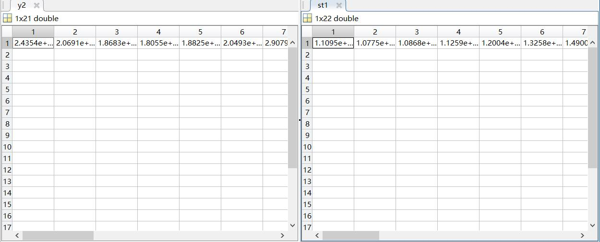
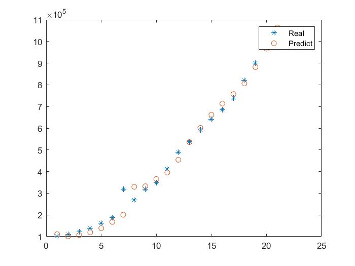

# 十. 时间序列（Matlab）

## 1. 读取数据

全国GDP值2000-2020年数据如下：

| 年份 | GDP（亿元） | 年份 | GDP（亿元） |
| ---- | ----------- | ---- | ----------- |
| 2000 | 100280      | 2011 | 487940      |
| 2001 | 110863      | 2012 | 538580      |
| 2002 | 121717      | 2013 | 592963      |
| 2003 | 137422      | 2014 | 641280      |
| 2004 | 161840      | 2015 | 685992      |
| 2005 | 187318      | 2016 | 740065      |
| 2006 | 319438      | 2017 | 820754      |
| 2007 | 270092      | 2018 | 900309      |
| 2008 | 319144      | 2019 | 990865      |
| 2009 | 348517      | 2020 | 1015986     |
| 2010 | 412119      |      |             |

```matlab
y=[100280 110863 121717 137422 161840 187318 319438 270092 319144 348517 412119 487940 538580 592963 641280 685992 740065 820754 900309 990865 1015986];
data=y;
```

##  2. 指数平滑预测

### 2.1 一次指数平滑

对本时刻观察值和本时刻预测值赋予不同的权重，求得下一时刻预测值。对数据进行归一化处理，其他按比例运算，在第一次指数平滑中，选取a=0.01、0.2和0.3，长度lenA=21，得到结果：

```matlab
lenD=length(data);
a=[0.01 0.2 0.3 ]; 
lenA=length(a);
y1(1,1:lenA)=(data(1)+data(2))/2;
for i=2:lenD
y1(i,:)=a*data(i-1)+(1-a).*y1(i-1);
end
y1
next=a*data(lenD)+(1-a).*y1(lenD,:)
```




### 2.2 二次指数平滑

先得到归一化数据st1，根据二次指数平滑方法公式进行运算得到预测结果，与原始数据st1对比可见我国的GDP整体呈现上升趋势

```matlab
clc,clear
y=[100280 110863 121717 137422 161840 187318 319438 270092 319144 348517 412119 487940 538580 592963 641280 685992 740065 820754 900309 990865 1015986];
data=y;
lenD=length(data);
a=0.3;
st1(1)=data(1);
st2(2)=data(1);
 
for i=2:lenD
st1(i)=a*data(i)+(1-a).*st1(i-1);
st2(i)=a*st1(i)+(1-a).*st2(i-1);
end
b1=2*st1-st2
b2=a/(1-a)*(st1-st2)
y2=b1+b2
```



### 2.3 三次指数平滑

给定平滑系数，利用三次指数平滑的计算公式预测未来T期的值。最后引入均方差概念来判断平滑系数是否准确

```matlab
yt=[100280 110863 121717 137422 161840 187318 319438 270092 319144 348517 412119 487940 538580 592963 641280 685992 740065 820754 900309 990865 1015986];
n=length(yt); 
alpha=0.3; st1_0=mean(yt(1:3)); st2_0=st1_0;st3_0=st1_0; 
st1(1)=alpha*yt(1)+(1-alpha)*st1_0; 
st2(1)=alpha*st1(1)+(1-alpha)*st2_0; 
st3(1)=alpha*st2(1)+(1-alpha)*st3_0; 
for i=2:n 
 st1(i)=alpha*yt(i)+(1-alpha)*st1(i-1); 
 st2(i)=alpha*st1(i)+(1-alpha)*st2(i-1); 
 st3(i)=alpha*st2(i)+(1-alpha)*st3(i-1); 
end 
xlswrite('touzi.xls',[st1',st2',st3']) 
st1=[st1_0,st1];st2=[st2_0,st2];st3=[st3_0,st3]; 
a=3*st1-3*st2+st3; 
b=0.5*alpha/(1-alpha)^2*((6-5*alpha)*st1-2*(5-4*alpha)*st2+(4-3*alpha)*st3); 
c=0.5*alpha^2/(1-alpha)^2*(st1-2*st2+st3); 
yh=a+b+c; 
xlswrite('touzi.xls',yh','Sheet1','D1') 
plot(1:n,yt,'*',1:n,yh(1:n),'O') 
legend('Real','Predict') 
coe=[c(n+1),b(n+1),a(n+1)]; 
yh1=polyval(coe,2)
yh2=polyval(coe,3)
yh3=polyval(coe,4)
yh4=polyval(coe,5)
yh5=polyval(coe,6)
```


 由三次指数平滑运算我们可以得到预测结果，可见2021年GDP达到最高值，然后在2022年出现下降趋势，再在往后的四年持续稳定增加

| 年份 | 2021      | 2022       | 2023       | 2024       | 2025       |
| ---- | --------- | ---------- | ---------- | ---------- | ---------- |
| GDP  | 1.828e+06 | 1.2615e+06 | 1.3426e+06 | 1.4261e+06 | 1.5120e+06 |