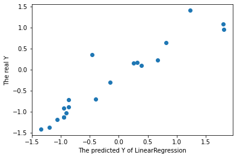

# 四. 多重线性回归（Python）


```python
import pandas as pd
import numpy as np
import matplotlib.pyplot as plt
from sklearn.decomposition import PCA
from sklearn.model_selection import train_test_split
```

## 1. 读取数据


```python
data = pd.read_csv('./data.csv', encoding =  'UTF-8')
data
```

<table border="1" class="dataframe">
  <thead>
    <tr style="text-align: right;">
      <th></th>
      <th>x1</th>
      <th>x2</th>
      <th>x3</th>
      <th>x4</th>
      <th>x5</th>
      <th>y</th>
    </tr>
  </thead>
  <tbody>
    <tr>
      <th>0</th>
      <td>213432.8</td>
      <td>7240</td>
      <td>4.75</td>
      <td>633.6</td>
      <td>123.700000</td>
      <td>622.33</td>
    </tr>
    <tr>
      <th>1</th>
      <td>253598.6</td>
      <td>8755</td>
      <td>4.75</td>
      <td>712.6</td>
      <td>121.400000</td>
      <td>747.83</td>
    </tr>
    <tr>
      <th>2</th>
      <td>229495.5</td>
      <td>8265</td>
      <td>4.75</td>
      <td>654.1</td>
      <td>118.933333</td>
      <td>646.92</td>
    </tr>
    <tr>
      <th>3</th>
      <td>219295.4</td>
      <td>7780</td>
      <td>4.75</td>
      <td>717.0</td>
      <td>121.333333</td>
      <td>675.68</td>
    </tr>
    <tr>
      <th>4</th>
      <td>197920.0</td>
      <td>7725</td>
      <td>4.75</td>
      <td>713.1</td>
      <td>122.866667</td>
      <td>745.90</td>
    </tr>
    <tr>
      <th>...</th>
      <td>...</td>
      <td>...</td>
      <td>...</td>
      <td>...</td>
      <td>...</td>
      <td>...</td>
    </tr>
    <tr>
      <th>60</th>
      <td>34544.6</td>
      <td>3210</td>
      <td>5.49</td>
      <td>133.3</td>
      <td>95.333333</td>
      <td>131.10</td>
    </tr>
    <tr>
      <th>61</th>
      <td>39767.4</td>
      <td>3010</td>
      <td>5.49</td>
      <td>123.5</td>
      <td>94.666667</td>
      <td>122.80</td>
    </tr>
    <tr>
      <th>62</th>
      <td>35291.9</td>
      <td>2920</td>
      <td>5.49</td>
      <td>113.6</td>
      <td>92.333333</td>
      <td>112.10</td>
    </tr>
    <tr>
      <th>63</th>
      <td>32537.3</td>
      <td>3020</td>
      <td>5.49</td>
      <td>107.6</td>
      <td>87.666667</td>
      <td>110.00</td>
    </tr>
    <tr>
      <th>64</th>
      <td>29825.5</td>
      <td>3020</td>
      <td>5.49</td>
      <td>105.0</td>
      <td>97.700000</td>
      <td>102.10</td>
    </tr>
  </tbody>
</table>
<p>65 rows × 6 columns</p>
提取因变量和自变量


```python
X = data.iloc[:, 0:4]
Y = data.iloc[:, 5]
```

## 2. 判断多重共线性

ols法估计，R^2值高、F检验值高、且x1,x2，x3的t检验不显著


```python
X = sm.add_constant(X) #加上一列常数1，这是回归模型中的常数项
reg = sm.OLS(Y, X) #生成回归模型
model = reg.fit() #拟合数据
model.summary()
```


<table class="simpletable">
<caption>OLS Regression Results</caption>
<tr>
  <th>Dep. Variable:</th>            <td>y</td>        <th>  R-squared:         </th> <td>   0.962</td>
</tr>
<tr>
  <th>Model:</th>                   <td>OLS</td>       <th>  Adj. R-squared:    </th> <td>   0.959</td>
</tr>
<tr>
  <th>Method:</th>             <td>Least Squares</td>  <th>  F-statistic:       </th> <td>   375.3</td>
</tr>
<tr>
  <th>Date:</th>             <td>Mon, 13 Dec 2021</td> <th>  Prob (F-statistic):</th> <td>1.04e-41</td>
</tr>
<tr>
  <th>Time:</th>                 <td>02:53:32</td>     <th>  Log-Likelihood:    </th> <td>  13.684</td>
</tr>
<tr>
  <th>No. Observations:</th>      <td>    65</td>      <th>  AIC:               </th> <td>  -17.37</td>
</tr>
<tr>
  <th>Df Residuals:</th>          <td>    60</td>      <th>  BIC:               </th> <td>  -6.495</td>
</tr>
<tr>
  <th>Df Model:</th>              <td>     4</td>      <th>                     </th>     <td> </td>   
</tr>
<tr>
  <th>Covariance Type:</th>      <td>nonrobust</td>    <th>                     </th>     <td> </td>   
</tr>
</table>
<table class="simpletable">
<tr>
    <td></td>       <th>coef</th>     <th>std err</th>      <th>t</th>      <th>P>|t|</th>  <th>[0.025</th>    <th>0.975]</th>  
</tr>
<tr>
  <th>const</th> <td> 3.469e-17</td> <td>    0.025</td> <td> 1.37e-15</td> <td> 1.000</td> <td>   -0.051</td> <td>    0.051</td>
</tr>
<tr>
  <th>x1</th>    <td>    0.0922</td> <td>    0.081</td> <td>    1.137</td> <td> 0.260</td> <td>   -0.070</td> <td>    0.254</td>
</tr>
<tr>
  <th>x2</th>    <td>    0.0454</td> <td>    0.041</td> <td>    1.116</td> <td> 0.269</td> <td>   -0.036</td> <td>    0.127</td>
</tr>
<tr>
  <th>x3</th>    <td>    0.0172</td> <td>    0.032</td> <td>    0.542</td> <td> 0.590</td> <td>   -0.046</td> <td>    0.081</td>
</tr>
<tr>
  <th>x4</th>    <td>    0.8669</td> <td>    0.081</td> <td>   10.637</td> <td> 0.000</td> <td>    0.704</td> <td>    1.030</td>
</tr>
</table>
<table class="simpletable">
<tr>
  <th>Omnibus:</th>       <td>23.100</td> <th>  Durbin-Watson:     </th> <td>   2.160</td>
</tr>
<tr>
  <th>Prob(Omnibus):</th> <td> 0.000</td> <th>  Jarque-Bera (JB):  </th> <td> 141.489</td>
</tr>
<tr>
  <th>Skew:</th>          <td>-0.568</td> <th>  Prob(JB):          </th> <td>1.89e-31</td>
</tr>
<tr>
  <th>Kurtosis:</th>      <td>10.138</td> <th>  Cond. No.          </th> <td>    7.25</td>
</tr>
</table><br/><br/>Notes:<br/>[1] Standard Errors assume that the covariance matrix of the errors is correctly specified.


相关系数，对数据进行标准化处理（z-score标准化），可见有共线性


```python
X = (X - X.mean())/np.std(X)
Y = (Y - Y.mean())/np.std(Y)
X.corr()
```

<table border="1" class="dataframe">
  <thead>
    <tr style="text-align: right;">
      <th></th>
      <th>x1</th>
      <th>x2</th>
      <th>x3</th>
      <th>x4</th>
    </tr>
  </thead>
  <tbody>
    <tr>
      <th>x1</th>
      <td>1.000000</td>
      <td>0.703095</td>
      <td>-0.464662</td>
      <td>0.946787</td>
    </tr>
    <tr>
      <th>x2</th>
      <td>0.703095</td>
      <td>1.000000</td>
      <td>-0.059720</td>
      <td>0.719972</td>
    </tr>
    <tr>
      <th>x3</th>
      <td>-0.464662</td>
      <td>-0.059720</td>
      <td>1.000000</td>
      <td>-0.440459</td>
    </tr>
    <tr>
      <th>x4</th>
      <td>0.946787</td>
      <td>0.719972</td>
      <td>-0.440459</td>
      <td>1.000000</td>
    </tr>
  </tbody>
</table>
分割数据


```python
X_train, X_test, Y_train, Y_test = train_test_split(X,Y,train_size=0.7, random_state=1)
```

## 3. 消除多重共线性（PCA法）

对模型进行训练，返回降维后数据


```python
pca = PCA(n_components='mle')
pca.fit(X_train)
X_train = pca.transform(X_train)
Y_train= (Y_train - Y_train.mean())/np.std(Y)
X_train 
```


    array([[ 1.570424  , -0.93829933],
           [-2.30291629, -0.77854422],
           [ 1.08351187,  1.16012196],
           [ 0.32295353,  0.12070028],
           [-2.42997178, -1.28607699],
           [ 0.94438602,  1.02459601],
           [-2.32801688, -0.77829169],
           [-2.16486222, -0.67454388],
           [-1.93978149,  0.1724962 ],
           [ 0.01967437, -0.11280316],
           [-1.32073297,  0.75801798],
           [-1.97618471, -0.58105161],
           [-2.40838564, -1.22822222],
           [ 1.76706079, -0.97252849],
           [ 0.72709636,  1.02691268],
           [ 0.04243175,  0.80995503],
           [ 0.04285174,  1.64586828],
           [-0.56489392, -0.43367922],
           [ 0.76723663,  1.11295505],
           [ 2.05694611, -0.59451562],
           [ 1.09836063, -0.50078143],
           [ 0.36992529,  1.66065839],
           [ 0.06051041,  1.56617018],
           [-1.85288098,  1.97653715],
           [-2.34741203, -1.22598376],
           [-1.87922031,  0.17743686],
           [ 1.09024765,  1.25227001],
           [-2.57313034, -1.28851827],
           [ 0.86909685,  1.12346043],
           [ 0.81787884,  1.20212348],
           [ 2.39110855, -0.8672501 ],
           [-2.15215927,  1.44698343],
           [ 1.77843682, -0.8036404 ],
           [-2.52008806, -1.31471821],
           [ 2.8243233 , -0.28218367],
           [ 0.71865329,  0.46025756],
           [ 1.8817035 , -0.74220526],
           [ 0.83446377, -0.11817724],
           [ 2.28376973, -0.72526617],
           [ 1.29485017, -1.11822654],
           [ 2.23823353, -0.94888151],
           [ 1.79434283, -0.77141572],
           [ 1.21440562, -1.07899312],
           [-1.94424067,  1.69582372],
           [-0.20000637, -0.22854681]])

## 4. 重建线性回归

使用返回后的数据用线性回归模型建模，ols回归后R^2为0.933，p值小，说明模型拟合效果好


```python
import statsmodels.api as sm
ols = sm.OLS(Y_train, X_train).fit()
ols.summary()
```


<table class="simpletable">
<caption>OLS Regression Results</caption>
<tr>
  <th>Dep. Variable:</th>            <td>y</td>        <th>  R-squared (uncentered):</th>      <td>   0.933</td>
</tr>
<tr>
  <th>Model:</th>                   <td>OLS</td>       <th>  Adj. R-squared (uncentered):</th> <td>   0.929</td>
</tr>
<tr>
  <th>Method:</th>             <td>Least Squares</td>  <th>  F-statistic:       </th>          <td>   297.6</td>
</tr>
<tr>
  <th>Date:</th>             <td>Mon, 13 Dec 2021</td> <th>  Prob (F-statistic):</th>          <td>6.49e-26</td>
</tr>
<tr>
  <th>Time:</th>                 <td>02:27:45</td>     <th>  Log-Likelihood:    </th>          <td> -4.5617</td>
</tr>
<tr>
  <th>No. Observations:</th>      <td>    45</td>      <th>  AIC:               </th>          <td>   13.12</td>
</tr>
<tr>
  <th>Df Residuals:</th>          <td>    43</td>      <th>  BIC:               </th>          <td>   16.74</td>
</tr>
<tr>
  <th>Df Model:</th>              <td>     2</td>      <th>                     </th>              <td> </td>   
</tr>
<tr>
  <th>Covariance Type:</th>      <td>nonrobust</td>    <th>                     </th>              <td> </td>   
</tr>
</table>
<table class="simpletable">
<tr>
   <td></td>     <th>coef</th>     <th>std err</th>      <th>t</th>      <th>P>|t|</th>  <th>[0.025</th>    <th>0.975]</th>  
</tr>
<tr>
  <th>x1</th> <td>    0.5940</td> <td>    0.024</td> <td>   24.341</td> <td> 0.000</td> <td>    0.545</td> <td>    0.643</td>
</tr>
<tr>
  <th>x2</th> <td>    0.0673</td> <td>    0.040</td> <td>    1.674</td> <td> 0.101</td> <td>   -0.014</td> <td>    0.148</td>
</tr>
</table>
<table class="simpletable">
<tr>
  <th>Omnibus:</th>       <td> 1.742</td> <th>  Durbin-Watson:     </th> <td>   2.091</td>
</tr>
<tr>
  <th>Prob(Omnibus):</th> <td> 0.419</td> <th>  Jarque-Bera (JB):  </th> <td>   0.878</td>
</tr>
<tr>
  <th>Skew:</th>          <td>-0.245</td> <th>  Prob(JB):          </th> <td>   0.645</td>
</tr>
<tr>
  <th>Kurtosis:</th>      <td> 3.477</td> <th>  Cond. No.          </th> <td>    1.65</td>
</tr>
</table><br/><br/>Notes:<br/>[1] R² is computed without centering (uncentered) since the model does not contain a constant.<br/>[2] Standard Errors assume that the covariance matrix of the errors is correctly specified.
```python
pca.explained_variance_ratio_
```


    array([0.70103682, 0.2586647 ])


```python
pca.get_params()
```


    {'copy': True,
     'iterated_power': 'auto',
     'n_components': 'mle',
     'random_state': None,
     'svd_solver': 'auto',
     'tol': 0.0,
     'whiten': False}


```python
from sklearn.linear_model import LinearRegression
lr = LinearRegression()
lr.fit(X_train,Y_train)
lr.score(X_train, Y_train)
# X_test = data.iloc[64:, 0:4]
# y_test = data.iloc[64:, 5]
```


    0.9326301840968643

## 5. 测试集验证


```python
X_test = (X_test - X_test.mean())/np.std(X_test)
X_test = pca.transform(X_test)
X_test
```


    array([[-1.51024245, -0.21962447],
           [-1.71293609, -0.7144579 ],
           [-1.73266676,  1.22094126],
           [ 3.12792355, -0.62282555],
           [-1.53383462,  0.70006592],
           [-1.52774474, -0.61751499],
           [ 1.95957121,  1.06265604],
           [ 1.02538936,  0.96167462],
           [-1.66458408,  1.77898767],
           [-0.59999531, -0.69743499],
           [ 0.46131224, -0.25488547],
           [-0.18712547, -0.6395096 ],
           [-2.119587  , -1.31631745],
           [ 0.55904671, -0.25298001],
           [-0.7278439 , -0.4330191 ],
           [-1.87791862, -1.18051858],
           [-1.62320808,  0.16471934],
           [ 3.11298947, -0.74480309],
           [ 0.52238133,  1.1746119 ],
           [ 1.25089457,  1.03010045]])

预测值


```python
y_pred = lr.predict(X_test)
y_pred
```


    array([-0.91181478, -1.06549217, -0.94703505,  1.81600913, -0.86396872,
           -0.94897312,  1.23540678,  0.67373625, -0.86906112, -0.40329085,
            0.25686302, -0.15416136, -1.34751326,  0.31504278, -0.46144457,
           -1.19483491, -0.95306198,  1.79893438,  0.3892856 ,  0.81228255])

真实值


```python
Y_test
```


    51   -1.037059
    55   -1.185173
    46   -0.921221
    2     0.957926
    47   -0.884966
    53   -1.133002
    21    1.404832
    26    0.226110
    44   -0.715188
    40   -0.704134
    36    0.158906
    39   -0.300026
    63   -1.415966
    35    0.169517
    27    0.345928
    58   -1.367332
    50   -1.137865
    3     1.085083
    31    0.095239
    24    0.640387
    Name: y, dtype: float64

比较真实值与预测值


```python
plt.scatter(y_pred, Y_test)
plt.xlabel('The predicted Y of LinearRegression')
plt.ylabel('The real Y')
```


    Text(0, 0.5, 'The real Y')



​    


R^2值为0.868，说明在测试集上回归效果较好，也说明PCA方法较好地消除了多重共线性


```python
olsr = sm.OLS(y_pred, Y_test).fit()
olsr.summary()
```


<table class="simpletable">
<caption>OLS Regression Results</caption>
<tr>
  <th>Dep. Variable:</th>            <td>y</td>        <th>  R-squared (uncentered):</th>      <td>   0.868</td>
</tr>
<tr>
  <th>Model:</th>                   <td>OLS</td>       <th>  Adj. R-squared (uncentered):</th> <td>   0.862</td>
</tr>
<tr>
  <th>Method:</th>             <td>Least Squares</td>  <th>  F-statistic:       </th>          <td>   125.4</td>
</tr>
<tr>
  <th>Date:</th>             <td>Mon, 13 Dec 2021</td> <th>  Prob (F-statistic):</th>          <td>8.25e-10</td>
</tr>
<tr>
  <th>Time:</th>                 <td>02:18:45</td>     <th>  Log-Likelihood:    </th>          <td> -7.7443</td>
</tr>
<tr>
  <th>No. Observations:</th>      <td>    20</td>      <th>  AIC:               </th>          <td>   17.49</td>
</tr>
<tr>
  <th>Df Residuals:</th>          <td>    19</td>      <th>  BIC:               </th>          <td>   18.48</td>
</tr>
<tr>
  <th>Df Model:</th>              <td>     1</td>      <th>                     </th>              <td> </td>   
</tr>
<tr>
  <th>Covariance Type:</th>      <td>nonrobust</td>    <th>                     </th>              <td> </td>   
</tr>
</table>
<table class="simpletable">
<tr>
  <td></td>     <th>coef</th>     <th>std err</th>      <th>t</th>      <th>P>|t|</th>  <th>[0.025</th>    <th>0.975]</th>  
</tr>
<tr>
  <th>y</th> <td>    1.0119</td> <td>    0.090</td> <td>   11.199</td> <td> 0.000</td> <td>    0.823</td> <td>    1.201</td>
</tr>
</table>
<table class="simpletable">
<tr>
  <th>Omnibus:</th>       <td> 7.487</td> <th>  Durbin-Watson:     </th> <td>   1.953</td>
</tr>
<tr>
  <th>Prob(Omnibus):</th> <td> 0.024</td> <th>  Jarque-Bera (JB):  </th> <td>   6.318</td>
</tr>
<tr>
  <th>Skew:</th>          <td>-0.601</td> <th>  Prob(JB):          </th> <td>  0.0425</td>
</tr>
<tr>
  <th>Kurtosis:</th>      <td> 5.477</td> <th>  Cond. No.          </th> <td>    1.00</td>
</tr>
</table><br/><br/>Notes:<br/>[1] R² is computed without centering (uncentered) since the model does not contain a constant.<br/>[2] Standard Errors assume that the covariance matrix of the errors is correctly specified.