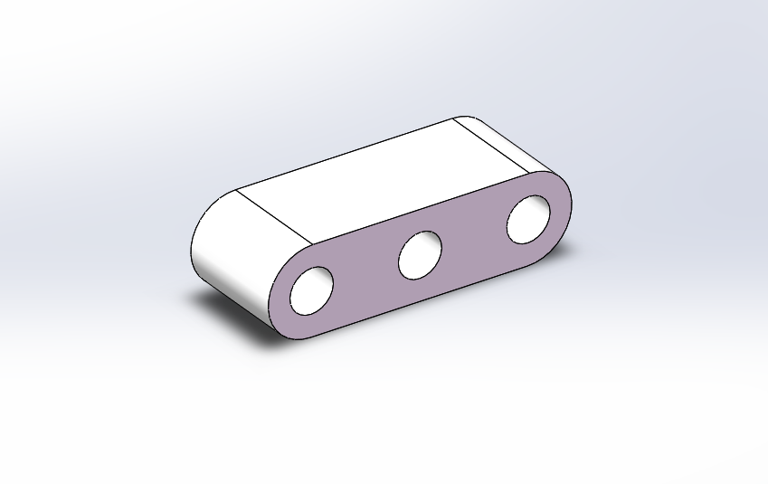

[TOC]

# 嵌入式机器人开发期末作业——外卖小车设计

## 一、车壳设计

### 1.1 小车整体

#### 1.1.1 车身外观

1. 线条流畅，侧翼边缘采取了弧度设计，更具流线感。
2. 整体偏向立方体，使得小车在低速行驶的基础上能够具有更大的容积，以便存储更多的外卖。
3. 上窄下宽，以便降低重心，减小翻车等事故风险，尤其在威海这样大风地区。

#### 1.1.2 车身比例

1. 通过**数学证明计算**出的车辆高度约为0.78m。在满足尽可能多装外卖的基础上，使得车辆整体比例协调美观。
2. 在给定底盘尺寸的基础上，车壳在其四个方向均进行了一定程度延伸扩展，使得小车底面积更大，容积更大。且更易于对小车的进一步改造。

#### 1.1.3 车身一体化

1. 车身形成一个封闭的箱体，底盘以及轮胎减震结构内嵌于箱体内侧。比起罩在底盘上的半封闭外壳，更能对底盘及轮胎机构起到防护作用，避免撞击摩擦损坏。底部包裹情况见下图：

2. 一体化车身底部为万向轮设计了圆形开洞，外形富有特点，且使得万向轮可自由旋转。

#### 1.1.4 激光雷达

1. 车顶设计了两个激光雷达，分别向前和向后，位于车辆的前侧和后侧。在车辆行驶过程中起到检测目标、规避障碍的作用。

#### 1.1.5 车灯和显示屏

1. 车前和车后分别设计了两只LED大灯的示意结构和一块备用的显示屏，可用于显示小车配送信息或者警示信息。

   |  |  |
   | :----------------------------------------------------------: | :----------------------------------------------------------: |
   |                           45度斜视                           |                             正视                             |

### 1.2 车门设计

#### 1.2.1 维修门

1. 车身一侧为便于维修内部机械零件和整体操作内部外卖的操作门。因此此门设计得较大。我们设计的门的宽度大于内部外卖存储箱的宽度，门的下沿与底盘齐平，以便于维修人员对内部所有结构进行操作。
2. 门体形状综合参考了已有智能快递车的设计方案，下窄上宽，与车身形状形成对比，具有几何特点。
3. 左右开合的方式符合常识习惯。

#### 1.2.2 操作屏和小窗口

1. 车身另一侧设计了一个操作显示屏（上）和一个用于商家和用户放取外卖的小窗口（下）。操作显示屏用于商家和客户对外卖的放取操作，采取智能化扫码读取信息，再控制内部传送机制进行外卖箱的相应运作。

   - 客户使用时，当内部传送系统识别目标外卖后，传送机制将外卖送至小窗口，送达时传感器接收信号，使得小窗口的门自动朝外向两侧打开，客户将外卖取出，检测到取出后，若无下条指令，小窗口自动关闭。小车继续配送。

   - 商家使用时，当在操作显示屏上完成信息录入后，待内部传送系统开始查询空位，查询完毕后自动将空位转到小窗口时，小窗口自动打开，商家手动将外卖放入，随后若无下条指令，小窗口自动关闭。小车开始配送或等待下一轮外卖放入。

## 二、车轮系统设计方案

### 2.1 整体设计

- 在小车实际使用过程中。可能会面对非常复杂的路况。如死角，斜坡，障碍物等。而我们希望小车可以安全稳定的到达目的地，所以在轮子位置需要设计一种减震机构来时运送过程更加平稳。
- 同时，我们还要使轮子有360度的转向能力。这是小车可以更灵活的运动。外卖车轮系统是整个外卖小车的核心部分，他的主要功能包括两点：减震与行进。针对这两个主要功能，及车轮可360度旋转的设计需求。
- 我们采取了模块化的设计方法，既小车的4个轮子均采用相同的设计。同时创造性的将动力系统与减震系统融合到一起。最终实现了所需的各项功功能。

#### 2.1.1 整体样式

1. ##### 轮子系统整体样式

   - **说明**：下图为单个轮子样式。在轮子系统中，我们集成了减震功能，与动力系统。

   - **减震系统**：由一个带可伸缩弹簧的减震器，与另外一个支架构成。主要可以减轻小车在前进方向上由于障碍所造成的震动。 
   - **动力系统**：由马达和减速器构成一个整体。此整体与车轮保持平行，将马达产生的动力提供给车轮。 

   - **支撑平台**：车轮上方为系统支撑平台。与减震器与支架相连。构成减震机构。同时带有轴承与小车底盘相连。实现系统整体360度旋转。
   - 值得一提的是，马达与减速器整个整体为非固定的，它会随着减震器而做出一定程度的位移。 为了实现360度旋转的万向轮功能，设计仿照

<table>    <tr>        <td >
 
</td>        <td >

</td>        <td >

</td>    </tr>    <tr>        <td>
左视图
</td>        <td>
正视图
 </td>        <td>
右视图
 </td>    </tr></table>

2. ##### 小车装配样式

   - 四个车轮采用相同的设计，对称的安装在小车底部。同时，因为车轮直径较大，所以小车的外壳与底盘均为这个万向轮的设计留出了空间。整个车轮系统通过轴承与小车。
   - 当驱动车轮旋转的舵机工作时，车轮就会旋转固定的角度。同时与底盘相连每个车轮旋转相互独立。每个车轮的减震也都独立工作。这样保证了小车的运动方式更加灵活。

   - 特别地，小车装配时，沿前进方向对称的左右两侧车轮装配体为镜面对称的关系

     

#### 2.1.2 设计需求及对应思路

- ##### 需求

  1. 四个轮子能360°旋转

  2. 可实现减震机构

  3. 车轮有电机等驱动

- ##### 思路

  1. 根据以上需求，首先考虑减震功能。 我们首先参考了目前主流汽车所采用的减震结构。如（麦弗逊减震机构等）。但这些减震机构是针对两个同轴轮，对称的两个轮间有杆相连，这样并不能实现需求1。 所以，我们希望每个车轮有独立的减震机构。 

  2. 同时，每个车轮有独立的驱动系统。 这就是模块化设计的思路。这种设计思路的优点是，使小车整体的设计工作变得容易。因为在装配与加工时，只需要生产多个相同的零件。降低了生产和组装的难度。 更重要的是，采取模块化的设计之后。当车轮出现故障需要维修时，往往仅需要准备少部分种类的零件，同时维修技工的培训与学习成本也会降低。

     基于此模块化的设计，我们将在接下来具体介绍车轮系统的设计方案

### 2.2 动力系统设计方案

#### 2.2.1 马达与减速器

##### 1. 马达选型及参数

- **此马达的选型是参考闻天楼307现有的小车**

- **型号**：25-2418直流无刷减速电机

- **商品链接**：https://m.tb.cn/h.47BhkVW?sm=6c9e59

- **选择原因**：

  1. 因为小车在校园中运行时，速度较慢。一般不超过15km/h 。所以驱动马达对功率的需求并不需要特别高。

  2. 同时因为车轮系统的设计空间有限。同时又需要兼顾减震功能和驱动。所以对电机的体积有一定限制。 如果过大将对后续的设计造成困难。

  3. 综上我们根据现有的马达参数，选取如下这款马达。小车的整体动力由4个相同的马达提供。

##### 2. 减速器

- **连接方式**：下图为减速器与系统整体的连接方式。减速器的上方外设有一对平行的突出，其中开有直径为1cm的螺丝孔。作为固定于旋转轴的作用。减速器的另一端，与花键相连。花键穿过支架与轮子相连。 也就是说，在减震器的与马达和花键相连。内置齿轮，功能为将马达产生的动力，以合适的速度传递给车轮。设计根据公式

$$
P=FV
$$

​		设计出合适的减速器内部零构件。

* **减震配合**：为了与减震系统相配合，防止零件运动时发生卡死现象。所以在减震时，减速器设计为随支架运动。 为了达到这一效果，减速器的上方固定点，与支架的上方固定点同轴心。 这样从左面与右面看去他们是同轴转动的。而又因为减速器的另一个支点花键 也与支架相连。所以减速器与支架彻底固定。二者保持相对静止

|  |  |
| :-------------------------------------------------------: | :-----------------------------------------------------: |
|                         连接方式                          |                        减震配合                         |

#### 2.2.2 车轮与连接

##### 1. 车轮设计及参数

- **总直径**：23cm

- **胎宽** ：6cm

- **设计思路**：该轮胎的设计参考了常规轮胎，由轮毂与轮胎构成。充气轮胎保证了小车的抓地力同时起到雷丁的减震效果

##### 2. 车轮连接（花键）

- **设计思路**：因为轮子承受了整个车的重力。所以车轮的转动轴需要有足够的结构强度去支撑。在设计中，我们花键采取了较大的直径。车轮通过花键与减速器相连，花键横截面直径为3cm。之所以采取花键，是因为

  1. 同等轴径下承受扭矩大

  2. 受力均匀，应力集中小，使用寿命长

     |  |  |
     | :----------------------------------------------------: | :------------------------------------------------------: |
     |                         转动轴                         |                           花键                           |
     
     

### 2.3 前进与转向

#### 2.3.1 前进与后退效果

- 小车前进或后退时，四个车轮必须保持同一方向。
- 除此之外，4个马达需要以相同的速度转动。只有这样才能保证前进或后退的操作顺利完成。
- 因为小车的运行速度较慢。当小车传感器检测到行进前方有障碍物需要制动时，需要控制马达以较大速度反向转动。即可实现小车的刹车或互推的功能

#### 2.3.2 转向效果

- **车轮360度转向**

  因每个车轮均可360度旋转，且相互独立。 所以可以轻易的实现转向的操作。 下图为转弯时轮子的状态。小车一侧的前后两个轮子别转由不同的方向。同时马达可以保持差速传动，以实现更快转向的效果

### 2.3 减震系统设计方案

#### 2.3.1 减震器

- **设计思路**：减震器内置弹簧，可根据受力而收缩，形成车轮相对底盘的位移，达到减震的效果。

- **优点**：在此系统中，减震器并未与车轮转轴直接相连。而是通过支架，连接到了车轮转轴的后侧。这样设计在保留了减震效果的前提下，节约了车轮转轴附近的空间

#### 2.3.2 车轮支架

- **支架样式**：

- **支架功能**：
  1. 支撑减震器/花键
  2. 与减震器相连，构成受力三角。实现减震功能

#### 2.3.3 减震原理

- 减震的机构从侧面看，可以简单抽象为一个三角形，具体如下。三角形边AB代表了系统中车轮上方的挡板。AC代表减震器，BC代表支架。在正常行驶的时候，三角形ABC保持稳定。

- 当前进方向上遇到阻碍是，车轮收到一个向上的力F，F作用在减震器上，减震器弹簧收缩。 情况如下图。在三角形ABC中，AB边保持不变 ，BC边保持不变。AC边长度变小。所以点C关于AB的高的长度缩小。

- 车轮在水平方向和竖直方向均有小部分位移。竖直方向上车轮与底盘的距离变小。这抵消了由于障碍所带来的上下方向的震动。

  **优点**： 1. 机构简单有效

  ​             2. 减震系统相对独立

  ​             3. 相较减震器竖直放置时，在竖直方向的减震更有效

  

#### 2.3.4 减震实现

*  正常行驶时 ，弹簧的弹力与重力在减震器方向上的分力相抵消。支架与减震器共同支撑小车。同时马达通过减震器驱动车轮转动。在这一过程中，减震器与支架相对小车底盘静止。

* 在小车前进方向上，遇到障碍时, 轮子会遭到向上的阻力。造成减震器收缩，由上面抽象出的几何数学模型。轮子整体相对底盘的距离缩小。与此同时，小车底盘余地变得距离宝成稳定。于是就实现减震。

## 三、外卖传送结构

### 3.1 简介

#### 3.1.1 设计思路

在设计外卖传送结构时，我们主要从以下两个方面考虑：

+ 保证运送外卖的数量尽可能的多，充分提高小车的利用率。在小车空间有限的情况下，我们需要尽可能的减少机械结构的占比，将更多可能的空间提供给外卖盒。
+ 在用户取外卖的过程中，均通过一个窗口进行操作。这就要求我们的机械结构足够灵活，可以将所有的外卖运送到窗口所在位置，同时保证取外卖的时间尽可能快。

#### 3.1.2 结构介绍

基于以上两点，我们采用了垂直循环结构设计单个的外卖柜，并通过链轮和圆角导轨将每个外卖柜等距相连，保证每个外卖柜可以通过导轨传输到达窗口。

### 3.2 零件介绍

#### 3.2.1 外卖箱设计

##### 1. 外卖盒

外卖盒的大小决定了外卖箱的大小与存放外卖数量，我们需要在实际情况下进行考虑，并尽可能减小外卖盒设计大小，从而提高外卖数量。

首先，当前食堂或餐厅的外卖主要使用圆角矩形打包盒，且外卖盒近似为长方体。在此基础上，我们将外卖盒的长宽高分别定为$20cm，10cm，10cm$，在此条件下基本上可以容纳当前市面上绝大多数外卖，做到了外卖盒的普遍适用性。同时，在长方体的一侧开口，通过侧面的开口来取出外卖。

其次，因为我们在外卖箱中使用了垂直循环结构，所以我们要考虑到每个外卖盒之间相隔的距离，外卖盒之间相隔距离也是决定外卖数量的因素之一。在保持外卖盒长宽高不变的基础上，通过增加圆角能够适当减小间距，因为外卖盒并非绝对的长方体，在边缘部分往往会存在很大空隙，通过减小为圆角可以缩短间距。

下图为外卖盒旋转到导轨圆角时的情况，左图为直角边外卖盒，右图为圆角边外卖盒，在外卖盒间距相等的情况下，直角边外卖盒会造成外卖盒相撞，而圆角边外卖盒则很好的避免了这一问题。

圆角的外卖盒同时还在侧面增加一定弧度，防止因剧烈运动或小半径转弯过程中，外卖掉出外卖盒。

<strong>底面和顶面与侧面有弧度</strong>

以下是外卖盒的图片展示：

<table>
    <tr>
        <td >
 
</td>
        <td >

</td>
        <td >

</td>
    </tr>
    <tr>
        <td>
正视图
</td>
        <td>
侧视图
 </td>
        <td>
俯视图
 </td>
    </tr>
</table>

同时，外卖盒需要与链条相连，通过侧面添加的连接轴，保证外卖盒有一定的自由度，可以自由旋转，同时使外卖盒配合链条一并运动，轴的具体图片如下：

<table>
    <tr>
        <td >
 
</td>
        <td >

</td>
        <td >

</td>
    </tr>
    <tr>
        <td>
正视图
</td>
        <td>
侧视图
 </td>
        <td>
俯视图
 </td>
    </tr>
</table>

##### 2. 垂直循环结构

在外卖箱中的垂直循环结构由链轮与导轨组成，滑动导轨由两个直流电机驱动，形状为圆角矩形。每个外卖盒之间以尽可能小的距离等距分布，具体结构如下图所示：

在该结构中，每隔一定距离会放置一个外卖盒，每个垂直循环结构中共有6个外卖盒。外卖盒之间的距离由外卖盒的高度与圆角矩形的圆角半径决定。外卖盒的高度在实际的考虑之下设计为$10cm$，为了能保证外卖旋转过程中不相撞，外卖盒两盒中心之间间距设计为$18cm$，为外卖不相撞的情况下间距最小数值。

垂直循环结构的旋转方向由所需外卖所在位置决定，当用户需要取对应外卖时，会通过相应程序计算是顺时针旋转或是逆时针旋转，选择所需旋转距离最小的旋转方向。

以下是垂直循环结构展示：

<table>
    <tr>
        <td >
 
</td>
        <td >

</td>
        <td >

</td>
    </tr>
    <tr>
        <td>
正视图
</td>
        <td>
侧视图
 </td>
        <td>
俯视图
 </td>
    </tr>
</table>

同时，垂直循环结构还以链轮为基础，由于外卖盒具有一定重量，所以我们在设计链条时，考虑到链条之间的节距，将链条的节距设置为$2cm$，同时在圆角矩阵的四周分别安放四个齿轮，其中上方两个齿轮为从动齿轮，下方两个齿轮为驱动齿轮，具体的展示如下：

<table>
    <tr>
        <td >
 
</td>
        <td >

</td>
        <td >

</td>
    </tr>
    <tr>
        <td>
链节1
</td>
        <td>
链节2
 </td>
        <td>
链轮
 </td>
    </tr>
</table>

##### 3. 外卖箱外壳

设计外卖箱外壳可以将外卖盒与垂直循环结构看做一个整体，外卖箱外壳具体作用有如下几点：

+ 固定链轮轴与卡槽，保证链轮与电机的配合
+ 放置导轨，使外卖盒底面始终与水平面平行
+ 使整个外卖箱更为美观

外卖盒设计的长宽高分别为$26cm，22cm，50cm$，同时外卖箱在面向窗口一侧留出空间，保证外卖能够从窗口被拿出，可以方便外卖盒的放入与取出。

我们将链轮的固定轴与导轨设置在外壳的一侧，固定轴由外壳伸出，用于与链轮配合。并将部分外壳挖空，留出导轨的位置，导轨可以保证外卖盒始终水平，防止外卖倾撒。

<strong>侧面导轨与轴草图</strong>

其次外卖箱还需要与小车底板上的链轮连接，我们需要轴对其进行连接，轴的图具体如下：

<table>
    <tr>
        <td >
 
</td>
        <td >

</td>
        <td >

</td>
    </tr>
    <tr>
        <td>
正视图
</td>
        <td>
侧视图
 </td>
        <td>
俯视图
 </td>
    </tr>
</table>

以下是外卖箱的具体展示图：

<table>
    <tr>
        <td >
 
</td>
        <td >

</td>
        <td >

</td>
    </tr>
    <tr>
        <td>
导轨
</td>
        <td>
正视图
 </td>
        <td>
侧视图
 </td>
    </tr>
</table>

#### 3.2.2 外卖运送装置

##### 1. 水平循环结构

水平循环结构与垂直循环结构类似，均由链轮与导轨组成，滑动导轨由两个直流电机驱动，形状为圆角矩形。

水平循环结构将各个外卖箱之间相连，每个外卖箱中心点等距分布。为了保证外卖箱在旋转过程中不相撞，我们将外卖箱之间距离控制在$50cm$。

水平循环结构的旋转方向由所需外卖所在位置决定，当用户需要取对应外卖时，会通过相应程序计算是顺时针旋转或是逆时针旋转，选择所需旋转距离最小的旋转方向。

以下是具体图片展示：

<table>
    <tr>
        <td >
 
</td>
        <td >

</td>
        <td >

</td>
    </tr>
    <tr>
        <td>
正视图
</td>
        <td>
侧视图
 </td>
        <td>
俯视图
 </td>
    </tr>
</table>

#### 3.2.3 装配体展示

将以上各个部分零件进行组装，得到小车内部空间的装配图。

具体的展示图片如下所示：

<table>
    <tr>
        <td >
 
</td>
        <td >

</td>
        <td >

</td>
    </tr>
    <tr>
        <td>
正视图
</td>
        <td>
侧视图
 </td>
        <td>
俯视图
 </td>
    </tr>
</table>

### 3.3 外卖流程

#### 3.3.1 外卖传送至窗口

##### 详细步骤

外卖传送至窗口主要分为以下几个步骤：

+ 外卖所在位置判断，决定旋转的方向为顺时针或逆时针
+ 水平循环结构转动，将对应外卖箱开口面与小窗口对齐
+ 垂直循环结构转动，将对应外卖盒转至小窗口
+ 外卖车自动打开窗口

<strong>外卖传送流程图</strong>

当小车到达指定地点，如果需要取出外卖，首先输入对应的外卖序号，通过小车的主控电脑判断当前外卖所在位置，在确定位置后迅速决定水平循环结构与垂直循环结构的旋转方向。

当旋转方向确定后，水平循环结构先开始旋转，将对应外卖箱的开门侧面与窗口对齐。

等待外卖箱旋转到指定位置后，根据外卖所在层数与小窗口对应高度，开始进行垂直循环结构的旋转，等待外卖盒与窗口转至同一高度。

推荐在窗口安装红外线传感器，判断外卖盒是否已对齐窗口，若没有对齐或未检测到外卖，则继续进行调整，当对齐后，小车自动打开窗门，小车主控电脑自动上传本次外卖记录，判断状态已完成。

##### 优化方法

在上述的步骤叙述中，存在着一定的改进空间，可以加快外卖传送的流程，减小取外卖的时间。

我们让水平循环结构旋转与垂直循环结构同时进行，减小旋转的过程时间。

<strong>外卖传送流程改进</strong>

在水平循环结构旋转与垂直循环结构旋转的同时，外卖盒会受到合并的加速度。为了防止外卖在旋转的过程中撒漏，需要在原有旋转速度的基础上减慢，将速度控制在合理的范围之内。

#### 3.3.2 外卖放入空位

##### 详细步骤

外卖放入空位可以看做取外卖的逆过程，其主要分为以下几个步骤：

+ 确定空位位置，判断离窗口最近外卖箱是否有空位，如果没有空位则寻找其他外卖箱
+ 水平与垂直循环结构分别转动，将对应空位转置窗口
+ 打开窗口，等待外卖放入窗口

<strong>外卖放入空位流程</strong>

首先需要判断距离窗口最近的空位，通过小车的主控电脑，在离窗口最近的外卖箱进行寻找。如果最近的外卖箱不存在空位，则在次近的外卖箱寻找。

接着利用水平循环结构与垂直循环结构，将空位转置小窗口处。

当外卖已经对齐窗口后，打开窗口，等待外卖放入窗口。利用红外传感器判断外卖是否放入，等待卖家放入外卖并确认后，将窗口关闭并继续进行接下来的操作。

##### 优化方法

在外卖放入前，我们需要考虑当前存在于外卖小车中的所有外卖的位置，防止小车偏沉，进而导致小车在转弯过程中侧翻。

在放入外卖后，通过主控电脑进行计算，尽量保持小车重量的均衡。如果发现小车的某一侧较轻，则首先选择较轻一侧的空位，将对应空位旋转至窗口。

<strong>外卖放入空位流程</strong>

在经过相应的优化后，可以确保得到更高效与合理的放入方式，进而提高外卖小车运送效率。

