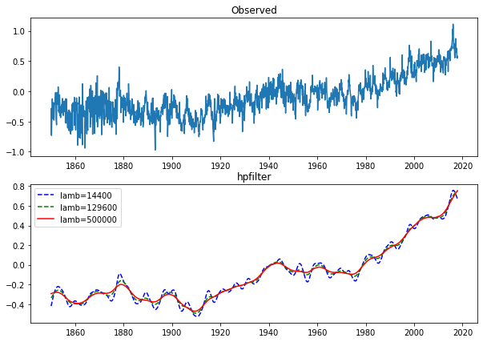
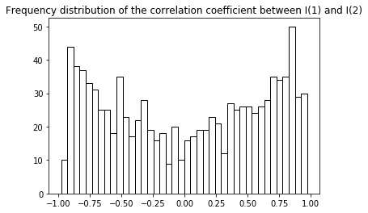

# Chapter2：时间序列转换

## **分布的转换**

观察到的时间序列在表现出这些分布特性之前，通常需要进行某种形式的变换，

### 变换方法(使获得近似正态性)

1. 包含对数的特殊情况的幂变换:

$$
f^{(BC)}(x_t,\lambda)=\begin{cases}
(x_t^\lambda-1)/\lambda & \lambda\neq0 \\
log(x_t) & \lambda=0 
\end{cases}
$$

2. 广义幂(GP)变换

$$
f^{GP}(x_t,\lambda)=\begin{cases}
((x_t+1)^\lambda-1)/\lambda & x_t\geq0,λ\neq0 \\
log(x_t+1) & x_t\geq0,λ=0 \\
-((-x_t+1)^{2-\lambda}-1)/2-\lambda & x_t<0,λ\neq2\\
-log(-x_t+1)&x_t<0,λ\neq2
\end{cases}
$$

3. 处理两个符号的极值的反双曲正弦(IHS)变换:

$$
f^{IHS}(x_t,\lambda)=
\frac{sinh^{-1}(\lambda x_t)}{\lambda}=log\frac{\lambda x_t+(\lambda^2 x_t^2+1)^{1/2}}{\lambda}\quad \lambda>0
$$

转换参数可以用估计最大似然(ML)的方法。假设对于一般变换
$$
f(x_t,\lambda)=\mu_t+a_t
$$

其中假设ut是独立的，是正态分布的,并且均值为零，方差不变。然后通过最大化集中对数似然函数得到ML估计量:
$$
\iota(\lambda)=C_f-(\frac{T}{2})\sum_{t=1}^{T}log{\hat{a}^2+D_f(x_t,\lambda)}
$$

其中
$$
\hat{a}_t=f(x_t,\lambda)-\hat{u}_t
$$

是模型的ML估计的残差，Cf为常数Df计算公式为
$$
D_f(x_t,\lambda)=(\lambda-1)\sum_{t=1}^{T}log{|x_t|}
\\=(\lambda-1)\sum_{t=1}^Tsgn(x_t)log(|x_t|+1)\\=-\frac{1}{2}\sum_{t=1}^Tlog(1+\lambda^2x_t^2)
$$

### 平稳性诱导转换

一个简单的平稳性变换是取一个级数的连续差分，定义x的一阶差分为：
$$
\nabla{x_t}=x_t-x_{t-1}
$$

在某些情况下，一阶差分可能不足以引起平稳性，可能需要进一步的差分。二阶差值定义为一阶差值的一阶差值，即
$$
\nabla \nabla x_t=\nabla^2 x_t
$$

为了给出二阶差的显式表达式，方便引入滞后算子B，定义为：
$$
B^jx_t\equiv x_{t-j}
$$

从而
$$
\nabla x_t=x_t-x_{t-1}=x_t-Bx_t=(1-B)x_t
$$

进而
$$
\nabla^2x_t=(1-B)^2x_t=(1-2B+B^2)x_t=x_t-2x_{t-1}+x_{t-2}
$$

在一个变量的变化率与其对数之间有一种有用的关系，即:
$$
\frac{x_t-x_{t-1}}{x_{t-1}}=\frac{x_t}{x_{t-1}}\approx log\frac{x_t}{x_{t-1}}=logx_t-log{x_{t-1}}=\nabla logx_t
$$

这个近似是由log(1 + y) 约等于y得到的。因此，如果
$$
y_t=(x_t-x_{t-1})/x_{t-1}
$$

很小，通货膨胀率可以通过对数的变化来近似，这通常是一种更方便的变换。

### 分解时间序列和平滑转换

最简单的MA用它自己、它的前代和后代的平均值代替x，也就是用
$$
MA(3)\frac{1}{3}(x_{t-1}+x_t+x_{t+1})
$$

代替x。更复杂的公式显然是可能的:(2n + 1)项加权和。以MA [WMA(2n+ 1)]替换xt
$$
WMA_t(2n+1)=\sum_{t=-n}^n\omega_ix_{t-i}WMA_t(2n+1)=\sum_{t=-n}^n\omega_ix_{t-i}
$$


# Chapter3：平稳时间序列的ARMA模型

## **ARMA模型**

### 平稳性

判断时间序列平稳性：

1. 画时序图，看数据的分布，有明显上升或者下降趋势或者有明显周期性的数据是非平稳的。
2. 通过自相关图和偏自相关图进行判断。如果数据的统计学性质比较好，通过自相关和偏自相关图不但能判断平稳还能直接得出模型的阶数也就是ARMA(P,Q)中的PQ值，进而确定了模型。
   - 在一般的情况下，AIC准则可以表示为：

$$
AIC=2k-2ln(L)  
$$

k是参数的数量，L是似然函数。假设条件是模型的误差服从独立正态分布。

自相关系数(ACF)计算公式可以总结为
$$
acf(k)=\gamma_k=\frac{c_k}{c_0}=\frac{N}{N-k}*\frac{\sum_{t=k+1}^N(x_t-\mu)(x_{t-k}-\mu)}{\sum_{t=1}^N(x_t-\mu)(x_t-\mu)}
$$

### 模型过程

ARMA模型由AR和MA两个过程合成，ARMA（p,q)过程为
$$
z_t=\phi_1 z_{t-1}+\phi_2z_{t-2}+…+\phi_pz_{t-p}+\alpha_t-\theta_1\alpha_{t-1}-…-\theta_p\alpha_{t-p}
$$


### 例3.1：


```python
from statsmodels.tsa.arima_model import ARMA
from datetime import datetime
from itertools import product
import pandas as pd
import numpy as np
from statsmodels.tsa.stattools import acf,pacf
from statsmodels.graphics.tsaplots import plot_acf, plot_pacf
import matplotlib.pyplot as plt

#读取NAO的数据
df = pd.read_excel('Dataset/nao.xlsx')
data1=df.iloc[3:]
data=data1['Unnamed: 1'].tolist()
data=np.array(data)
# 求出序列的ACF and PACF
lag_acf = acf(data, nlags=20)
lag_pacf = pacf(data, nlags=20, method='ols')
fig, axes = plt.subplots(2,1, figsize=(20,20))
plot_acf(data, lags=100, ax=axes[0])
plot_pacf(data, lags=100, ax=axes[1])
plt.show()
##这里定阶p和q都是1
##编写AR(1)模型
order = (1,0)
tempModel = ARMA(data,order).fit(ic='aic', method='mle', trend='nc')
print(tempModel.summary())
##进行R2检验
delta = tempModel.fittedvalues - data # 残差
score = 1 - delta.var()/data.var()
print(score)
#这里编写MA(1)
order2 = (0,1)
tempModel2 = ARMA(data,order2).fit(ic='aic', method='mle', trend='nc')
print(tempModel.summary())
##进行R2检验
delta2 = tempModel2.fittedvalues - data # 残差
score2 = 1 - delta2.var()/data.var()
print(score2)
```


                                  ARMA Model Results                              
    ==============================================================================
    Dep. Variable:                      y   No. Observations:                  815
    Model:                     ARMA(1, 0)   Log Likelihood               -1151.312
    Method:                           mle   S.D. of innovations              0.994
    Date:                Fri, 14 Aug 2020   AIC                           2306.625
    Time:                        15:57:30   BIC                           2316.031
    Sample:                             0   HQIC                          2310.235
                                                                                  
    ==============================================================================
                     coef    std err          z      P>|z|      [0.025      0.975]
    ------------------------------------------------------------------------------
    ar.L1.y        0.1860      0.034      5.404      0.000       0.119       0.253
                                        Roots                                    
    =============================================================================
                      Real          Imaginary           Modulus         Frequency
    -----------------------------------------------------------------------------
    AR.1            5.3771           +0.0000j            5.3771            0.0000
    -----------------------------------------------------------------------------
    0.03454268126958926
                                  ARMA Model Results                              
    ==============================================================================
    Dep. Variable:                      y   No. Observations:                  815
    Model:                     ARMA(1, 0)   Log Likelihood               -1151.312
    Method:                           mle   S.D. of innovations              0.994
    Date:                Fri, 14 Aug 2020   AIC                           2306.625
    Time:                        15:57:30   BIC                           2316.031
    Sample:                             0   HQIC                          2310.235
                                                                                  
    ==============================================================================
                     coef    std err          z      P>|z|      [0.025      0.975]
    ------------------------------------------------------------------------------
    ar.L1.y        0.1860      0.034      5.404      0.000       0.119       0.253
                                        Roots                                    
    =============================================================================
                      Real          Imaginary           Modulus         Frequency
    -----------------------------------------------------------------------------
    AR.1            5.3771           +0.0000j            5.3771            0.0000
    -----------------------------------------------------------------------------
    0.03222459882982298

### 例3.2：


```python
df = pd.read_excel('Dataset/interest_rates.xlsx')
data1=df.iloc[3:788]
data=data1['Unnamed: 1'].tolist()
data=np.array(data)
print(data)
# 求出序列的ACF and PACF
lag_acf = acf(data, nlags=20)
lag_pacf = pacf(data, nlags=20, method='ols')
fig, axes = plt.subplots(2,1, figsize=(20,20))
plot_acf(data, lags=100, ax=axes[0])
plot_pacf(data, lags=100, ax=axes[1])
plt.show()
##这里定阶p和q都是1
##编写AR(1)模型
order = (1,0)
tempModel = ARMA(data,order).fit(ic='aic', method='mle', trend='nc')
print(tempModel.summary())
##进行R2检验
delta = tempModel.fittedvalues - data # 残差
score = 1 - delta.var()/data.var()
print(score)
```

    [ 1.02825     2.36504167  2.3175      2.35083333  2.45183333  2.46616667
      2.46841667  2.48558333  2.415125    2.389875    2.41816667  2.39604167
      2.40104167  2.40083333  2.3835      2.36670833  2.365625    2.34858333
      2.334375    2.13354167  2.097375    2.09770833  2.13058333  2.096
      2.06404167  2.11508333  2.04733333  1.713875    1.60616667  1.56166667
      1.61329167  1.62108333  1.58766667  1.63779167  1.86591667  2.35641667
      3.81        3.797       3.906       3.937       3.969       3.971
      4.005       4.072       4.071       4.104       4.072       4.071
      5.218       5.165       5.008       4.955       5.136       4.977
      4.027       5.091       4.991       5.02        4.858       4.553
      4.148       4.099       3.914       3.921       3.854       3.845
      4.121       6.605       6.603       6.459       6.375       6.127
      6.014       5.523       5.179       4.816       4.294       4.159
      3.76        3.625       3.584       3.305       3.152       3.107
      3.276       3.287       3.283       3.382       3.452       3.484
      3.488       3.472       3.386       3.4         3.687       4.538
      4.554       4.621       4.652       4.556       5.681       5.546
      5.588       5.565       5.09        4.639       4.349       4.165
      4.399       4.485       4.407       4.436       4.537       6.688
      6.7         6.552       5.727       5.389       5.403       5.242
      5.531       4.405       4.052       3.816       3.921       3.887
      3.752       3.635       3.858       3.689       3.717       3.491
      3.426       3.756       3.709       3.635       3.702       3.761
      3.723       3.674       3.745       3.739       3.721       3.758
      4.307       4.302       4.302       4.384       4.464       4.654
      4.656       4.703       4.698       6.63        6.627       6.543
      6.442       6.549       6.375       6.364       5.542       5.63
      5.559       5.559       5.44        5.395       5.521       5.483
      5.62        5.604       5.638       5.659       5.728       6.679
      6.726       6.747       6.513       6.738       6.527       6.08
      6.035       5.495       5.412       5.248       5.275       5.345
      5.291       5.475       5.726       7.553       7.484       7.52
      7.374       7.108       7.08        7.241       7.242       7.059
      6.945       6.577       6.493       6.789       6.777       6.728
      7.711       7.782       7.798       7.85        7.88        7.83
      7.79        7.811       7.743       7.738       7.65        7.55
      7.6         7.27        6.94        6.19        6.87        6.85
      6.82        6.82        6.81        6.81        6.82        6.79
      6.75        6.66        5.92        5.65        5.59        5.57
      5.75        4.83        4.63        4.48        4.36        4.36
      4.37        4.34        4.3         4.27        5.21        5.6
      5.79        6.44        6.74        6.88        7.76        8.21
      8.08        8.07        7.67        7.33        7.06        8.27
     10.91       10.97       10.77       11.73       12.46       12.09
     11.92       11.95       11.52       11.36       11.23       11.2
     11.24       11.06       10.93       10.98       10.99       10.59
      9.88        9.5         9.26        9.47        9.43        9.71
     10.43       10.36       11.42       11.1        10.82        9.99
      8.76        8.46        9.06       10.44       10.96       10.87
     10.88       12.05       14.         14.14       13.78       12.73
     11.02        9.92        8.24        7.4         7.45        7.43
      6.54        5.68        4.53        4.96        6.37        5.81
      5.96        5.93        6.73        8.4         9.17        9.22
      8.9         8.98        9.86       11.51       11.57       11.86
     12.63       11.35       11.32       11.35       12.57       13.32
     13.32       13.38       13.38       15.33       15.9        15.79
     16.14       16.18       16.17       16.09       15.8        14.55
     14.86       14.4        14.29       13.95       13.07       12.82
     12.09       11.53       11.33       11.35       12.09       13.15
     13.42       13.96       15.55       14.08       14.51       14.16
     13.3        12.48       12.89       12.53       12.23       11.28
     10.08        9.91        8.91        9.22        9.96       10.59
     10.74       10.47        9.84        9.7         9.47        9.37
      9.34        9.16        8.84        8.84        8.87        8.87
      8.85        8.43        8.38        8.82        8.86       10.97
     10.21       10.02        9.85        9.23        9.1        10.55
     12.69       12.93       11.93       11.94       11.89       11.39
     10.96       11.06       11.05       11.11       11.15       11.98
     12.02       11.06        9.99        9.7         9.32        9.45
      9.39        9.61       10.25       10.63       10.66       10.52
     10.29        9.35        9.43        8.46        8.54        8.84
      9.79        9.69        9.45        8.43        8.19        8.37
      8.79        8.27        7.74        7.54        8.88       10.05
     11.13       11.53       11.54       12.07       12.54       12.45
     12.39       12.41       12.47       12.54       13.59       13.29
     13.32       13.44       14.46       14.45       14.5        14.5
     14.45       14.57       14.59       14.5        14.38       14.32
     14.31       14.26       13.37       12.92       12.96       13.
     12.39       11.64       11.25       10.84       10.72       10.52
     10.2         9.66        9.86        9.98       10.1         9.97
      9.8        10.1         9.97        9.43        9.42        9.43
      9.65        9.16        7.47        6.49        6.39        6.05
      5.37        5.38        5.33        5.3         5.19        5.13
      5.06        5.17        5.15        4.95        4.87        4.89
      4.76        4.83        4.88        4.81        4.88        5.09
      5.34        5.39        5.44        5.63        5.87        5.93
      6.16        6.09        6.3         6.2         6.37        6.62
      6.59        6.52        6.53        6.38        6.22        6.01
      5.93        5.8         5.79        5.83        5.53        5.51
      5.51        5.55        5.63        6.13        6.16        5.93
      5.76        6.04        6.13        6.21        6.42        6.64
      6.92        6.9         6.9         7.13        7.01        6.73
      6.97        7.09        7.          7.06        7.36        7.17
      7.24        6.75        6.56        6.24        5.56        5.29
      5.01        4.83        4.88        4.88        4.66        4.82
      4.8         5.14        5.22        5.18        5.6         5.75
      5.83        5.83        5.95        5.94        5.83        5.83
      5.8         5.75        5.71        5.72        5.69        5.57
      5.46        5.29        5.11        5.02        5.1         5.04
      4.71        4.33        4.16        3.81        3.87        3.9
      3.91        4.04        3.98        4.04        3.97        3.75
      3.86        3.81        3.73        3.86        3.92        3.79
      3.49        3.51        3.47        3.44        3.5         3.32
      3.53        3.59        3.81        3.86        3.9         4.
      4.11        4.24        4.31        4.54        4.65        4.8
      4.77        4.73        4.73        4.69        4.75        4.71
      4.79        4.82        4.75        4.7         4.57        4.48
      4.43        4.45        4.47        4.46        4.48        4.45
      4.44        4.47        4.5         4.56        4.59        4.63
      4.82        4.93        5.04        5.11        5.17        5.44
      5.39        5.42        5.54        5.67        5.79        5.83
      5.83        5.72        5.65        5.51        5.31        5.07
      5.43        4.83        4.61        5.06        5.24        5.15
      4.99        4.56        3.51        1.69        1.24        0.91
      0.66        0.62        0.57        0.53        0.5         0.44
      0.38        0.39        0.46        0.46        0.49        0.49
      0.48        0.51        0.5         0.5         0.49        0.5
      0.49        0.5         0.51        0.49        0.49        0.51
      0.54        0.56        0.57        0.53        0.52        0.5
      0.45        0.46        0.46        0.44        0.3         0.32
      0.39        0.42        0.42        0.36        0.34        0.29
      0.24        0.25        0.24        0.22        0.25        0.27
      0.31        0.34        0.34        0.31        0.31        0.31
      0.28        0.29        0.31        0.29        0.26        0.32
      0.36        0.39        0.37        0.28        0.36        0.43
      0.4         0.44        0.4         0.41        0.41        0.38
      0.34        0.43        0.43        0.45        0.47        0.49
      0.46        0.45        0.48        0.48        0.46        0.48
      0.47        0.45        0.45        0.44        0.4         0.37
      0.23        0.21        0.17        0.14        0.05        0.14
      0.11        0.02        0.07        0.06        0.08      ]


                                  ARMA Model Results                              
    ==============================================================================
    Dep. Variable:                      y   No. Observations:                  785
    Model:                     ARMA(1, 0)   Log Likelihood                -498.259
    Method:                           mle   S.D. of innovations              0.455
    Date:                Thu, 13 Aug 2020   AIC                           1000.519
    Time:                        13:24:35   BIC                           1009.850
    Sample:                             0   HQIC                          1004.107
                                                                                  
    ==============================================================================
                     coef    std err          z      P>|z|      [0.025      0.975]
    ------------------------------------------------------------------------------
    ar.L1.y        0.9972      0.002    512.190      0.000       0.993       1.001
                                        Roots                                    
    =============================================================================
                      Real          Imaginary           Modulus         Frequency
    -----------------------------------------------------------------------------
    AR.1            1.0028           +0.0000j            1.0028            0.0000
    -----------------------------------------------------------------------------
    0.985893989308828

### 例3.3：


```python
#读取sunspots的数据
df = pd.read_excel('Dataset/sunspots.xlsx')
data1=df.iloc[3:321]
data=data1['Unnamed: 1'].tolist()
data=np.array(data)
print(data)
# 求出序列的ACF and PACF
lag_acf = acf(data, nlags=20)
lag_pacf = pacf(data, nlags=20, method='ols')
fig, axes = plt.subplots(2,1, figsize=(20,20))
plot_acf(data, lags=100, ax=axes[0])
plot_pacf(data, lags=100, ax=axes[1])
plt.show()
##这里定阶p和q都是1
##编写AR(9)模型
order = (9,0)
tempModel = ARMA(data,order).fit(ic='aic', method='mle', trend='nc')
print(tempModel.summary())
##进行R2检验
delta = tempModel.fittedvalues - data # 残差
score = 1 - delta.var()/data.var()
print(score)
##编写AR(2)模型
order = (2,0)
tempModel = ARMA(data,order).fit(ic='aic', method='mle', trend='nc')
print(tempModel.summary())
##进行R2检验
delta = tempModel.fittedvalues - data # 残差
score = 1 - delta.var()/data.var()
print(score)
```

    [ 18.3  26.7  38.3  60.   96.7  48.3  33.3  16.7  13.3   5.    0.    0.
       3.3  18.3  45.   78.3 105.  100.   65.   46.7  43.3  36.7  18.3  35.
      66.7 130.  203.3 171.7 121.7  78.3  58.3  18.3   8.3  26.7  56.7 116.7
     135.  185.  168.3 121.7  66.7  33.3  26.7   8.3  18.3  36.7  66.7 100.
     134.8 139.   79.5  79.7  51.2  20.3  16.   17.   54.   79.3  90.  104.8
     143.2 102.   75.2  60.7  34.8  19.   63.  116.3 176.8 168.  136.  110.8
      58.   51.   11.7  33.  154.2 257.3 209.8 141.3 113.5  64.2  38.   17.
      40.2 138.2 220.  218.2 196.8 149.8 111.  100.   78.2  68.3  35.5  26.7
      10.7   6.8  11.3  24.2  56.7  75.   71.8  79.2  70.3  46.8  16.8  13.5
       4.2   0.    2.3   8.3  20.3  23.2  59.   76.3  68.3  52.9  38.5  24.2
       9.2   6.3   2.2  11.4  28.2  59.9  83.  108.5 115.2 117.4  80.8  44.3
      13.4  19.5  85.8 192.7 227.3 168.7 143.  105.5  63.3  40.3  18.1  25.1
      65.8 102.7 166.3 208.3 182.5 126.3 122.  102.7  74.1  39.   12.7   8.2
      43.4 104.4 178.3 182.2 146.6 112.1  83.5  89.2  57.8  30.7  13.9  62.8
     123.6 232.  185.3 169.2 110.1  74.5  28.3  18.9  20.7   5.7  10.   53.7
      90.5  99.  106.1 105.8  86.3  42.4  21.8  11.2  10.4  11.8  59.5 121.7
     142.  130.  106.6  69.4  43.8  44.4  20.2  15.7   4.6   8.5  40.8  70.1
     105.5  90.1 102.8  80.9  73.2  30.9   9.5   6.    2.4  16.1  79.   95.
     173.6 134.6 105.7  62.7  43.5  23.7   9.7  27.9  74.  106.5 114.7 129.7
     108.2  59.4  35.1  18.6   9.2  14.6  60.2 132.8 190.6 182.6 148.  113.
      79.2  50.8  27.1  16.1  55.3 154.3 214.7 193.  190.7 118.9  98.3  45.
      20.1   6.6  54.2 200.7 269.3 261.7 225.1 159.   76.4  53.4  39.9  15.
      22.   66.8 132.9 150.  149.4 148.   94.4  97.6  54.1  49.2  22.5  18.4
      39.3 131.  220.1 218.9 198.9 162.4  91.   60.5  20.6  14.8  33.9 123.
     211.1 191.8 203.3 133.   76.1  44.9  25.1  11.6  28.9  88.3 136.3 173.9
     170.4 163.6  99.3  65.3  45.8  24.7  12.6   4.2   4.8  24.9  80.8  84.5
      94.  113.3  69.8  39.8  21.7]


                                  ARMA Model Results                              
    ==============================================================================
    Dep. Variable:                      y   No. Observations:                  317
    Model:                     ARMA(9, 0)   Log Likelihood               -1456.982
    Method:                           mle   S.D. of innovations             23.777
    Date:                Thu, 13 Aug 2020   AIC                           2933.965
    Time:                        13:25:27   BIC                           2971.554
    Sample:                             0   HQIC                          2948.980
                                                                                  
    ==============================================================================
                     coef    std err          z      P>|z|      [0.025      0.975]
    ------------------------------------------------------------------------------
    ar.L1.y        1.1929      0.054     22.016      0.000       1.087       1.299
    ar.L2.y       -0.4067      0.086     -4.724      0.000      -0.575      -0.238
    ar.L3.y       -0.1238      0.089     -1.389      0.166      -0.298       0.051
    ar.L4.y        0.1188      0.090      1.320      0.188      -0.058       0.295
    ar.L5.y       -0.0593      0.091     -0.650      0.516      -0.238       0.119
    ar.L6.y        0.0227      0.091      0.250      0.803      -0.156       0.201
    ar.L7.y        0.0340      0.091      0.373      0.709      -0.144       0.212
    ar.L8.y       -0.0536      0.088     -0.609      0.543      -0.226       0.119
    ar.L9.y        0.2550      0.055      4.661      0.000       0.148       0.362
                                        Roots                                    
    =============================================================================
                      Real          Imaginary           Modulus         Frequency
    -----------------------------------------------------------------------------
    AR.1            1.0079           -0.0000j            1.0079           -0.0000
    AR.2            0.8499           -0.5756j            1.0265           -0.0948
    AR.3            0.8499           +0.5756j            1.0265            0.0948
    AR.4            0.4154           -1.0894j            1.1659           -0.1920
    AR.5            0.4154           +1.0894j            1.1659            0.1920
    AR.6           -1.1962           -0.4580j            1.2809           -0.4418
    AR.7           -1.1962           +0.4580j            1.2809            0.4418
    AR.8           -0.4680           -1.1985j            1.2866           -0.3093
    AR.9           -0.4680           +1.1985j            1.2866            0.3093
    -----------------------------------------------------------------------------
    0.8517151228852998
                                  ARMA Model Results                              
    ==============================================================================
    Dep. Variable:                      y   No. Observations:                  317
    Model:                     ARMA(2, 0)   Log Likelihood               -1525.319
    Method:                           mle   S.D. of innovations             29.615
    Date:                Thu, 13 Aug 2020   AIC                           3056.638
    Time:                        13:25:28   BIC                           3067.915
    Sample:                             0   HQIC                          3061.143
                                                                                  
    ==============================================================================
                     coef    std err          z      P>|z|      [0.025      0.975]
    ------------------------------------------------------------------------------
    ar.L1.y        1.4793      0.045     32.914      0.000       1.391       1.567
    ar.L2.y       -0.5907      0.045    -13.149      0.000      -0.679      -0.503
                                        Roots                                    
    =============================================================================
                      Real          Imaginary           Modulus         Frequency
    -----------------------------------------------------------------------------
    AR.1            1.2521           -0.3537j            1.3011           -0.0438
    AR.2            1.2521           +0.3537j            1.3011            0.0438
    -----------------------------------------------------------------------------
    0.7910567584643853


# Chapter4：非平稳时间序列的ARMA模型

## **ARMA模型**

### 背景

自回归移动平均(ARMA)类模型依赖于基础过程是弱平稳的假设，这 限制了均值和方差是常数，并要求自协方差只依赖于时滞。然而，正如 我们所看到的，许多时间序列肯定不是平稳的，因为它们往往表现出时间变化的均值或方差。

一种可能性是，均值在时间上演变为 d 阶的(非随机)多项式，而误差则假定为一个 随机的、平稳的、但可能是自相关的、零均值过程。
$$
x_t=\mu_t+\epsilon_t=\sum_{j=0}^d\beta_jt^j+\Psi(B)a_t
$$

### 平稳性检验和白噪声检验

能够适用ARMA模型进行分析预测的时间序列必须满足的条件是平稳非白噪声序列。对数据的平稳性进行检验是时间序列分析的重要步骤，一般通过**时序图和相关图**来检验时间序列的平稳性。时序图的特点是直观简单但是误差较大，自相关图即自相关和偏自相关函数图相对复杂但是结果更加准确。

### 检验步骤

1. 利用时序图进行直观的判断
2. 利用相关图进行更进一步的检验。
3. 对于非平稳时间序列中若存在增长或下降趋势，则需要进行差分处理然后进行平稳性检验直至平稳为止。其中，差分的次数就是模型ARIMA(p,d,q)的阶数，理论上说，差分的次数越多，对时序信息的非平稳确定性信息的提取越充分，但是从理论上说，差分的次数并非越多越好，每一次差分运算，都会造成信息的损失，所以应当避免过分的差分，一般在应用中，差分的阶数不超过2。


#### 检验实例

1. 获取被观测系统时间序列数据；

```python
import numpy as np
import pandas as pd
import statsmodels.api as sm
dta=[10930,10318,10595,10972,7706,6756,9092,10551,9722,10913,11151,8186,6422, 
6337,11649,11652,10310,12043,7937,6476,9662,9570,9981,9331]
dta=pd.Series(dta)
dta.index=pd.Index(sm.tsa.datetools.dates_from_range('1996','2019'))
dta
```

2. 对数据绘图，观测是否为平稳时间序列( 一般都不平稳)；对于非平稳时间序列要先进行d阶差分运算，化为平稳时间序列；

```python
import matplotlib.pyplot as plt
dta.plot(figsize=(12,8))
from statsmodels.graphics.tsaplots import plot_acf
plot_acf(dta)
```

3. 画出ACF图，由ACF图可以看出，自相关系数长期大于0，说明序列具有很强的长期相关性，所以趋势并不平稳，因此要做差分运算，依次测试。

```python
diff1 = np.diff(dta)
diff1.plot()
```

4. 经过第二步处理，已经得到平稳时间序列。要对平稳时间序列分别求得其自相关系数ACF 和偏自相关系数PACF ，通过对自相关图和偏自相关图的分析，得到最佳的阶层 p 和阶数 q；

```python
from statsmodels.graphics.tsaplots import plot_acf
plot_acf(diff1)
from statsmodels.graphics.tsaplots import plot_pacf
plot_pacf(dta)
```

5. 拟合ARIMA模型 (0,1,1)，获得参数

```python
from statsmodels.tsa.arima_model import ARIMA
model = ARIMA(diff1, (0,1,1)).fit() 
print(model.summary())
```


### 例4.1：


```python
import pandas as pd
import numpy as np
import matplotlib.pyplot as plt
from statsmodels.tsa.arima_model import ARIMA
```


```python
##这里开始读取数据
df = pd.read_excel('Dataset/interest_rates.xlsx')
data1=df.iloc[3:788]
data=data1['Unnamed: 1'].tolist()
data=np.array(data)
print(data)
#画出时序图
plt.rcParams['font.sans-serif'] = ['SimHei']    #定义使其正常显示中文字体黑体
plt.rcParams['axes.unicode_minus'] = False      #用来正常显示表示负号
plt.plot(data)
plt.show()
#画出自相关性图
from statsmodels.graphics.tsaplots import plot_acf, plot_pacf
plot_acf(data)
plt.show()
```

    [ 1.02825     2.36504167  2.3175      2.35083333  2.45183333  2.46616667
      2.46841667  2.48558333  2.415125    2.389875    2.41816667  2.39604167
      2.40104167  2.40083333  2.3835      2.36670833  2.365625    2.34858333
      2.334375    2.13354167  2.097375    2.09770833  2.13058333  2.096
      2.06404167  2.11508333  2.04733333  1.713875    1.60616667  1.56166667
      1.61329167  1.62108333  1.58766667  1.63779167  1.86591667  2.35641667
      3.81        3.797       3.906       3.937       3.969       3.971
      4.005       4.072       4.071       4.104       4.072       4.071
      5.218       5.165       5.008       4.955       5.136       4.977
      4.027       5.091       4.991       5.02        4.858       4.553
      4.148       4.099       3.914       3.921       3.854       3.845
      4.121       6.605       6.603       6.459       6.375       6.127
      6.014       5.523       5.179       4.816       4.294       4.159
      3.76        3.625       3.584       3.305       3.152       3.107
      3.276       3.287       3.283       3.382       3.452       3.484
      3.488       3.472       3.386       3.4         3.687       4.538
      4.554       4.621       4.652       4.556       5.681       5.546
      5.588       5.565       5.09        4.639       4.349       4.165
      4.399       4.485       4.407       4.436       4.537       6.688
      6.7         6.552       5.727       5.389       5.403       5.242
      5.531       4.405       4.052       3.816       3.921       3.887
      3.752       3.635       3.858       3.689       3.717       3.491
      3.426       3.756       3.709       3.635       3.702       3.761
      3.723       3.674       3.745       3.739       3.721       3.758
      4.307       4.302       4.302       4.384       4.464       4.654
      4.656       4.703       4.698       6.63        6.627       6.543
      6.442       6.549       6.375       6.364       5.542       5.63
      5.559       5.559       5.44        5.395       5.521       5.483
      5.62        5.604       5.638       5.659       5.728       6.679
      6.726       6.747       6.513       6.738       6.527       6.08
      6.035       5.495       5.412       5.248       5.275       5.345
      5.291       5.475       5.726       7.553       7.484       7.52
      7.374       7.108       7.08        7.241       7.242       7.059
      6.945       6.577       6.493       6.789       6.777       6.728
      7.711       7.782       7.798       7.85        7.88        7.83
      7.79        7.811       7.743       7.738       7.65        7.55
      7.6         7.27        6.94        6.19        6.87        6.85
      6.82        6.82        6.81        6.81        6.82        6.79
      6.75        6.66        5.92        5.65        5.59        5.57
      5.75        4.83        4.63        4.48        4.36        4.36
      4.37        4.34        4.3         4.27        5.21        5.6
      5.79        6.44        6.74        6.88        7.76        8.21
      8.08        8.07        7.67        7.33        7.06        8.27
     10.91       10.97       10.77       11.73       12.46       12.09
     11.92       11.95       11.52       11.36       11.23       11.2
     11.24       11.06       10.93       10.98       10.99       10.59
      9.88        9.5         9.26        9.47        9.43        9.71
     10.43       10.36       11.42       11.1        10.82        9.99
      8.76        8.46        9.06       10.44       10.96       10.87
     10.88       12.05       14.         14.14       13.78       12.73
     11.02        9.92        8.24        7.4         7.45        7.43
      6.54        5.68        4.53        4.96        6.37        5.81
      5.96        5.93        6.73        8.4         9.17        9.22
      8.9         8.98        9.86       11.51       11.57       11.86
     12.63       11.35       11.32       11.35       12.57       13.32
     13.32       13.38       13.38       15.33       15.9        15.79
     16.14       16.18       16.17       16.09       15.8        14.55
     14.86       14.4        14.29       13.95       13.07       12.82
     12.09       11.53       11.33       11.35       12.09       13.15
     13.42       13.96       15.55       14.08       14.51       14.16
     13.3        12.48       12.89       12.53       12.23       11.28
     10.08        9.91        8.91        9.22        9.96       10.59
     10.74       10.47        9.84        9.7         9.47        9.37
      9.34        9.16        8.84        8.84        8.87        8.87
      8.85        8.43        8.38        8.82        8.86       10.97
     10.21       10.02        9.85        9.23        9.1        10.55
     12.69       12.93       11.93       11.94       11.89       11.39
     10.96       11.06       11.05       11.11       11.15       11.98
     12.02       11.06        9.99        9.7         9.32        9.45
      9.39        9.61       10.25       10.63       10.66       10.52
     10.29        9.35        9.43        8.46        8.54        8.84
      9.79        9.69        9.45        8.43        8.19        8.37
      8.79        8.27        7.74        7.54        8.88       10.05
     11.13       11.53       11.54       12.07       12.54       12.45
     12.39       12.41       12.47       12.54       13.59       13.29
     13.32       13.44       14.46       14.45       14.5        14.5
     14.45       14.57       14.59       14.5        14.38       14.32
     14.31       14.26       13.37       12.92       12.96       13.
     12.39       11.64       11.25       10.84       10.72       10.52
     10.2         9.66        9.86        9.98       10.1         9.97
      9.8        10.1         9.97        9.43        9.42        9.43
      9.65        9.16        7.47        6.49        6.39        6.05
      5.37        5.38        5.33        5.3         5.19        5.13
      5.06        5.17        5.15        4.95        4.87        4.89
      4.76        4.83        4.88        4.81        4.88        5.09
      5.34        5.39        5.44        5.63        5.87        5.93
      6.16        6.09        6.3         6.2         6.37        6.62
      6.59        6.52        6.53        6.38        6.22        6.01
      5.93        5.8         5.79        5.83        5.53        5.51
      5.51        5.55        5.63        6.13        6.16        5.93
      5.76        6.04        6.13        6.21        6.42        6.64
      6.92        6.9         6.9         7.13        7.01        6.73
      6.97        7.09        7.          7.06        7.36        7.17
      7.24        6.75        6.56        6.24        5.56        5.29
      5.01        4.83        4.88        4.88        4.66        4.82
      4.8         5.14        5.22        5.18        5.6         5.75
      5.83        5.83        5.95        5.94        5.83        5.83
      5.8         5.75        5.71        5.72        5.69        5.57
      5.46        5.29        5.11        5.02        5.1         5.04
      4.71        4.33        4.16        3.81        3.87        3.9
      3.91        4.04        3.98        4.04        3.97        3.75
      3.86        3.81        3.73        3.86        3.92        3.79
      3.49        3.51        3.47        3.44        3.5         3.32
      3.53        3.59        3.81        3.86        3.9         4.
      4.11        4.24        4.31        4.54        4.65        4.8
      4.77        4.73        4.73        4.69        4.75        4.71
      4.79        4.82        4.75        4.7         4.57        4.48
      4.43        4.45        4.47        4.46        4.48        4.45
      4.44        4.47        4.5         4.56        4.59        4.63
      4.82        4.93        5.04        5.11        5.17        5.44
      5.39        5.42        5.54        5.67        5.79        5.83
      5.83        5.72        5.65        5.51        5.31        5.07
      5.43        4.83        4.61        5.06        5.24        5.15
      4.99        4.56        3.51        1.69        1.24        0.91
      0.66        0.62        0.57        0.53        0.5         0.44
      0.38        0.39        0.46        0.46        0.49        0.49
      0.48        0.51        0.5         0.5         0.49        0.5
      0.49        0.5         0.51        0.49        0.49        0.51
      0.54        0.56        0.57        0.53        0.52        0.5
      0.45        0.46        0.46        0.44        0.3         0.32
      0.39        0.42        0.42        0.36        0.34        0.29
      0.24        0.25        0.24        0.22        0.25        0.27
      0.31        0.34        0.34        0.31        0.31        0.31
      0.28        0.29        0.31        0.29        0.26        0.32
      0.36        0.39        0.37        0.28        0.36        0.43
      0.4         0.44        0.4         0.41        0.41        0.38
      0.34        0.43        0.43        0.45        0.47        0.49
      0.46        0.45        0.48        0.48        0.46        0.48
      0.47        0.45        0.45        0.44        0.4         0.37
      0.23        0.21        0.17        0.14        0.05        0.14
      0.11        0.02        0.07        0.06        0.08      ]


```python
#平稳性检测
from statsmodels.tsa.stattools import adfuller
print('原始序列的检验结果为：',adfuller(data))

#对数据进行差分后得到 自相关图和 偏相关图
D_data = np.diff(data)
print(D_data)
plt.plot(D_data)
plt.show()

plot_acf(D_data)    #画出自相关图

plot_pacf(D_data)   #画出偏相关图
plt.show()
print(u'差分序列的ADF 检验结果为： ', adfuller(D_data))   #平稳性检验
from statsmodels.stats.diagnostic import acorr_ljungbox
print(u'差分序列的白噪声检验结果：',acorr_ljungbox(D_data, lags= 1)) #返回统计量和 p 值

model = ARIMA(data, (0,1,1)).fit()
print(model.summary() )       #生成一份模型报告
model.forecast(5)   #为未来5天进行预测， 返回预测结果， 标准误差， 和置信区间
```

    原始序列的检验结果为： (-1.7537748552113088, 0.4036404438743394, 21, 763, {'1%': -3.4389495235166416, '5%': -2.8653354363373253, '10%': -2.56879107669766}, 902.7421499838515)
    [ 1.33679167e+00 -4.75416667e-02  3.33333333e-02  1.01000000e-01
      1.43333333e-02  2.25000000e-03  1.71666667e-02 -7.04583333e-02
     -2.52500000e-02  2.82916667e-02 -2.21250000e-02  5.00000000e-03
     -2.08333340e-04 -1.73333333e-02 -1.67916667e-02 -1.08333333e-03
     -1.70416667e-02 -1.42083333e-02 -2.00833333e-01 -3.61666667e-02
      3.33333330e-04  3.28750000e-02 -3.45833333e-02 -3.19583333e-02
      5.10416667e-02 -6.77500000e-02 -3.33458333e-01 -1.07708333e-01
     -4.45000000e-02  5.16250000e-02  7.79166666e-03 -3.34166667e-02
      5.01250000e-02  2.28125000e-01  4.90500000e-01  1.45358333e+00
     -1.30000000e-02  1.09000000e-01  3.10000000e-02  3.20000000e-02
      2.00000000e-03  3.40000000e-02  6.70000000e-02 -1.00000000e-03
      3.30000000e-02 -3.20000000e-02 -1.00000000e-03  1.14700000e+00
     -5.30000000e-02 -1.57000000e-01 -5.30000000e-02  1.81000000e-01
     -1.59000000e-01 -9.50000000e-01  1.06400000e+00 -1.00000000e-01
      2.90000000e-02 -1.62000000e-01 -3.05000000e-01 -4.05000000e-01
     -4.90000000e-02 -1.85000000e-01  7.00000000e-03 -6.70000000e-02
     -9.00000000e-03  2.76000000e-01  2.48400000e+00 -2.00000000e-03
     -1.44000000e-01 -8.40000000e-02 -2.48000000e-01 -1.13000000e-01
     -4.91000000e-01 -3.44000000e-01 -3.63000000e-01 -5.22000000e-01
     -1.35000000e-01 -3.99000000e-01 -1.35000000e-01 -4.10000000e-02
     -2.79000000e-01 -1.53000000e-01 -4.50000000e-02  1.69000000e-01
      1.10000000e-02 -4.00000000e-03  9.90000000e-02  7.00000000e-02
      3.20000000e-02  4.00000000e-03 -1.60000000e-02 -8.60000000e-02
      1.40000000e-02  2.87000000e-01  8.51000000e-01  1.60000000e-02
      6.70000000e-02  3.10000000e-02 -9.60000000e-02  1.12500000e+00
     -1.35000000e-01  4.20000000e-02 -2.30000000e-02 -4.75000000e-01
     -4.51000000e-01 -2.90000000e-01 -1.84000000e-01  2.34000000e-01
      8.60000000e-02 -7.80000000e-02  2.90000000e-02  1.01000000e-01
      2.15100000e+00  1.20000000e-02 -1.48000000e-01 -8.25000000e-01
     -3.38000000e-01  1.40000000e-02 -1.61000000e-01  2.89000000e-01
     -1.12600000e+00 -3.53000000e-01 -2.36000000e-01  1.05000000e-01
     -3.40000000e-02 -1.35000000e-01 -1.17000000e-01  2.23000000e-01
     -1.69000000e-01  2.80000000e-02 -2.26000000e-01 -6.50000000e-02
      3.30000000e-01 -4.70000000e-02 -7.40000000e-02  6.70000000e-02
      5.90000000e-02 -3.80000000e-02 -4.90000000e-02  7.10000000e-02
     -6.00000000e-03 -1.80000000e-02  3.70000000e-02  5.49000000e-01
     -5.00000000e-03  0.00000000e+00  8.20000000e-02  8.00000000e-02
      1.90000000e-01  2.00000000e-03  4.70000000e-02 -5.00000000e-03
      1.93200000e+00 -3.00000000e-03 -8.40000000e-02 -1.01000000e-01
      1.07000000e-01 -1.74000000e-01 -1.10000000e-02 -8.22000000e-01
      8.80000000e-02 -7.10000000e-02  0.00000000e+00 -1.19000000e-01
     -4.50000000e-02  1.26000000e-01 -3.80000000e-02  1.37000000e-01
     -1.60000000e-02  3.40000000e-02  2.10000000e-02  6.90000000e-02
      9.51000000e-01  4.70000000e-02  2.10000000e-02 -2.34000000e-01
      2.25000000e-01 -2.11000000e-01 -4.47000000e-01 -4.50000000e-02
     -5.40000000e-01 -8.30000000e-02 -1.64000000e-01  2.70000000e-02
      7.00000000e-02 -5.40000000e-02  1.84000000e-01  2.51000000e-01
      1.82700000e+00 -6.90000000e-02  3.60000000e-02 -1.46000000e-01
     -2.66000000e-01 -2.80000000e-02  1.61000000e-01  1.00000000e-03
     -1.83000000e-01 -1.14000000e-01 -3.68000000e-01 -8.40000000e-02
      2.96000000e-01 -1.20000000e-02 -4.90000000e-02  9.83000000e-01
      7.10000000e-02  1.60000000e-02  5.20000000e-02  3.00000000e-02
     -5.00000000e-02 -4.00000000e-02  2.10000000e-02 -6.80000000e-02
     -5.00000000e-03 -8.80000000e-02 -1.00000000e-01  5.00000000e-02
     -3.30000000e-01 -3.30000000e-01 -7.50000000e-01  6.80000000e-01
     -2.00000000e-02 -3.00000000e-02  0.00000000e+00 -1.00000000e-02
      0.00000000e+00  1.00000000e-02 -3.00000000e-02 -4.00000000e-02
     -9.00000000e-02 -7.40000000e-01 -2.70000000e-01 -6.00000000e-02
     -2.00000000e-02  1.80000000e-01 -9.20000000e-01 -2.00000000e-01
     -1.50000000e-01 -1.20000000e-01  0.00000000e+00  1.00000000e-02
     -3.00000000e-02 -4.00000000e-02 -3.00000000e-02  9.40000000e-01
      3.90000000e-01  1.90000000e-01  6.50000000e-01  3.00000000e-01
      1.40000000e-01  8.80000000e-01  4.50000000e-01 -1.30000000e-01
     -1.00000000e-02 -4.00000000e-01 -3.40000000e-01 -2.70000000e-01
      1.21000000e+00  2.64000000e+00  6.00000000e-02 -2.00000000e-01
      9.60000000e-01  7.30000000e-01 -3.70000000e-01 -1.70000000e-01
      3.00000000e-02 -4.30000000e-01 -1.60000000e-01 -1.30000000e-01
     -3.00000000e-02  4.00000000e-02 -1.80000000e-01 -1.30000000e-01
      5.00000000e-02  1.00000000e-02 -4.00000000e-01 -7.10000000e-01
     -3.80000000e-01 -2.40000000e-01  2.10000000e-01 -4.00000000e-02
      2.80000000e-01  7.20000000e-01 -7.00000000e-02  1.06000000e+00
     -3.20000000e-01 -2.80000000e-01 -8.30000000e-01 -1.23000000e+00
     -3.00000000e-01  6.00000000e-01  1.38000000e+00  5.20000000e-01
     -9.00000000e-02  1.00000000e-02  1.17000000e+00  1.95000000e+00
      1.40000000e-01 -3.60000000e-01 -1.05000000e+00 -1.71000000e+00
     -1.10000000e+00 -1.68000000e+00 -8.40000000e-01  5.00000000e-02
     -2.00000000e-02 -8.90000000e-01 -8.60000000e-01 -1.15000000e+00
      4.30000000e-01  1.41000000e+00 -5.60000000e-01  1.50000000e-01
     -3.00000000e-02  8.00000000e-01  1.67000000e+00  7.70000000e-01
      5.00000000e-02 -3.20000000e-01  8.00000000e-02  8.80000000e-01
      1.65000000e+00  6.00000000e-02  2.90000000e-01  7.70000000e-01
     -1.28000000e+00 -3.00000000e-02  3.00000000e-02  1.22000000e+00
      7.50000000e-01  0.00000000e+00  6.00000000e-02  0.00000000e+00
      1.95000000e+00  5.70000000e-01 -1.10000000e-01  3.50000000e-01
      4.00000000e-02 -1.00000000e-02 -8.00000000e-02 -2.90000000e-01
     -1.25000000e+00  3.10000000e-01 -4.60000000e-01 -1.10000000e-01
     -3.40000000e-01 -8.80000000e-01 -2.50000000e-01 -7.30000000e-01
     -5.60000000e-01 -2.00000000e-01  2.00000000e-02  7.40000000e-01
      1.06000000e+00  2.70000000e-01  5.40000000e-01  1.59000000e+00
     -1.47000000e+00  4.30000000e-01 -3.50000000e-01 -8.60000000e-01
     -8.20000000e-01  4.10000000e-01 -3.60000000e-01 -3.00000000e-01
     -9.50000000e-01 -1.20000000e+00 -1.70000000e-01 -1.00000000e+00
      3.10000000e-01  7.40000000e-01  6.30000000e-01  1.50000000e-01
     -2.70000000e-01 -6.30000000e-01 -1.40000000e-01 -2.30000000e-01
     -1.00000000e-01 -3.00000000e-02 -1.80000000e-01 -3.20000000e-01
      0.00000000e+00  3.00000000e-02  0.00000000e+00 -2.00000000e-02
     -4.20000000e-01 -5.00000000e-02  4.40000000e-01  4.00000000e-02
      2.11000000e+00 -7.60000000e-01 -1.90000000e-01 -1.70000000e-01
     -6.20000000e-01 -1.30000000e-01  1.45000000e+00  2.14000000e+00
      2.40000000e-01 -1.00000000e+00  1.00000000e-02 -5.00000000e-02
     -5.00000000e-01 -4.30000000e-01  1.00000000e-01 -1.00000000e-02
      6.00000000e-02  4.00000000e-02  8.30000000e-01  4.00000000e-02
     -9.60000000e-01 -1.07000000e+00 -2.90000000e-01 -3.80000000e-01
      1.30000000e-01 -6.00000000e-02  2.20000000e-01  6.40000000e-01
      3.80000000e-01  3.00000000e-02 -1.40000000e-01 -2.30000000e-01
     -9.40000000e-01  8.00000000e-02 -9.70000000e-01  8.00000000e-02
      3.00000000e-01  9.50000000e-01 -1.00000000e-01 -2.40000000e-01
     -1.02000000e+00 -2.40000000e-01  1.80000000e-01  4.20000000e-01
     -5.20000000e-01 -5.30000000e-01 -2.00000000e-01  1.34000000e+00
      1.17000000e+00  1.08000000e+00  4.00000000e-01  1.00000000e-02
      5.30000000e-01  4.70000000e-01 -9.00000000e-02 -6.00000000e-02
      2.00000000e-02  6.00000000e-02  7.00000000e-02  1.05000000e+00
     -3.00000000e-01  3.00000000e-02  1.20000000e-01  1.02000000e+00
     -1.00000000e-02  5.00000000e-02  0.00000000e+00 -5.00000000e-02
      1.20000000e-01  2.00000000e-02 -9.00000000e-02 -1.20000000e-01
     -6.00000000e-02 -1.00000000e-02 -5.00000000e-02 -8.90000000e-01
     -4.50000000e-01  4.00000000e-02  4.00000000e-02 -6.10000000e-01
     -7.50000000e-01 -3.90000000e-01 -4.10000000e-01 -1.20000000e-01
     -2.00000000e-01 -3.20000000e-01 -5.40000000e-01  2.00000000e-01
      1.20000000e-01  1.20000000e-01 -1.30000000e-01 -1.70000000e-01
      3.00000000e-01 -1.30000000e-01 -5.40000000e-01 -1.00000000e-02
      1.00000000e-02  2.20000000e-01 -4.90000000e-01 -1.69000000e+00
     -9.80000000e-01 -1.00000000e-01 -3.40000000e-01 -6.80000000e-01
      1.00000000e-02 -5.00000000e-02 -3.00000000e-02 -1.10000000e-01
     -6.00000000e-02 -7.00000000e-02  1.10000000e-01 -2.00000000e-02
     -2.00000000e-01 -8.00000000e-02  2.00000000e-02 -1.30000000e-01
      7.00000000e-02  5.00000000e-02 -7.00000000e-02  7.00000000e-02
      2.10000000e-01  2.50000000e-01  5.00000000e-02  5.00000000e-02
      1.90000000e-01  2.40000000e-01  6.00000000e-02  2.30000000e-01
     -7.00000000e-02  2.10000000e-01 -1.00000000e-01  1.70000000e-01
      2.50000000e-01 -3.00000000e-02 -7.00000000e-02  1.00000000e-02
     -1.50000000e-01 -1.60000000e-01 -2.10000000e-01 -8.00000000e-02
     -1.30000000e-01 -1.00000000e-02  4.00000000e-02 -3.00000000e-01
     -2.00000000e-02  0.00000000e+00  4.00000000e-02  8.00000000e-02
      5.00000000e-01  3.00000000e-02 -2.30000000e-01 -1.70000000e-01
      2.80000000e-01  9.00000000e-02  8.00000000e-02  2.10000000e-01
      2.20000000e-01  2.80000000e-01 -2.00000000e-02  0.00000000e+00
      2.30000000e-01 -1.20000000e-01 -2.80000000e-01  2.40000000e-01
      1.20000000e-01 -9.00000000e-02  6.00000000e-02  3.00000000e-01
     -1.90000000e-01  7.00000000e-02 -4.90000000e-01 -1.90000000e-01
     -3.20000000e-01 -6.80000000e-01 -2.70000000e-01 -2.80000000e-01
     -1.80000000e-01  5.00000000e-02  0.00000000e+00 -2.20000000e-01
      1.60000000e-01 -2.00000000e-02  3.40000000e-01  8.00000000e-02
     -4.00000000e-02  4.20000000e-01  1.50000000e-01  8.00000000e-02
      0.00000000e+00  1.20000000e-01 -1.00000000e-02 -1.10000000e-01
      0.00000000e+00 -3.00000000e-02 -5.00000000e-02 -4.00000000e-02
      1.00000000e-02 -3.00000000e-02 -1.20000000e-01 -1.10000000e-01
     -1.70000000e-01 -1.80000000e-01 -9.00000000e-02  8.00000000e-02
     -6.00000000e-02 -3.30000000e-01 -3.80000000e-01 -1.70000000e-01
     -3.50000000e-01  6.00000000e-02  3.00000000e-02  1.00000000e-02
      1.30000000e-01 -6.00000000e-02  6.00000000e-02 -7.00000000e-02
     -2.20000000e-01  1.10000000e-01 -5.00000000e-02 -8.00000000e-02
      1.30000000e-01  6.00000000e-02 -1.30000000e-01 -3.00000000e-01
      2.00000000e-02 -4.00000000e-02 -3.00000000e-02  6.00000000e-02
     -1.80000000e-01  2.10000000e-01  6.00000000e-02  2.20000000e-01
      5.00000000e-02  4.00000000e-02  1.00000000e-01  1.10000000e-01
      1.30000000e-01  7.00000000e-02  2.30000000e-01  1.10000000e-01
      1.50000000e-01 -3.00000000e-02 -4.00000000e-02  0.00000000e+00
     -4.00000000e-02  6.00000000e-02 -4.00000000e-02  8.00000000e-02
      3.00000000e-02 -7.00000000e-02 -5.00000000e-02 -1.30000000e-01
     -9.00000000e-02 -5.00000000e-02  2.00000000e-02  2.00000000e-02
     -1.00000000e-02  2.00000000e-02 -3.00000000e-02 -1.00000000e-02
      3.00000000e-02  3.00000000e-02  6.00000000e-02  3.00000000e-02
      4.00000000e-02  1.90000000e-01  1.10000000e-01  1.10000000e-01
      7.00000000e-02  6.00000000e-02  2.70000000e-01 -5.00000000e-02
      3.00000000e-02  1.20000000e-01  1.30000000e-01  1.20000000e-01
      4.00000000e-02  0.00000000e+00 -1.10000000e-01 -7.00000000e-02
     -1.40000000e-01 -2.00000000e-01 -2.40000000e-01  3.60000000e-01
     -6.00000000e-01 -2.20000000e-01  4.50000000e-01  1.80000000e-01
     -9.00000000e-02 -1.60000000e-01 -4.30000000e-01 -1.05000000e+00
     -1.82000000e+00 -4.50000000e-01 -3.30000000e-01 -2.50000000e-01
     -4.00000000e-02 -5.00000000e-02 -4.00000000e-02 -3.00000000e-02
     -6.00000000e-02 -6.00000000e-02  1.00000000e-02  7.00000000e-02
      0.00000000e+00  3.00000000e-02  0.00000000e+00 -1.00000000e-02
      3.00000000e-02 -1.00000000e-02  0.00000000e+00 -1.00000000e-02
      1.00000000e-02 -1.00000000e-02  1.00000000e-02  1.00000000e-02
     -2.00000000e-02  0.00000000e+00  2.00000000e-02  3.00000000e-02
      2.00000000e-02  1.00000000e-02 -4.00000000e-02 -1.00000000e-02
     -2.00000000e-02 -5.00000000e-02  1.00000000e-02  0.00000000e+00
     -2.00000000e-02 -1.40000000e-01  2.00000000e-02  7.00000000e-02
      3.00000000e-02  0.00000000e+00 -6.00000000e-02 -2.00000000e-02
     -5.00000000e-02 -5.00000000e-02  1.00000000e-02 -1.00000000e-02
     -2.00000000e-02  3.00000000e-02  2.00000000e-02  4.00000000e-02
      3.00000000e-02  0.00000000e+00 -3.00000000e-02  0.00000000e+00
      0.00000000e+00 -3.00000000e-02  1.00000000e-02  2.00000000e-02
     -2.00000000e-02 -3.00000000e-02  6.00000000e-02  4.00000000e-02
      3.00000000e-02 -2.00000000e-02 -9.00000000e-02  8.00000000e-02
      7.00000000e-02 -3.00000000e-02  4.00000000e-02 -4.00000000e-02
      1.00000000e-02  0.00000000e+00 -3.00000000e-02 -4.00000000e-02
      9.00000000e-02  0.00000000e+00  2.00000000e-02  2.00000000e-02
      2.00000000e-02 -3.00000000e-02 -1.00000000e-02  3.00000000e-02
      0.00000000e+00 -2.00000000e-02  2.00000000e-02 -1.00000000e-02
     -2.00000000e-02  0.00000000e+00 -1.00000000e-02 -4.00000000e-02
     -3.00000000e-02 -1.40000000e-01 -2.00000000e-02 -4.00000000e-02
     -3.00000000e-02 -9.00000000e-02  9.00000000e-02 -3.00000000e-02
     -9.00000000e-02  5.00000000e-02 -1.00000000e-02  2.00000000e-02]


    差分序列的ADF 检验结果为：  (-6.591050104448264, 7.113180208123616e-09, 20, 763, {'1%': -3.4389495235166416, '5%': -2.8653354363373253, '10%': -2.56879107669766}, 903.5811535071566)
    差分序列的白噪声检验结果： (array([69.8147034]), array([6.51454612e-17]))
                                 ARIMA Model Results                              
    ==============================================================================
    Dep. Variable:                    D.y   No. Observations:                  784
    Model:                 ARIMA(0, 1, 1)   Log Likelihood                -462.056
    Method:                       css-mle   S.D. of innovations              0.436
    Date:                Thu, 13 Aug 2020   AIC                            930.111
    Time:                        13:40:36   BIC                            944.105
    Sample:                             1   HQIC                           935.492
                                                                                  
    ==============================================================================
                     coef    std err          z      P>|z|      [0.025      0.975]
    ------------------------------------------------------------------------------
    const         -0.0007      0.020     -0.036      0.971      -0.040       0.038
    ma.L1.D.y      0.2778      0.032      8.705      0.000       0.215       0.340
                                        Roots                                    
    =============================================================================
                      Real          Imaginary           Modulus         Frequency
    -----------------------------------------------------------------------------
    MA.1           -3.5993           +0.0000j            3.5993            0.5000
    -----------------------------------------------------------------------------
    
    (array([0.08727113, 0.0865506 , 0.08583006, 0.08510953, 0.08438899]),
     array([0.43620933, 0.70779517, 0.90092698, 1.05941722, 1.19710496]),
     array([[-0.76768344,  0.94222571],
            [-1.30070245,  1.47380364],
            [-1.67995438,  1.8516145 ],
            [-1.99131007,  2.16152913],
            [-2.26189361,  2.43067159]]))


### 例4.2：


```python
df = pd.read_excel('Dataset/dollar.xlsx')
data1=df.iloc[3:10822
      ]
data=data1['Unnamed: 1'].tolist()
data=np.array(data)
print(data)
#画出时序图
plt.rcParams['font.sans-serif'] = ['SimHei']    
plt.rcParams['axes.unicode_minus'] = False     
plt.plot(data)
plt.show()
#画出自相关性图
from statsmodels.graphics.tsaplots import plot_acf, plot_pacf
plot_acf(data)
plt.show()

#平稳性检测
from statsmodels.tsa.stattools import adfuller
print('原始序列的检验结果为：',adfuller(data))

D_data = np.diff(data)
print(D_data)
plt.plot(D_data)
plt.show()
plot_acf(D_data)    #画出自相关图
# plt.show()
plot_pacf(D_data)   #画出偏相关图
plt.show()
print(u'差分序列的ADF 检验结果为： ', adfuller(D_data))   #平稳性检验
from statsmodels.stats.diagnostic import acorr_ljungbox
print(u'差分序列的白噪声检验结果：',acorr_ljungbox(D_data, lags= 1)) #返回统计量和 p 值


model = ARIMA(data, (0,1,1)).fit()
print(model.summary() )       
model.forecast(5)   #为未来5天进行预测， 返回预测结果， 标准误差， 和置信区间
##进行R2检验
delta = model.fittedvalues - np.diff(data) # 残差
score = 1 - delta.var()/np.diff(data).var()
print(score)
```

    [2.3414 2.3518 2.3552 ... 1.3399 1.3436 1.351 ]


    原始序列的检验结果为： (-2.955203324315912, 0.03929493905922501, 2, 10815, {'1%': -3.43095479452452, '5%': -2.8618072854216945, '10%': -2.566912270895225}, -68222.84876939279)
    [ 0.0104  0.0034 -0.0067 ...  0.0012  0.0037  0.0074]


    差分序列的ADF 检验结果为：  (-72.95091248782758, 0.0, 1, 10815, {'1%': -3.43095479452452, '5%': -2.8618072854216945, '10%': -2.566912270895225}, -68207.29138388563)
    差分序列的白噪声检验结果： (array([39.22151123]), array([3.78348752e-10]))
                                 ARIMA Model Results                              
    ==============================================================================
    Dep. Variable:                    D.y   No. Observations:                10817
    Model:                 ARIMA(0, 1, 1)   Log Likelihood               34238.095
    Method:                       css-mle   S.D. of innovations              0.010
    Date:                Thu, 13 Aug 2020   AIC                         -68470.189
    Time:                        13:42:53   BIC                         -68448.323
    Sample:                             1   HQIC                        -68462.816
                                                                                  
    ==============================================================================
                     coef    std err          z      P>|z|      [0.025      0.975]
    ------------------------------------------------------------------------------
    const      -9.146e-05      0.000     -0.876      0.381      -0.000       0.000
    ma.L1.D.y      0.0627      0.010      6.425      0.000       0.044       0.082
                                        Roots                                    
    =============================================================================
                      Real          Imaginary           Modulus         Frequency
    -----------------------------------------------------------------------------
    MA.1          -15.9442           +0.0000j           15.9442            0.5000
    -----------------------------------------------------------------------------
    0.003779701178606043


```python
from statsmodels.graphics.tsaplots import plot_acf, plot_pacf
plot_acf(data)
plt.show()

#平稳性检测
from statsmodels.tsa.stattools import adfuller
print('原始序列的检验结果为：',adfuller(data))

D_data = np.diff(data)
print(D_data)
plt.plot(D_data)
plt.show()

plot_acf(D_data)    #画出自相关图
# plt.show()
plot_pacf(D_data)   #画出偏相关图
plt.show()
print(u'差分序列的ADF 检验结果为： ', adfuller(D_data))   #平稳性检验
from statsmodels.stats.diagnostic import acorr_ljungbox
print(u'差分序列的白噪声检验结果：',acorr_ljungbox(D_data, lags= 1)) #返回统计量和 p 值


model = ARIMA(data, (0,1,3)).fit()
print(model.summary() )       #生成一份模型报告
model.forecast(5)   #为未来5天进行预测， 返回预测结果， 标准误差， 和置信区间
##进行R2检验
delta = model.fittedvalues - np.diff(data) # 残差
score = 1 - delta.var()/np.diff(data).var()
print(score)
```


    原始序列的检验结果为： (-2.955203324315912, 0.03929493905922501, 2, 10815, {'1%': -3.43095479452452, '5%': -2.8618072854216945, '10%': -2.566912270895225}, -68222.84876939279)
    [ 0.0104  0.0034 -0.0067 ...  0.0012  0.0037  0.0074]


    差分序列的ADF 检验结果为：  (-72.95091248782758, 0.0, 1, 10815, {'1%': -3.43095479452452, '5%': -2.8618072854216945, '10%': -2.566912270895225}, -68207.29138388563)
    差分序列的白噪声检验结果： (array([39.22151123]), array([3.78348752e-10]))
                                 ARIMA Model Results                              
    ==============================================================================
    Dep. Variable:                    D.y   No. Observations:                10817
    Model:                 ARIMA(0, 1, 3)   Log Likelihood               34240.883
    Method:                       css-mle   S.D. of innovations              0.010
    Date:                Thu, 13 Aug 2020   AIC                         -68471.766
    Time:                        13:43:23   BIC                         -68435.321
    Sample:                             1   HQIC                        -68459.477
                                                                                  
    ==============================================================================
                     coef    std err          z      P>|z|      [0.025      0.975]
    ------------------------------------------------------------------------------
    const      -9.153e-05      0.000     -0.906      0.365      -0.000       0.000
    ma.L1.D.y      0.0614      0.010      6.386      0.000       0.043       0.080
    ma.L2.D.y     -0.0184      0.010     -1.912      0.056      -0.037       0.000
    ma.L3.D.y     -0.0140      0.010     -1.475      0.140      -0.033       0.005
                                        Roots                                    
    =============================================================================
                      Real          Imaginary           Modulus         Frequency
    -----------------------------------------------------------------------------
    MA.1            4.0697           -0.0000j            4.0697           -0.0000
    MA.2           -2.6896           -3.2065j            4.1852           -0.3611
    MA.3           -2.6896           +3.2065j            4.1852            0.3611
    -----------------------------------------------------------------------------
    0.0042932001696438515


# Chapter5：单位根，差异和趋势平稳性，以及分数差分

## **平稳性**

### 背景

经典计量经济模型常用到的数据有三种类型：

1. 时间序列数据（time-series data) ，亦即单一变量按时间的先后次序产生的数据。

2. 截面数据(cross-sectional data) ，亦即多个变量在同一个时间点（截面空间）上产生的数据。

3. 平行/面板数据（panel data/time-series cross-section data) ，也称时间序列截面数据（time series and cross section data）或混合数据（pool data），是多个变量的时间序列的组合（或称时间序列数据与截面数据的结合）。

在这三类数据中，时间序列数据以及截面数据都是一维数据；而面板数据则是统计分析人员在时间和截面空间上取得的二维数据。在经济计量实践中，时间序列数据使用的频率最高。

### 定义

假定某个时间序列由某一随机过程（stochastic process）生成，即假定时间序列{Xt}（t=1, 2, …）的每一个数值都是从一个概率分布中随机得到的。如果经由该随机过程所生成的时间序列满足下列条件：

均值E(Xt)=m是与时间t 无关的常数；

方差Var(Xt)=s^2是与时间t 无关的常数；

协方差Cov(Xt,Xt+k)=gk 是只与时期间隔k有关，与时间t 无关的常数；

则称经由该随机过程而生成的时间序列是（弱）平稳的（stationary)。该随机过程便是一个平稳的随机过程（stationary stochastic process）。

例如，**白噪声（white noise）过程**就是平稳的：

```
Xt=ut  ， ut~IIN(0,s^2)
```

因为它的均值为常数零；方差为常数s^2；所有时间间隔的协方差均为零。

但**随机游走（random walk）过程**是非平稳的：

```
Xt=Xt-1+ut ， ut~IIN(0,s^2)，
```

因为尽管其均值为常数E（Xt）=E（Xt-1），但其方差Var(Xt)=ts^2非常数。

不过，若令DXt=Xt-Xt-1，则随机游走过程的**一阶差分（first difference）**是平稳的：

```
DXt=Xt-Xt-1=ut ，ut~IIN(0,s^2)
```

一般地，在经济系统中，一个非平稳的时间序列通常均可**通过差分变换的方法转换成为平稳序列**。

## **单位根**

### 检验平稳性

单位根检验是指检验序列中是否存在单位根，因为存在单位根就是非平稳时间序列。

定义随机序列{Xt}，t=1,2,…是一单位根过程，若x_t=ρx_t-1 +ε ， t=1,2… 其中|ρ|<1，{ε }为一平稳序列(白噪音)，且E[ε ]=0, V(ε )=σ <∞, Cov(ε ,ε )=μ <∞这里τ=1,2…。特别地，若ρ=1，则上式就变成一个随机游走序列，因此随机游走序列是一种最简单的单位根过程。将定义式改写为下列形式：（ 1-ρL）x_t =ε ， t=1,2,…其中L为滞后算子，1-ρL为滞后算子多项式，其特征方程为1-ρz=0,有根z= 1/ρ。当ρ=1时，时间序列存在一个单位根，此时{x_t }是一个单位根过程。当ρ<1时，{x_t }为平稳序列。而当ρ〉1时，{x_t }为一类具有所谓爆炸根的非平稳过程，它经过差分后仍然为非平稳过程，因此不为单整过程。一般情况下，单整过程可以称作单位根过程。


### 例5.4：

```python
import pandas as pd
import numpy as np
import matplotlib.pyplot as plt
```


```python
data = pd.read_csv("Dataset/nao.csv",index_col=0)
```


```python
data.head():
```

<table border="1" class="dataframe">
  <thead>
    <tr style="text-align: right;">
      <th></th>
      <th>nao</th>
    </tr>
    <tr>
      <th>time</th>
      <th></th>
    </tr>
  </thead>
  <tbody>
    <tr>
      <th>1950M01</th>
      <td>0.92</td>
    </tr>
    <tr>
      <th>1950M02</th>
      <td>0.40</td>
    </tr>
    <tr>
      <th>1950M03</th>
      <td>-0.36</td>
    </tr>
    <tr>
      <th>1950M04</th>
      <td>0.73</td>
    </tr>
    <tr>
      <th>1950M05</th>
      <td>-0.59</td>
    </tr>
  </tbody>
</table>


```python
plt.figure(figsize=(18,5),dpi=300)
data['nao'].plot()
```


```python
data['diff'] = data['nao'].diff(1)
data.plot(subplots=True,figsize=(15,5))
```


```python
data.plot(subplots=True,figsize=(15,5))
```


### 例5.5：

```python
import pandas as pd
import matplotlib.pyplot as plt
import numpy as np
```


```python
data = pd.read_csv("Dataset/gdp.csv",index_col=0)
ts = data['index'] 
ts.head()
```


    year
    1270    0.483038
    1271    0.477300
    1272    0.494482
    1273    0.465640
    1274    0.463213
    Name: index, dtype: float64


```python
data.tail()
```


<table border="1" class="dataframe">
  <thead>
    <tr style="text-align: right;">
      <th></th>
      <th>index</th>
      <th>diff_01</th>
    </tr>
    <tr>
      <th>year</th>
      <th></th>
      <th></th>
    </tr>
  </thead>
  <tbody>
    <tr>
      <th>1909</th>
      <td>3.165367</td>
      <td>0.018547</td>
    </tr>
    <tr>
      <th>1910</th>
      <td>3.231050</td>
      <td>0.065682</td>
    </tr>
    <tr>
      <th>1911</th>
      <td>3.316187</td>
      <td>0.085137</td>
    </tr>
    <tr>
      <th>1912</th>
      <td>3.416252</td>
      <td>0.100065</td>
    </tr>
    <tr>
      <th>1913</th>
      <td>3.544130</td>
      <td>0.127879</td>
    </tr>
  </tbody>
</table>


```python
plt.figure(figsize=(15,5),dpi=300)
data['index'].plot(grid=True)
```


```python
#平稳性检测
from statsmodels.tsa.stattools import adfuller as ADF
print(u'原始序列的ADF检验结果为：', ADF(data['index']))
```

    原始序列的ADF检验结果为： (7.148596453970322, 1.0, 6, 637, {'10%': -2.5691919933016076, '1%': -3.44065745275905, '5%': -2.8660879520543534}, -2001.7160367999013)

```python
#进行一阶差分
data['diff_01'] = data['index'].diff(1)
plt.figure(figsize=(15,5),dpi=300)
#绘制差分后的时序图
data['diff_01'].plot(grid=True)
```


```python
#差分后 删除缺失值
D_data = data.dropna()
#差分后平稳性检测
print(u'原始序列的ADF检验结果为：', ADF(D_data['diff_01']))
```

    原始序列的ADF检验结果为： (-2.9545365533438948, 0.039363799735742666, 17, 625, {'10%': -2.56923863104, '1%': -3.440856177517568, '5%': -2.86617548304384}, -1972.9453748537412)

```python
from statsmodels.graphics.tsaplots import plot_acf, plot_pacf
```


```python
fig = plt.figure(figsize=(15,5),dpi=300)
ax1 = fig.add_subplot(211)
fig = plot_acf(data['index'],lags=200,ax=ax1)
fig.tight_layout()

ax2 = fig.add_subplot(212)
fig = plot_pacf(data['index'],lags=200,ax=ax2)
fig.tight_layout()
```


```python
#白噪声检测
from statsmodels.stats.diagnostic import acorr_ljungbox
print(u'差分序列的白噪声检验结果为：', acorr_ljungbox(D_data['diff_01'], lags=1)) #返回统计量和p值
```

    差分序列的白噪声检验结果为： (array([30.39857711]), array([3.51786103e-08]))


```python
#一阶差分后的时间序列是平稳非白噪声的时间序列数据
from statsmodels.tsa.arima_model import ARIMA
data = data.dropna()
ts_log = np.log(ts)
```


```python
from statsmodels.tsa.arima_model import ARMA
model = ARMA(data['diff_01'], order=(2,2)).fit() 
print(model.bic,model.aic,model.hqic)
```


    -2003.245018205709 -2030.0418865511347 -2019.6429258143712


### 例5.10：

```python
import numpy as np
import pandas as pd
import matplotlib.pyplot as plt

```


```python
data = pd.read_csv("Dataset/wine_spirits.csv",index_col=0)
```


```python
data.head()
```

<table border="1" class="dataframe">
  <thead>
    <tr style="text-align: right;">
      <th></th>
      <th>wine_spirits</th>
    </tr>
    <tr>
      <th>time</th>
      <th></th>
    </tr>
  </thead>
  <tbody>
    <tr>
      <th>1950</th>
      <td>0.09</td>
    </tr>
    <tr>
      <th>1951</th>
      <td>0.12</td>
    </tr>
    <tr>
      <th>1952</th>
      <td>0.09</td>
    </tr>
    <tr>
      <th>1953</th>
      <td>0.11</td>
    </tr>
    <tr>
      <th>1954</th>
      <td>0.13</td>
    </tr>
  </tbody>
</table>


```python
plt.figure(figsize=(15,5),dpi=300)
data['wine_spirits'].plot(grid=True)
```


# Chapter6：断裂和非线性趋势

## **突破趋势模型**

### 例6.2：

```python
import pandas as pd
import numpy as np
import matplotlib.pyplot as plt
```


```python
data = pd.read_csv("Dataset/interest_rates.csv",index_col=0)
```


```python
data.head()
```

<table border="1" class="dataframe">
  <thead>
    <tr style="text-align: right;">
      <th></th>
      <th>interest_rates</th>
    </tr>
    <tr>
      <th>time</th>
      <th></th>
    </tr>
  </thead>
  <tbody>
    <tr>
      <th>1952-1-1</th>
      <td>0.994750</td>
    </tr>
    <tr>
      <th>1952-2-1</th>
      <td>1.028250</td>
    </tr>
    <tr>
      <th>1952-3-1</th>
      <td>2.365042</td>
    </tr>
    <tr>
      <th>1952-4-1</th>
      <td>2.317500</td>
    </tr>
    <tr>
      <th>1952-5-1</th>
      <td>2.350833</td>
    </tr>
  </tbody>
</table>


```python
plt.figure(figsize=(15,5),dpi=300)
data['interest_rates'].plot(grid=True)
```


```python
#一阶差分
data['diff_01'] = data['interest_rates'].diff(1)
#二阶差分
data['diff_02'] = data['diff_01'].diff(1)
```


```python
data.plot(subplots=True,figsize=(15,5))
```


### 例6.3：

```python
import pandas as pd
import numpy as np
import matplotlib.pyplot as plt
```


```python
data = pd.read_csv("Dataset/dollar.csv",index_col=0)
```


```python
data.head()
```

<table border="1" class="dataframe">
  <thead>
    <tr style="text-align: right;">
      <th></th>
      <th>dollar</th>
    </tr>
    <tr>
      <th>time</th>
      <th></th>
    </tr>
  </thead>
  <tbody>
    <tr>
      <th>1</th>
      <td>2.3359</td>
    </tr>
    <tr>
      <th>2</th>
      <td>2.3414</td>
    </tr>
    <tr>
      <th>3</th>
      <td>2.3518</td>
    </tr>
    <tr>
      <th>4</th>
      <td>2.3552</td>
    </tr>
    <tr>
      <th>5</th>
      <td>2.3485</td>
    </tr>
  </tbody>
</table>


```python
plt.figure(figsize=(15,5),dpi=300)
data['dollar'].plot(grid=True)
```


```python
data['diff_01'] = data['dollar'].diff(1)
data.plot(subplots=True,figsize=(15,5))
```


### 例6.6：

```python
import numpy as np
import pandas as pd
import matplotlib.pyplot as plt
```


```python
data = pd.read_csv("Dataset/bj_series_c.csv",index_col=0)
```


```python
data.head()
```

<table border="1" class="dataframe">
  <thead>
    <tr style="text-align: right;">
      <th></th>
      <th>bi_series</th>
    </tr>
    <tr>
      <th>time</th>
      <th></th>
    </tr>
  </thead>
  <tbody>
    <tr>
      <th>1760</th>
      <td>26.6</td>
    </tr>
    <tr>
      <th>1761</th>
      <td>27.0</td>
    </tr>
    <tr>
      <th>1762</th>
      <td>27.1</td>
    </tr>
    <tr>
      <th>1763</th>
      <td>27.1</td>
    </tr>
    <tr>
      <th>1764</th>
      <td>27.1</td>
    </tr>
  </tbody>
</table>


```python
plt.figure(figsize=(15,5),dpi=300)
data['bi_series'].plot(grid=True)
```


```python
#一阶差分
data['diff'] = data['bi_series'].diff(1)
data['diff'].plot(figsize=(15,5),grid=True)
```


```python
data.plot(subplots=True,figsize=(15,5))
```


```python
ts = pd.Series(data['bi_series'])
ts.plot(figsize=(15,5))
```


# Chapter7：单变量模型预测

## **ARIMA模型**

### 定义

ARIMA(p，d，q)中，AR是“自回归”，p为自回归项数；MA为“滑动平均”，q为滑动平均项数，d为使之成为平稳序列所做的差分次数（阶数）。ARIMA(p，d，q)模型是ARMA(p，q)模型的扩展。ARIMA(p，d，q)模型可以表示为：

$\left(1-\sum_{i=1}^{p} \phi_{i} L^{i}\right)(1-L)^{d} X_{t}=\left(1+\sum_{i=1}^{q} \theta_{i} L^{i}\right) \varepsilon_{t}$

其中*L*是滞后算子（Lag operator）。

非平稳时间序列，在消去其局部水平或者趋势之后，其显示出一定的同质性，也就是说，此时序列的某些部分 与其它部分很相似。这种非平稳时间序列经过差分处理后可以转换为平稳时间序列，那 称这样的时间序列为齐次非平稳时间序列，其中差分的次数就是齐次的阶。

将$\nabla$记为差分算子，那么有$\nabla^{2} y_{t}=\nabla\left(y_{t}-y_{t-1}\right)=y_{t}-2 y_{t-1}+y_{t-2}$

对于延迟算子B，有$y_{t-p}=B^{p} y_{t}, \forall p \geq 1$

因此可以得出$\nabla^{k}=(1-B)^{k}$

设有d阶其次非平稳时间序列{Yt}，那么有$\nabla^{d} y_{t}$是平稳时间序列，则可以设其为ARMA(p,q)模型，即

$\lambda(B)\left(\nabla^{d} y_{t}\right)=\theta(B) \varepsilon_{t}$

其中$\lambda(B)=1-\lambda_{1} B-\lambda_{2} B^{2}-\cdots-\lambda_{p} B^{p}, \quad \theta(B)=1-\theta_{1} B-\theta_{2} B^{2}-\cdots-\theta_{p} B^{p}$

分别为自回归系数多项式和滑动平均系数多项式。$\varepsilon_{t}$为零均值白噪声序列。可以称所设模型为自回归求和滑动平均模型，记为ARIMA(p,d,q)。


### 建模步骤

1. 时间序列的获取

2. 时间序列的预处理

   时间序列的预处理包括两个方面的检验，平稳性检验和白噪声检验。能够适用ARMA模型进行分析预测的时间序列必须满足的条件是平稳非白噪声序列。对数据的平稳性进行检验是时间序列分析的重要步骤，一般通过时序图和相关图来检验时间序列的平稳性。时序图的特点是直观简单但是误差较大，自相关图即自相关和偏自相关函数图相对复杂但是结果更加准确。

3. 模型识别

   模型识别即从已知的模型中选择一个与给出的时间序列过程相吻合的模型。模型识别的方法很多，例如Box-Jenkins模型识别方法等。

4. 模型定阶

   在确定了模型的类型之后，还需要知道模型的阶数，可使用BIC准则法进行定阶。

5. 参数估计

   对模型的参数进行估计的方法通常有相关矩估计法、最小二乘估计以及极大似然估计等。

6. 模型的验证

   模型的验证主要是验证模型的拟合效果，如果模型完全或者基本解释了系统数掘的相关性，那么模型的噪声序列为白噪声序列，那么模型的验证也就是噪声序列的独立性检验。贝体的检验方法可利用Barlett定理构造检验统计量Q。如果求得的模型通不过经验，那么应该重新拟合模型，直至模型能通过自噪声检验。


### 例7.1：

```python
import numpy as np
import pandas as pd
import matplotlib.pyplot as plt
```


```python
data = pd.read_csv("Dataset/quenouille.csv",index_col=0)
```


```python
data.head()
```

<table border="1" class="dataframe">
  <thead>
    <tr style="text-align: right;">
      <th></th>
      <th>y1</th>
      <th>y2</th>
      <th>y3</th>
      <th>y4</th>
      <th>y5</th>
    </tr>
    <tr>
      <th>time</th>
      <th></th>
      <th></th>
      <th></th>
      <th></th>
      <th></th>
    </tr>
  </thead>
  <tbody>
    <tr>
      <th>1867</th>
      <td>538</td>
      <td>597</td>
      <td>944</td>
      <td>900</td>
      <td>722</td>
    </tr>
    <tr>
      <th>1868</th>
      <td>522</td>
      <td>509</td>
      <td>841</td>
      <td>964</td>
      <td>719</td>
    </tr>
    <tr>
      <th>1869</th>
      <td>513</td>
      <td>663</td>
      <td>911</td>
      <td>893</td>
      <td>716</td>
    </tr>
    <tr>
      <th>1870</th>
      <td>529</td>
      <td>751</td>
      <td>768</td>
      <td>1051</td>
      <td>724</td>
    </tr>
    <tr>
      <th>1871</th>
      <td>565</td>
      <td>739</td>
      <td>718</td>
      <td>1057</td>
      <td>732</td>
    </tr>
  </tbody>
</table>


```python
data.plot(subplots=True,figsize=(15,5))
```


### 例7.2：

```python
import pandas as pd
import numpy as np
import matplotlib.pyplot as plt
```


```python
data = pd.read_csv("Dataset/global_temps.csv",index_col=0)

```


```python
data.head()
```


<table border="1" class="dataframe">
  <thead>
    <tr style="text-align: right;">
      <th></th>
      <th>tempatures</th>
    </tr>
    <tr>
      <th>time</th>
      <th></th>
    </tr>
  </thead>
  <tbody>
    <tr>
      <th>1850-01</th>
      <td>-0.700</td>
    </tr>
    <tr>
      <th>1850-02</th>
      <td>-0.286</td>
    </tr>
    <tr>
      <th>1850-03</th>
      <td>-0.732</td>
    </tr>
    <tr>
      <th>1850-04</th>
      <td>-0.563</td>
    </tr>
    <tr>
      <th>1850-05</th>
      <td>-0.327</td>
    </tr>
  </tbody>
</table>


```python
plt.figure(figsize=(15,3),dpi=300)
data['tempatures'].plot(grid=True)
```


```python
data['diff_01'] = data['tempatures'].diff(1)
data['diff_01'].plot(figsize=(15,5))
```


```python
data.plot(subplots=True,figsize=(15,5))
```


```python
ts = pd.Series(data['tempatures'])
ts
```


    time
    1850-01      -0.700
    1850-02      -0.286
    1850-03      -0.732
    1850-04      -0.563
    1850-05      -0.327
    1850-06      -0.213
    1850-07      -0.125
    1850-08      -0.237
    1850-09      -0.439
    1850-10      -0.451
    1850-11      -0.187
    1850-12      -0.257
    1851-01      -0.296
    1851-02      -0.356
    1851-03      -0.479
    1851-04      -0.441
    1851-05      -0.295
    1851-06      -0.197
    1851-07      -0.212
    1851-08      -0.157
    1851-09      -0.101
    1851-10      -0.057
    1851-11      -0.020
    1851-12      -0.051
    1852-01      -0.315
    1852-02      -0.477
    1852-03      -0.502
    1852-04      -0.557
    1852-05      -0.211
    1852-06      -0.040
                  ...  
    2020-7-15     0.697
    2020-8-15     0.740
    2020-9-15     0.796
    2020-10-15    0.845
    2020-11-15    0.840
    2020-12-15    1.024
    2020-1-16     0.934
    2020-2-16     1.111
    2020-3-16     1.106
    2020-4-16     0.937
    2020-5-16     0.707
    2020-6-16     0.744
    2020-7-16     0.744
    2020-8-16     0.790
    2020-9-16     0.729
    2020-10-16    0.598
    2020-11-16    0.553
    2020-12-16    0.620
    2020-1-17     0.739
    2020-2-17     0.845
    2020-3-17     0.873
    2020-4-17     0.737
    2020-5-17     0.659
    2020-6-17     0.641
    2020-7-17     0.651
    2020-8-17     0.714
    2020-9-17     0.557
    2020-10-17    0.570
    2020-11-17    0.547
    2020-12-17    0.585
    Name: tempatures, Length: 2016, dtype: float64


### 例7.3：

```python
import pandas as pd
import numpy as np
import matplotlib.pyplot as plt
```


```python
data = pd.read_csv("Dataset/kefalonia.csv",index_col=0)
```


```python
data.head()
```


<table border="1" class="dataframe">
  <thead>
    <tr style="text-align: right;">
      <th></th>
      <th>kefalonia</th>
    </tr>
    <tr>
      <th>time</th>
      <th></th>
    </tr>
  </thead>
  <tbody>
    <tr>
      <th>2003M01</th>
      <td>189.0</td>
    </tr>
    <tr>
      <th>2003M02</th>
      <td>152.0</td>
    </tr>
    <tr>
      <th>2003M03</th>
      <td>22.0</td>
    </tr>
    <tr>
      <th>2003M04</th>
      <td>53.0</td>
    </tr>
    <tr>
      <th>2003M05</th>
      <td>20.0</td>
    </tr>
  </tbody>
</table>


```python
plt.figure(figsize=(15,5),dpi=300)
data['kefalonia'].plot(grid=True)
```


```python
data['diff_01'] = data['kefalonia'].diff(1)
data.plot(subplots=True,figsize=(15,5))
```


# Chapter8：不可观测的组件模型，信号提取和滤波器

## **不可观测的组件模型**

差异平稳时间序列可以分解为随机的非平稳趋势，或信号，分量和平稳噪声，或不规则分量：

$$x_t = z_t+u_t$$

### 例8.2: H-P滤波法处理全球温度数据

不可观测的组件模型也与H-P滤波器有关，这是一种使经济时间序列趋于趋势化的流行方法。 该过滤器是通过将噪声分量$u_t=x_t-z_t$最小化而得出的，该最小化问题可以转变为函数最小化的问题：

$$
\sum_{t=1}^tu_t^2+\lambda\sum_{t=1}^T((z_{t+1}-z_t)-(z_t-z_{t-1}))^2
$$

其中λ是拉格朗日乘数，可以解释为平滑度参数。λ值越高，趋势越平滑，因此在极限情况下，随着λ~N，$z_t$逐渐趋于线性。 一阶情况下的条件为：

$$
0=-2(x_t-z_t)+2\lambda((z_t-z_{t-1})-(z_{t-1}-z_{t-2}))-4\lambda((z_{t+1}-z_t)-(z_t-z_{t-1}))+2\lambda((z_{t+2}-z_{t+1})-(z_{t+1}-z_t))
$$

上式可以写为：

$$
x_t=(1+\lambda(1-B)^2(1-B^{-1})^2)^{-1}z_t
$$

所以H-P滤波器的估计值为：

$$
\hat{z}_t(\lambda)=(1+\lambda(1-B)^2(1-B^{-1})^2)^{-1}x_t
$$

**H-P滤波器的实现**


```python
import numpy as np

def hpfilter(xt, lamb=10):
    n = len(xt)
    d1 = d_matrix(n)
    d2 = d_matrix(n-1)
    d = d2 @ d1
    zt = np.linalg.inv((np.eye(n) + lamb * d.T @ d)) @ xt
    return zt


def d_matrix(n):
    d = np.zeros((n-1, n))
    d[:, 1:] = np.eye(n-1)
    d[:, :-1] -= np.eye(n-1)
    return d
```

**读取global_temps数据**


```python
import pandas as pd
import matplotlib.dates as mdate
import matplotlib.pyplot as plt
import warnings


warnings.filterwarnings('ignore')
data = pd.read_csv('Dataset/global_temps.csv')
t = pd.to_datetime(data.iloc[:, 0], format='%Y-%m-%d')
xt = data.iloc[:, 1]
```

**使用H-P滤波器，使$\lambda$分别取值14400，129600和500000，计算三种情况下处理过后的数据** 


```python
filter1 = hpfilter(xt, 14400)
filter2 = hpfilter(xt, 129600)
filter3 = hpfilter(xt, 500000)
```

**将处理好的数据可视化，并进行对比**


```python
plt.figure(figsize=[10, 7])
plt.subplot(2, 1, 1)
plt.plot(t, xt)
plt.title('Observed')
plt.subplot(2, 1, 2)
plt.plot(t, filter1, '--b')
plt.plot(t, filter2, '--g')
plt.plot(t, filter3, 'r')
plt.title('hpfilter')
plt.legend(['lamb=14400', 'lamb=129600', 'lamb=500000'])
plt.show()
```




### 例8.3: H-P滤波法处理英国人均GDP

本例题选取了GDP数据，并用H-P滤波进行处理。

**读取英国人均GDP数据**


```python
data = pd.read_csv('Dataset/gdp.csv')
t = np.arange(1270, 1914, 1)
y = data.iloc[:, 1]
xt = np.log(y)
```

**分别对原数据和log对数处理过的数据进行H-P滤波，并计算年增长率**


```python
lamb = 10000
filter1 = hpfilter(xt, lamb)
filter2 = hpfilter(y, lamb)
annual = pd.DataFrame(filter2).pct_change()
```

**结果画图可视化**


```python
plt.figure(figsize=[10, 7])
plt.subplot(2, 1, 1)
plt.plot(t, xt, t, filter1, '--')
plt.legend(['Observed', 'hpfilter'])
plt.title('hpfilter')
plt.subplot(2, 1, 2)
plt.plot(t[:], annual)
plt.axhline(y=0, color='r', linestyle='-')
plt.title('yearly growth rate')
plt.show()
```


第一幅图为经过log处理过后的gdp数据，原数据与H-P滤波后的比较，第二幅图为H-P处理过的原数据的年增长率。


# Chapter9：季节性与指数平滑

## **一次移动平均法**

1. 一次移动平均方法是收集一组观察值，计算这组观察值的均值，利用这一均值作为下一期的预测值。
2. 移动平均法有两种极端情况：
   -  在移动平均值的计算中包括的过去观察值的实际个数N=1，这时利用最新的观察值作为下一期的预测值；
   - N=n，这时利用全部n个观察值的算术平均值作为预测值；当数据的随机因素较大时，宜选用较大的N，这样有利于较大限度地平滑由随机性所带来的严重偏差
3.  由移动平均法计算公式可以看出，每一新预测值是对前一移动平均预测值的修正，N越大平滑效果愈好。
4. 移动平均法的优点：
   - 计算量少
   - 移动平均线能较好地反映时间序列的趋势及其变化。
5.  移动平均法的两个主要限制：
   - 计算移动平均必须具有N个过去观察值，当需要预测大量的数值时，就必须存储大量数据；
   - N个过去观察值中每一个权数都相等，而早于（t-N+1）期的观察值的权数等于0，而实际上往往是最新观察值包含更多信息，应具有更大权重。

## **一次指数平滑法**

1. 一次指数平滑法是利用前一期的预测值代替得到预测的通式，即这是一种加权预测，权数为α。它既不需要存储全部历史数据，也不需要存储一组数据，从而可以大大减少数据存储问题，甚至有时只需一个最新观察值、最新预测值和α值，就可以进行预测。它提供的预测值是前一期预测值加上前期预测值中产生的误差的修正值。
2. 一次指数平滑法的初值的确定有几种方法：
   - 取第一期的实际值为初值；
   - 取最初几期的平均值为初值；
3. 一次指数平滑法比较简单，但也有问题。问题之一便是力图找到最佳的α值，以使均方差最小，这需要通过反复试验确定。

### 例9.1：英国季度啤酒销量一次差分的SACF值

实现SACF部分


```python
def first_difference(xt):
    y = np.array([])
    for i in range(len(xt)-1):
        y = np.append(y, xt[i+1] - xt[i])
    return y


def autocorrelation_function(k, xt):
    mean = np.mean(xt)
    var = np.var(xt)
    temp = 0
    for i in range(k, len(xt)):
        temp += (xt[i] - mean)*(xt[i-k] - mean)
    r = temp/(len(xt)*var)
    return r
```

**读取beer数据，用于计算SACF值**


```python
data = pd.read_csv('Dataset/beer.csv')
t = pd.to_datetime(data.iloc[:, 0], format='%Y-%m-%d')
xt = data.iloc[:, 1]
```

计算当前项值k从1至24时，对应SACF的值


```python
diff = first_difference(xt)
r = np.ones(24)
for k in range(1, 25):
    r[k-1] = autocorrelation_function(k, diff)
```

**数据可视化**


```python
plt.figure(figsize=[10, 7])
plt.subplot(2, 1, 1)
plt.plot(t[1:], diff)
plt.subplot(2, 1, 2)
plt.grid(True)
plt.stem(r, use_line_collection=True)
plt.show()
```


第一幅图为一次差分后的原始数据，第二幅图为k值与SACF值的关系。

### 例9.2：英格兰和威尔士月降雨量平方根的SACF值

图9.2使用了rainfall数据

读取数据


```python
data = pd.read_csv('Dataset/rainfall.csv')
t = pd.to_datetime(data.iloc[:, 0], format='%Y-%m-%d')
xt = data.iloc[:, 1]
```

**计算当前项值k从1至48时，对应SACF的值**


```python
xt = np.sqrt(xt)
r = np.ones(48)
for k in range(1, 49):
    r[k-1] = autocorrelation_function(k, xt)
```

数据可视化


```python
plt.figure(figsize=[10, 7])
plt.subplot(2, 1, 1)
plt.plot(t, xt)
plt.subplot(2, 1, 2)
plt.grid(True)
plt.stem(r, use_line_collection=True)
plt.show()
```


第一幅图为平方根后后的数据，第二幅图为k值与SACF值的关系。

### 例9.3：英格兰和威尔士降雨的确定性季节模型

首先将数据进行次方转化（power transformations），再逐个月份提取数据的季节性特征。

**运行次方转换函数**


```python
def power_transformations(xt, lam):
    if lam == 0:
        return np.log(xt)
    else:
        return (np.power(xt, lam)-1)/lam
```

**读取rainfall数据**


```python
data = pd.read_csv('Dataset/rainfall.csv')
temp = data.iloc[:, 0]
t = pd.to_datetime(data.iloc[:, 0], format='%Y-%m-%d')
xt = data.iloc[:, 1]
```

**将数据进行次方转换，并分别计算12个月的均值**


```python
transform1 = power_transformations(xt, 0.7)
for j in range(12):
    locals()['rain'+str(temp[j][5:7])] = np.array([])
    meanlist = np.ones([1, 12])
for i in range(len(temp)):
    locals()['rain'+str(temp[i][5:7])] = np.append(locals()['rain'+str(temp[i][5:7])], transform1[i])
for j in range(12):
    meanlist[0][j] = np.mean(locals()['rain'+str(temp[j][5:7])])
```

**打印结果**


```python
meanlist = np.power(meanlist, 2)
print(meanlist)
```

    [[ 951.3777867   616.10418091  597.47992825  525.84936653  587.14745725
       590.04491129  747.99771629  885.81024871  754.0871994  1072.93158257
      1092.62646744 1073.01702004]]


以上便是12个月降雨量的季节性特征

### 例9.4：啤酒销量各项差分的SACF

本图选取了beer数据，并隔四项进行差分，计算SACF。

**读取beer数据**


```python
data = pd.read_csv('Dataset/beer.csv')
t = pd.to_datetime(data.iloc[:, 0], format='%Y-%m-%d')
xt = np.diff(data.iloc[:, 1])
```

**进行4项差分处理**


```python
diff = np.ones(len(xt)-4)
for i in range(4, len(xt)):
    diff[i-4] = xt[i] - xt[i-4]
```

**计算当前项值k从1至24时，对应SACF的值**


```python
r = np.ones(24)
for k in range(1, 25):
    r[k-1] = autocorrelation_function(k, diff)
```

**数据可视化**


```python
plt.figure(figsize=[10, 7])
plt.subplot(2, 1, 1)
plt.plot(t[1:], xt)
plt.subplot(2, 1, 2)
plt.grid(True)
plt.stem(r, use_line_collection=True)
plt.show()
```


### 例9.5：啤酒销量的季节性ARIMA模型

本题通过计算英国啤酒销量的季节性模型，对未来的数据进行预测。

首先，我们可以得到啤酒销量的ARIMA模型为：

$$
\nabla\nabla_4x_t=(1-0.694B)(1-0.604B^4)a_t=(1-0.694B-0.604B^4+0.419B^5)a_t \qquad \hat{\sigma}=271.9
$$

根据此模型，我们可以对啤酒销量进行季节性差分，并进一步通过模型进行拟合。

**运行MA模型函数**


```python
def moving_average(phi, sigma, const, n):
    k = len(phi)
    xt = np.zeros(n)
    a = np.random.normal(0, sigma, n)
    for i in range(k):
        xt[i] = a[i]
    for i in range(1, n):
        for t in range(k):
            if t == 0:
                temp = a[i]
            else:
                temp -= phi[t] * a[i - t]
        xt[i] = temp + const
    return xt
```

**读取beer数据**


```python
np.random.seed(20)
data = pd.read_csv('Dataset/beer.csv')
t = pd.to_datetime(data.iloc[:, 0], format='%Y-%m-%d')
y = np.array(data.iloc[:, 1])
xt = np.diff(data.iloc[:, 1])
```

**根据季节性模型，解出得到模型的数据**


```python
ma = moving_average([0.694, 0, 0, 0.604, -0.419], 271.9, 0, len(xt)+9)
fdiff = np.ones(len(xt)+13)
fxt = np.ones(13)
fdiff[:4] = xt[:4]
for i in range(4, len(fdiff)):
    fdiff[i] = ma[i-4] + fdiff[i-4]
fxt[0] = y[-1]+fdiff[-13]
for j in range(1, 13):
    fxt[j] = fdiff[-13+j] + fxt[j-1]
```

**预测结果可视化**


```python
t = pd.date_range('2017-10-01', periods=13, freq='3M')
plt.figure(figsize=[10, 5])
plt.plot(t, fxt)
plt.gca().xaxis.set_major_formatter(mdate.DateFormatter('%Y-%m'))
plt.vlines(x='2017-12-31', ymin=4500, ymax=9500, colors='r', linestyles='--')
plt.vlines(x='2018-12-31', ymin=4500, ymax=9500, colors='r', linestyles='--')
plt.vlines(x='2019-12-31', ymin=4500, ymax=9500, colors='r', linestyles='--')
plt.title('Airline model forecasts of beer sales')
plt.show()
```


### 例9.6：用指数平滑预测全球温度

回顾第八章的不可观测模型，观测到的数据是由白噪音和不可观测序列组成$x_t=z_t+u_t$ ，当时间序列无明显的趋势变化，可用**一次指数平滑**预测。此时$z_t$为：

$$
z_t=\alpha x_t+(1-\alpha)z_{t-1}
$$

**实现一次指数平滑**


```python
def single_exponential_smoothing(xt, alpha):
    zt = np.ones(len(xt))
    zt[0] = xt[0]
    for i in range(1, len(xt)):
        zt[i] = alpha*xt[i]+(1-alpha)*xt[i-1]
    return zt
```

二次指数平滑是指在一次指数平滑的基础上，加上了趋势$\tau_t$，使原式变为$x_t=z_t+u_t+\tau_t$，是一次指数平滑的再平滑。它适用于具线性趋势的时间序列。其预测公式为：
$$
z_t=\gamma x_t+(1-\gamma)z_{t-1} \\
\tau_t=\gamma(z_t-z_{t-1})+(1-\gamma)\tau_{t-1}
$$

**实现二次指数平滑**


```python
def double_exponential_smoothing(xt, gamma):
    zt = np.ones(len(xt))
    tao = np.ones(len(xt))
    zt[0], tao[0] = 0, 0
    zt[1] = gamma*xt[1]+(1-gamma)*zt[0]
    tao[1] = gamma*(zt[1]-zt[0])+(1-gamma)*tao[0]
    for i in range(2, len(xt)):
        zt[i] = gamma*xt[i]+(1-gamma)*zt[i-1]
        tao[i] = gamma * (zt[i] - zt[i-1]) + (1 - gamma) * tao[i-1]
    y = zt + tao
    return y
```

本题使用了global temps数据，分别用一次指数平滑与二次指数平滑对数据进行预测，并分别计算出RMSE的值，通过对RMSE的值的大小进行比对，从而判断哪一种预测方法效果更好。

**读取global temps数据**


```python
data = pd.read_csv('Dataset/global_temps.csv')
t = pd.to_datetime(data.iloc[:, 0], format='%Y-%m-%d')[1:]
xt = np.diff(data.iloc[:, 1])
```

**分别计算一次指数平滑$\lambda=0.45$时，二次指数平滑$\lambda=0.196$时的预测值**


```python
ssmo = single_exponential_smoothing(xt, 0.45)
dsmo = double_exponential_smoothing(xt, 0.196)
```

**分别计算RMSE的值，打印结果**


```python
RMSE1 = np.sqrt(np.sum(np.power(xt[:]-ssmo[:], 2))/len(xt))
RMSE2 = np.sqrt(np.sum(np.power(xt[:]-dsmo[:], 2))/len(xt))
print(' single exp RMSE = ', RMSE1, '\n', 'double exp RMSE = ', RMSE2)
```

     single exp RMSE =  0.12555221411421877 
     double exp RMSE =  0.11876672136164598

**预测结果和原数据可视化**


```python
plt.figure(figsize=[10, 7])
plt.subplot(2, 1, 1)
plt.plot(t, xt, t, ssmo)
plt.legend(['observed', 'ssmo'])
plt.title('single exp smoothing')
plt.subplot(2, 1, 2)
plt.plot(t, xt, t, dsmo)
plt.legend(['observed', 'dsmo'])
plt.title('double exp smoothing')
plt.show()
```


### 例9.7：Holt-Winters模型预测啤酒销量数据

**三次指数平滑（Holt-Winters模型）**是在二次指数平滑的基础上，增加了季节分量$s_t$，使原式变为$x_t=z_t+s_t+\tau_t$。

Holt-Winters模型分为加法模型和乘法模型，加法模型的预测公式为：

$$
z_t=\alpha(x_t-s_{t-m})+(1-\beta)(z_{t-1}+\tau_{t-1}) \\
\tau_t=\beta(z_t-z_{t-1})+(1-\beta)\tau_{t-1} \\
s_t=\delta(x_t-z_t)+(1-\delta)s_{t-m}
$$

乘法模型的预测公式为：

$$
z_t=\alpha(\frac{x_t}{s_{t-m}})+(1-\beta)(z_{t-1}+\tau_{t-1}) \\
\tau_t=\beta(z_t-z_{t-1})+(1-\beta)\tau_{t-1} \\
s_t=\delta(\frac{x_t}{z_t})+(1-\delta)s_{t-m}
$$

**实现加法模型和乘法模型**


```python
def returndiff(x0, diff):
    xt = np.ones(len(diff)+1)
    xt[0] = x0
    for i in range(1, len(xt)):
        xt[i] = diff[i-1]+xt[i-1]
    return xt


def add_holt(xt, alpha, beta, delta, m, h):
    n = len(xt)
    zt, tao, st = [np.ones(n+h) for _ in range(3)]
    zt[0], tao[0] = xt[0], xt[0]
    st[-m:m] = 0
    for i in range(1, n):
        zt[i] = alpha*(xt[i]-st[i-m])+(1-beta)*(zt[i-1]+tao[i-1])
        tao[i] = beta*(zt[i]-zt[i-1])+(1-beta)*tao[i-1]
        st[i] = delta*(xt[i]-zt[i])+(1-delta)*st[i-m]
    for j in range(h):
        zt[n+j] = (1-beta)*(zt[j-1]+tao[j-1])
        tao[n+j] = beta*(zt[n+j]-zt[n+j-1])+(1-beta)*tao[n+j-1]
        st[n+j] = (1-delta)*st[n+j-m]
    y = zt+st+tao
    return y


def mul_holt(xt, alpha, beta, delta, m, h):
    n = len(xt)
    zt, tao, st = [np.ones(n+h) for _ in range(3)]
    zt[0], tao[0] = xt[0], 0
    st[-m:m] = delta
    for i in range(1, n):
        zt[i] = alpha*(xt[i]/st[i-m])+(1-beta)*(zt[i-1]+tao[i-1])
        tao[i] = beta*(zt[i]-zt[i-1])+(1-beta)*tao[i-1]
        st[i] = delta*(xt[i]/zt[i])+(1-delta)*st[i-m]
    for j in range(h):
        zt[n+j] = (1-beta)*(zt[j-1]+tao[j-1])
        tao[n+j] = beta*(zt[n+j]-zt[n+j-1])+(1-beta)*tao[n+j-1]
        st[n+j] = (1-delta)*st[n+j-m]
    y = zt*st+tao
    return y
```

使用beer数据，用两种方法分别进行预测。

**读取beer数据**


```python
np.random.seed(2)
data = pd.read_csv('Dataset/beer.csv')
t = pd.to_datetime(data.iloc[:, 0], format='%Y-%m-%d')
y = data.iloc[:, 1]
xt = np.diff(data.iloc[:, 1])
```

**分别用两种方法，对未来的数据进行预测**


```python
h = 13
addho = add_holt(xt, 0.1, 0.79, 0.33, 4, h)
mulho = mul_holt(xt, 0.1, 0.81, 0, 4, h)
addho = returndiff(y[0], addho)
mulho = returndiff(y[0], mulho)
```

**将原数据、模型预测数据、未来数据预测画图展现**


```python
tt = pd.date_range('2017-10-01', periods=13, freq='3M')
plt.figure(figsize=[12, 15])
plt.subplot(3, 1, 1)
plt.plot(t, y)
plt.legend(['observed'])
plt.title('Obsrved')
plt.subplot(3, 1, 2)
plt.plot(t, addho[:-h], t, mulho[:-h])
plt.legend(['Holt add', 'Holt mul'])
plt.title('Compare')
plt.subplot(3, 1, 3)
plt.plot(tt, addho[-13:], tt, mulho[-13:])
plt.legend(['Holt add', 'Holt mul'])
plt.gca().xaxis.set_major_formatter(mdate.DateFormatter('%Y'))
plt.vlines(x='2017-12-31', ymin=5000, ymax=9200, colors='r', linestyles='--')
plt.vlines(x='2018-12-31', ymin=5000, ymax=9200, colors='r', linestyles='--')
plt.vlines(x='2019-12-31', ymin=5000, ymax=9200, colors='r', linestyles='--')
plt.title('Forecast')
plt.show()
```


# Chapter10： ARCH&GARCH

## **自回归条件异方差模型(ARCH)**

### 波动率的特征

对于金融时间序列，波动率往往具有以下特征：

（1）存在**波动率聚集**现象。 即波动率在一段时间上高，一段时间上低。

（2）波动率以连续时间变化，很少发生跳跃

（3）波动率不会发散到无穷，波动率往往是**平稳**的

（4）波动率对价格大幅上升和大幅下降的反应是不同的，这个现象为**杠杆效应**


### ARCH的基本原理

在传统计量经济学模型中，干扰项的方差被假设为常数。但是许多经济时间序列呈现出波动的集聚性，在这种情况下假设方差为常数是不恰当的。

ARCH模型将当前一切可利用信息作为条件，并采用某种自回归形式来刻划方差的变异，对于一个时间序列而言，在不同时刻可利用的信息不同，而相应的条件方差也不同，利用ARCH 模型，可以刻划出随时间而变异的条件方差。


### ARCH模型思想

1. 资产收益率序列的扰动 {![[公式]](https://www.zhihu.com/equation?tex=a_%7Bt%7D+)} 是序列不相关的，但是不独立。

2. {![[公式]](https://www.zhihu.com/equation?tex=a_%7Bt%7D+)}的不独立性可以用其延迟值的简单二次函数来描述。具体而言，一个ARCH(m)模型为：

$a_{t}=\sigma_{t} \varepsilon_{t} \sigma_{t}^{2}=\alpha_{0}+\alpha_{1} a_{t-1}^{2}+\cdots+\alpha_{m} a_{t-m}^{2} \alpha_{0}>0 ; \forall i>0, \alpha_{i} \geqslant 0$

其中，{![[公式]](https://www.zhihu.com/equation?tex=%5Cvarepsilon+_%7Bt%7D+)}为 **均值为0，方差为1的独立同分布（iid）随机变量序列。**通常假定其服从标准正态分布。![[公式]](https://www.zhihu.com/equation?tex=%5Csigma+_%7Bt%7D%5E%7B2%7D+)为条件异方差。


### ARCH模型效应

从上面模型的结构看，大的过去的平方“扰动”会导致信息![[公式]](https://www.zhihu.com/equation?tex=a_%7Bt%7D+)大的条件异方差。从而at有取绝对值较大的值的倾向。这意味着：**在ARCH的框架下，大的"扰动"会倾向于紧接着出现另一个大的"扰动"。这与波动率聚集的现象相似。**

所谓ARCH模型效应，也就是**条件异方差序列的序列相关性**


### 例10.1：以沪深300指数为例，考察其收益率时间的分布和统计特性。


```python
import pandas as pd
import numpy as np
import statsmodels.tsa.api as smt
import statsmodels.api as sm
import scipy.stats as scs
from arch import arch_model
import matplotlib.pyplot as plt
import tushare as ts
import matplotlib as mpl

#正常显示画图时出现的中文和负号
from pylab import mpl
mpl.rcParams['font.sans-serif']=['SimHei']
mpl.rcParams['axes.unicode_minus']=False

# 定义画图函数
def ts_plot(data, lags=None,title=''):
    if not isinstance(data, pd.Series):
        data = pd.Series(data)
    with plt.style.context('ggplot'):
        fig = plt.figure(figsize=(10, 8))
        layout = (3, 2)
        ts_ax = plt.subplot2grid(layout, (0, 0))
        acf_ax = plt.subplot2grid(layout, (1, 0))
        pacf_ax = plt.subplot2grid(layout, (1, 1))
        qq_ax = plt.subplot2grid(layout, (2, 0))
        pp_ax = plt.subplot2grid(layout, (2, 1))
        data.plot(ax=ts_ax)
        ts_ax.set_title(title+'时序图')
        smt.graphics.plot_acf(data, lags=lags,
              ax=acf_ax, alpha=0.5)
        acf_ax.set_title('自相关系数')
        smt.graphics.plot_pacf(data, lags=lags,
             ax=pacf_ax, alpha=0.5)
        pacf_ax.set_title('偏自相关系数')
        sm.qqplot(data, line='s', ax=qq_ax)
        qq_ax.set_title('QQ 图')
        scs.probplot(data, sparams=(data.mean(),
          data.std()), plot=pp_ax)
        pp_ax.set_title('PP 图')
        plt.tight_layout()
    return

# 使用tushare获取沪深300交易数据
token='此处输入个人token接口号'
pro=ts.pro_api(token)
df=pro.index_daily(ts_code='000300.SH')
df.index=pd.to_datetime(df.trade_date)
del df.index.name
df=df.sort_index()
df['ret']=np.log(df.close/df.close.shift(1))
#df.head()
ts_plot(df.ret.dropna(),lags=30,title='沪深300收益率')
```

**ARCH模型的建模步骤：**

1. 检验收益序列是否平稳，根据自相关性建立合适的均值方程，如ARMA模型，描述收益率如何随时间变化，根据拟合的模型和实际值，得到残差序列。
2. 对拟合的均值方程得到的残差序列进行ARCH效应检验，即检验收益率围绕均值的偏差是否时大时小。检验序列是否具有ARCH效应的方法有两种：Ljung-Box检验和LM检验。
3. 若ARCH效应在统计上显著，则需要再设定一个波动率模型来刻画波动率的动态变化。
4. 对均值方差和波动率方差进行联合估计，即假设实际数据服从前面设定的均值方差和波动率方差后，对均值方差和波动率方差中的参数进行估计，并得到估计的误差。
5. 对拟合的模型进行检验。如果估计结果（残差项）不满足模型本身的假设，则模型的可用性较差。


```python
# 模拟ARCH时间序列，对沪深300收益率的ARCH效应进行统计检验
np.random.seed(2)
a0 = 2
a1 = .5
y = w = np.random.normal(size=1000)
Y = np.empty_like(y)
for t in range(1,len(y)):
    Y[t] = w[t] * np.sqrt((a0 + a1*y[t-1]**2))
ts_plot(Y, lags=30,title='模拟ARCH')

def ret_plot(ts, title=''):
    ts1=ts**2
    ts2=np.abs(ts)
    with plt.style.context('ggplot'):
        fig = plt.figure(figsize=(12, 6))
        layout = (2, 1)
        ts1_ax = plt.subplot2grid(layout, (0, 0), colspan=2)
        ts2_ax = plt.subplot2grid(layout, (1, 0))
        ts1.plot(ax=ts1_ax)
        ts1_ax.set_title(title+'日收益率平方')
        ts2.plot(ax=ts2_ax)
        ts2_ax.set_title(title+'日收益率绝对值')
        plt.tight_layout()
    return

ret_plot(df.ret.dropna(), title='沪深300')

# 使用Ljung-Box统计量对收益率平方的自相关性进行统计检验
def whitenoise_test(ts):
    '''计算box pierce 和 box ljung统计量'''
    from statsmodels.stats.diagnostic import acorr_ljungbox
    q,p=acorr_ljungbox(ts)
    with plt.style.context('ggplot'):
        fig = plt.figure(figsize=(10, 4))
        axes = fig.subplots(1,2)
        axes[0].plot(q, label='Q统计量')
        axes[0].set_ylabel('Q')
        axes[1].plot(p, label='p值')
        axes[1].set_ylabel('P')
        axes[0].legend()
        axes[1].legend()
        plt.tight_layout()
    return

ret=df.ret.dropna()
whitenoise_test(ret**2)
```


## **GARCH模型与波动率预测**

虽然ARCH模型简单，但为了充分刻画收益率的波动率过程，往往需要很多参数，例如上面用到ARCH(4)模型，有时会有更高的ARCH(m)模型。因此，Bollerslev(1986)年提出了一个推广形式，称为**广义的ARCH模型（GARCH）**。另$a_{t}=r_{t}-\mu_{t}$，为t时刻的信息。若at满足下式：

$a_{t}=\sigma_{t} \varepsilon_{t} \sigma_{t}^{2}=\alpha_{0}+\sum_{i=1}^{m} \alpha_{i} a_{t-i}^{2}+\sum_{j=1}^{s} \beta_{j} \sigma_{t-j}^{2} \alpha_{0}>0 ; \forall i>0, \alpha_{i} \geqslant 0, \beta_{i} \geqslant 0,\left(\alpha_{i}+\beta_{i}\right)<1$

其中，$\varepsilon_{t}$为**均值为0，方差为1的独立同分布（iid）随机变量序列**。通常假定其服从**标准正态分布**或**标准化学生-t分布**。$\sigma_{t}^{2}$为条件异方差。则称$a_{t}$服从GARCH(m,s)模型。

### GARCH模型建立

与之前的ARCH模型建立过程类似，不过GARCH(m,s)的定阶较难，一般使用低阶模型如GARCH(1,1),GARCH(2,1),GARCH(1,2)等。实际应用中，GARCH(1,1)和GARCH(2,1)一般可以满足对自回归条件异方差的描述。下面使用Python对GARCH(1,1)模型进行模拟和估计

### 例10.2：模拟GARCH（1,1）过程


```python
# 模拟GARCH(1, 1) 过程
np.random.seed(1)
a0 = 0.2
a1 = 0.5
b1 = 0.3
n = 10000
w = np.random.normal(size=n)
garch = np.zeros_like(w)
sigsq = np.zeros_like(w)
for i in range(1, n):
    sigsq[i] = a0 + a1*(garch[i-1]**2) + b1*sigsq[i-1]
    garch[i] = w[i] * np.sqrt(sigsq[i])
_ = ts_plot(garch, lags=30,title='模拟GARCH')
# 使用模拟的数据进行 GARCH(1, 1) 模型拟合
#arch_model默认建立GARCH（1,1）模型
am = arch_model(garch)
res = am.fit(update_freq=0)

print(res.summary())

res.resid.plot(figsize=(12,5))
plt.title('沪深300收益率拟合GARCH(1,1)残差',size=15)
plt.show()
res.conditional_volatility.plot(figsize=(12,5),color='r')
plt.title('沪深300收益率条件方差',size=15)
plt.show()

```


# Chapter11： 非线性随机过程

## **双线性模型（Bilinear Model）**

称[随机序列](https://baike.baidu.com/item/随机序列)$\left\{x_{i}\right\}$ 服从双线性模型，如果：

$x_{i}=\sum_{j=1}^{p} \varphi_{j} x_{i-j}+\sum_{j=0}^{q} \theta_{j} a_{i-j}+\sum_{k=0}^{Q} \sum_{l=1}^{P} \beta_{k l} x_{i-l} a_{i-k}$

其中$a_{i}$为i.i.d.随机序列，$E a_{i}=0, E a_{i}^{2}=\sigma^{2}$，当$\beta_{k l}=0(k=0,1, \ldots, Q, l=1, \ldots, P)$

则(1)式成为ARMA（p，q）模型，因此双线性模型是线性模型的直接推广。

## **门限平滑移动自回归模型（Threshold and Smooth Transition Autoregressions）**

门限自回归模型(threshold autoregressive model)，又称阈模型，简称TAR模型，它是一种[非线性模型](https://baike.baidu.com/item/非线性模型/10463547)。门限自回归模型的模型形式与分段线性模型形式非常相似。门限或阈（Threshold）的概念是指高于或低于门限值（阈值）的自回归过程不同，因此，可以捕捉到一个过程下降和上升模式中的非对称性。

### 思路及定义

TAR的基本思路：在观测时序$\left\{x_{i}\right\}$ 的取值范围内引入L-1个门限值$r_{j}=(j=1,2, \ldots, L-1)$ ，将该范围分成 L个区间，并根据延迟步数d将$\left\{x_{i}\right\}$按$\left\{x_{i-d}\right\}$值的大小分配到不同的门限区间内，再对不同区间内的$x_{i}$采用不同的自回归模型来描述，这些自回归模型的总和完成了对时序$\left\{x_{i}\right\}$整个非线性动态系统的描述。其一般形式为：

$x_{i}=\sum_{i=1}^{n_{j}} \varphi_{i}^{(j)} \alpha_{i}^{(j)}, r_{j-1}<x_{i-d} \leq r_{j}, j=1,2, \ldots, L$

其中，$r_{j}=(j=1,2, \ldots, L-1)$为门限值，L为门限期间的个数；d为延迟步数；$\left\{\alpha_{t}^{(j)}\right\}$对每一固定的j是方差为$\sigma_{t}^{2}$的白噪声系列，各$\left\{\alpha_{t}^{(j)}\right\}(j=1,2, \ldots, L-1)$之间是相互独立的；$\varphi^{(j)}$为第j个门限区间自回归系数；$n_{j}$为第j个门限区间模型的阶数。由于TAR模型实质是分区间的AR模型，建模时沿用AR模型的参数估计方法和模型检验准则，如最小二乘法与AIC准则。其建模过程实质上是一个对d，L，$r_{j}(j=1,2, \ldots, L-1), n_{j}(j=1,2, \ldots, L-1)$和$\varphi^{(j)}(j=1,2, \ldots, L-1)$ 的多维寻优问题。

### 建模步骤

1. 确实门限变量
2. 确定率定门限数L
3. 确定门限值
4. 确定回归系数的过程

为了计算方便，这里采用二分割（即L=2）说明模型的建模步骤。

### 例11.1：


```python
from sklearn.linear_model import LinearRegression
import pandas as pd
# 利用pandas读取csv，读取的数据为DataFrame对象
data = pd.read_csv('Dataset/jl.csv')
# 将DataFrame对象转化为数组,数组的第一列为数据序号，最后一列为预报对象，中间各列为预报因子
data= data.values.copy()
# print(data)
# 计算互相关系数，参数为预报因子序列和滞时k
def get_regre_coef(X,Y,k):
    S_xy=0
    S_xx=0
    S_yy=0
    # 计算预报因子和预报对象的均值
    X_mean = np.mean(X)
    Y_mean = np.mean(Y)
    for i in  range(len(X)-k):
        S_xy += (X[i] - X_mean) * (Y[i+k] - Y_mean)
    for i in range(len(X)):
        S_xx += pow(X[i] - X_mean, 2)
        S_yy += pow(Y[i] - Y_mean, 2)
    return S_xy/pow(S_xx*S_yy,0.5)
#计算相关系数矩阵
def regre_coef_matrix(data):
    row=data.shape[1]#列数
    r_matrix=np.ones((1,row-2))
    # print(row)
    for i in range(1,row-1):
        r_matrix[0,i-1]=get_regre_coef(data[:,i],data[:,row-1],1)#滞时为1
    return r_matrix
r_matrix=regre_coef_matrix(data)
# print(r_matrix)
###输出###
#[[0.048979   0.07829989 0.19005705 0.27501209 0.28604638]]

#对相关系数进行排序找到相关系数最大者作为门限元
def get_menxiannum(r_matrix):
    row=r_matrix.shape[1]#列数
    for i in range(row):
        if r_matrix.max()==r_matrix[0,i]:
            return i+1
    return -1
m=get_menxiannum(r_matrix)
# print(m)
##输出##第五个因子的互相关系数最大

#根据门限元对因子序列进行排序,m为门限变量的序号
def resort_bymenxian(data,m):
    data=data.tolist()#转化为列表
    data.sort(key=lambda x: x[m])#列表按照m+1列进行排序(升序)
    data=np.array(data)
    return data
data=resort_bymenxian(data,m)#得到排序后的序列数组

# 将排序后的序列按照门限元分割序列为两段，第一分割第一段1个数据，第二段n-1（n为样本容量）个数据；第二次分割第一段2个数据，第二段n-2个数据，一次类推，分别计算出分割后的F统计量并选出最大统计量对应的门限元的分割点作为门限值
def get_var(x):
    return x.std() ** 2 * x.size  # 计算总方差
#统计量F的计算,输入数据为按照门限元排序后的预报对象数据
def get_F(Y):
    col=Y.shape[0]#行数，样本容量
    FF=np.ones((1,col-1))#存储不同分割点的统计量
    V=get_var(Y)#计算总方差
    for i in range(1,col):#1到col-1
        S=get_var(Y[0:i])+get_var(Y[i:col])#计算两段的组内方差和
        F=(V-S)*(col-2)/S
        FF[0,i-1]=F#此步需要判断是否通过F检验，通过了才保留F统计量
    return FF
y=data[:,data.shape[1]-1]
FF=get_F(y)
def get_index(FF,element):#获取element在一维数组FF中第一次出现的索引
    i=-1
    for item in FF.flat:
        i+=1
        if item==element:
            return i
f_index=get_index(FF,np.max(FF))#获取统计量F的最大索引
# print(data[f_index,m-1])#门限元为第五个因子，代入索引得门限值 121

# 以门限值为分割点将数据序列分割为两段，分别进行多元线性回归，此处利用sklearn.linear_model模块中的线性回归模块。再代入预报因子分别计算两段的预测值
#以门限值为分割点将新data序列分为两部分，分别进行多元回归计算
def data_excision(data,f_index):
    f_index=f_index+1
    data1=data[0:f_index,:]
    data2=data[f_index:data.shape[0],:]
    return data1,data2
data1,data2=data_excision(data,f_index)
# 第一段
def get_XY(data):
    # 数组切片对变量进行赋值
    Y = data[:, data.shape[1] - 1]  # 预报对象位于最后一列
    X = data[:, 1:data.shape[1] - 1]#预报因子从第二列到倒数第二列
    return X, Y
X,Y=get_XY(data1)
regs=LinearRegression()
regs.fit(X,Y)
# print('第一段')
# print(regs.coef_)#输出回归系数
# print(regs.score(X,Y))#输出相关系数
#计算预测值
Y1=regs.predict(X)
# print('第二段')
X,Y=get_XY(data2)
regs.fit(X,Y)
# print(regs.coef_)#输出回归系数
# print(regs.score(X,Y))#输出相关系数
#计算预测值
Y2=regs.predict(X)
Y=np.column_stack((data[:,0],np.hstack((Y1,Y2)))).copy()
Y=np.column_stack((Y,data[:,data.shape[1]-1]))
Y=resort_bymenxian(Y,0)

# 将预测值和实际值按照年份序号从新排序，恢复其顺序，利用matplotlib模块做出预测值与实际值得对比图
#恢复顺序
Y=resort_bymenxian(Y,0)
# print(Y.shape)
# 预测结果可视化
plt.plot(Y[:,0],Y[:,1],'b--',Y[:,0],Y[:,2],'g')
plt.title('Comparison of predicted and measured values',fontsize=20,fontname='Times New Roman')#添加标题
plt.xlabel('Years',color='gray')#添加x轴标签
plt.ylabel('Average traffic in December',color='gray')#添加y轴标签
plt.legend(['Predicted values','Measured values'])#添加图例
plt.show()

```


## **马尔可夫转换模型（Markov Switching Model）**

时间序列建模的最简单方法是线性自回归模型。自回归模型指定输出变量线性地取决于其自身的先前值和随机项，即假定时间序列的均值和方差在所考虑的整个时间段内保持不变，但现实数据往往很难满足这样的条件。由于某些结构上的变化，时间序列可以从一个时期到下一个时期完全改变。区制转移模型（Regime shift models，简称RSM）通过将时间序列分为不同的“状态”，来解决基本时间序列建模中的不足。

### 基本思路

 时间序列存在于两个或多个状态，每个状态都有自己的概率分布，并且一个状态到另一个状态的转换由另一个过程或变量控制。区制转移模型有三种类型：阈值模型（Threshold models）、预测模型（Predictive models）和马尔科夫转换自回归模型（Markov switching autoregressive models）。

阈值模型观察到的变量超过阈值会触发状态转换。马尔科夫转换自回归模型（MSAM），假定状态为“隐藏状态”，并假定潜在状态的的转换遵循同质一阶马尔可夫链，而下一个状态的概率仅取决于当前状态。可以通过最大似然法来估计从一个状态到下一个状态的转移概率，通过使似然函数最大化来估计参数值。

### 例11.2：对上证综指的周收益率时间序列进行建模分析


```python
import pandas as pd
import statsmodels.api as sm
import matplotlib.pyplot as plt

#正常显示画图时出现的中文和负号
from pylab import mpl
mpl.rcParams['font.sans-serif']=['SimHei']
mpl.rcParams['axes.unicode_minus']=False
import tushare as ts
df=ts.get_k_data('sh',start='2000-01-01',end='2020-06-16')
df.index=pd.to_datetime(df.date)
df.head()
```

<div>
<style scoped>
    .dataframe tbody tr th:only-of-type {
        vertical-align: middle;
    }


<table border="1" class="dataframe">
  <thead>
    <tr style="text-align: right;">
      <th></th>
      <th>date</th>
      <th>open</th>
      <th>close</th>
      <th>high</th>
      <th>low</th>
      <th>volume</th>
      <th>code</th>
    </tr>
    <tr>
      <th>date</th>
      <th></th>
      <th></th>
      <th></th>
      <th></th>
      <th></th>
      <th></th>
      <th></th>
    </tr>
  </thead>
  <tbody>
    <tr>
      <th>2000-01-04</th>
      <td>2000-01-04</td>
      <td>1368.69</td>
      <td>1406.37</td>
      <td>1407.52</td>
      <td>1361.21</td>
      <td>9034020.0</td>
      <td>sh</td>
    </tr>
    <tr>
      <th>2000-01-05</th>
      <td>2000-01-05</td>
      <td>1407.83</td>
      <td>1409.68</td>
      <td>1433.78</td>
      <td>1398.32</td>
      <td>10580000.0</td>
      <td>sh</td>
    </tr>
    <tr>
      <th>2000-01-06</th>
      <td>2000-01-06</td>
      <td>1406.04</td>
      <td>1463.94</td>
      <td>1463.95</td>
      <td>1400.25</td>
      <td>13480500.0</td>
      <td>sh</td>
    </tr>
    <tr>
      <th>2000-01-07</th>
      <td>2000-01-07</td>
      <td>1477.15</td>
      <td>1516.60</td>
      <td>1522.82</td>
      <td>1477.15</td>
      <td>34515700.0</td>
      <td>sh</td>
    </tr>
    <tr>
      <th>2000-01-10</th>
      <td>2000-01-10</td>
      <td>1531.71</td>
      <td>1545.11</td>
      <td>1546.72</td>
      <td>1506.40</td>
      <td>31253500.0</td>
      <td>sh</td>
    </tr>
  </tbody>
</table>


对收益率数据进行建模。此外，日收益率包含的噪声较大，将其转换为周收益率在进行建模


```python
#上证综指周收益率
df_ret=df.close.resample('W').last().pct_change().dropna()
df_ret.plot(title='上证综指周收益率',figsize=(15,4))
plt.show()
```


**平稳性检验**


```python
#使用arch包中的单位根检验unitroot导入ADF
from arch.unitroot import ADF
ADF(df_ret)

#模型拟合
mod = sm.tsa.MarkovRegression(df_ret.dropna(), 
k_regimes=3, trend='nc', switching_variance=True)
 
res = mod.fit()
res.summary()
```


<table class="simpletable">
<caption>Markov Switching Model Results</caption>
<tr>
  <th>Dep. Variable:</th>         <td>close</td>      <th>  No. Observations:  </th>   <td>1067</td>   
</tr>
<tr>
  <th>Model:</th>           <td>MarkovRegression</td> <th>  Log Likelihood     </th> <td>2262.191</td> 
</tr>
<tr>
  <th>Date:</th>            <td>Tue, 11 Aug 2020</td> <th>  AIC                </th> <td>-4506.382</td>
</tr>
<tr>
  <th>Time:</th>                <td>23:52:21</td>     <th>  BIC                </th> <td>-4461.628</td>
</tr>
<tr>
  <th>Sample:</th>             <td>01-16-2000</td>    <th>  HQIC               </th> <td>-4489.426</td>
</tr>
<tr>
  <th></th>                   <td>- 06-21-2020</td>   <th>                     </th>     <td> </td>    
</tr>
<tr>
  <th>Covariance Type:</th>      <td>approx</td>      <th>                     </th>     <td> </td>    
</tr>
</table>
<table class="simpletable">
<caption>Regime 0 parameters</caption>
<tr>
     <td></td>       <th>coef</th>     <th>std err</th>      <th>z</th>      <th>P>|z|</th>  <th>[0.025</th>    <th>0.975]</th>  
</tr>
<tr>
  <th>sigma2</th> <td>    0.0003</td> <td> 4.07e-05</td> <td>    8.235</td> <td> 0.000</td> <td>    0.000</td> <td>    0.000</td>
</tr>
</table>
<table class="simpletable">
<caption>Regime 1 parameters</caption>
<tr>
     <td></td>       <th>coef</th>     <th>std err</th>      <th>z</th>      <th>P>|z|</th>  <th>[0.025</th>    <th>0.975]</th>  
</tr>
<tr>
  <th>sigma2</th> <td>    0.0012</td> <td>    0.000</td> <td>    9.557</td> <td> 0.000</td> <td>    0.001</td> <td>    0.001</td>
</tr>
</table>
<table class="simpletable">
<caption>Regime 2 parameters</caption>
<tr>
     <td></td>       <th>coef</th>     <th>std err</th>      <th>z</th>      <th>P>|z|</th>  <th>[0.025</th>    <th>0.975]</th>  
</tr>
<tr>
  <th>sigma2</th> <td>    0.0027</td> <td>    0.000</td> <td>    5.334</td> <td> 0.000</td> <td>    0.002</td> <td>    0.004</td>
</tr>
</table>
<table class="simpletable">
<caption>Regime transition parameters</caption>
<tr>
     <td></td>        <th>coef</th>     <th>std err</th>      <th>z</th>      <th>P>|z|</th>  <th>[0.025</th>    <th>0.975]</th>  
</tr>
<tr>
  <th>p[0->0]</th> <td>    0.9370</td> <td>    0.022</td> <td>   42.312</td> <td> 0.000</td> <td>    0.894</td> <td>    0.980</td>
</tr>
<tr>
  <th>p[1->0]</th> <td>    0.1029</td> <td>    0.052</td> <td>    1.965</td> <td> 0.049</td> <td>    0.000</td> <td>    0.206</td>
</tr>
<tr>
  <th>p[2->0]</th> <td> 6.929e-74</td> <td>    0.068</td> <td> 1.03e-72</td> <td> 1.000</td> <td>   -0.132</td> <td>    0.132</td>
</tr>
<tr>
  <th>p[0->1]</th> <td>    0.0604</td> <td>    0.007</td> <td>    8.350</td> <td> 0.000</td> <td>    0.046</td> <td>    0.075</td>
</tr>
<tr>
  <th>p[1->1]</th> <td>    0.8925</td> <td>    0.025</td> <td>   36.046</td> <td> 0.000</td> <td>    0.844</td> <td>    0.941</td>
</tr>
<tr>
  <th>p[2->1]</th> <td>    0.0127</td> <td>    0.042</td> <td>    0.300</td> <td> 0.764</td> <td>   -0.070</td> <td>    0.096</td>
</tr>
</table><br/><br/>
**对上证综指波动性状态的平滑概率进行可视化**


```python
fig, axes = plt.subplots(3, figsize=(12,8))
ax = axes[0]
ax.plot(res.smoothed_marginal_probabilities[0])
ax.set(title='上证综指低波动平滑概率图')
ax = axes[1]
ax.plot(res.smoothed_marginal_probabilities[1])
ax.set(title='上证综指中波动平滑概率图')
ax = axes[2]
ax.plot(res.smoothed_marginal_probabilities[2])
ax.set(title='上证综指高波动平滑概率图')
fig.tight_layout()
```


**具体情况**


```python
# 为了分析更多的指数或个股，下面将上述分析过程使用函数表示
def plot_rsm(code,title,start='2010-01-01',end='2020-06-17'):
    df=ts.get_k_data(code,start=start,end=end)
    df.index=pd.to_datetime(df.date)
    df_ret=df.close.resample('w').last().pct_change().dropna()
    #模型拟合
    mod = sm.tsa.MarkovRegression(df_ret.dropna(), k_regimes=3, trend='nc', switching_variance=True)
    res = mod.fit()
    fig, axes = plt.subplots(3, figsize=(12,8))
    ax = axes[0]
    ax.plot(res.smoothed_marginal_probabilities[0])
    ax.set(title=title+'低波动平滑概率图')
    ax = axes[1]
    ax.plot(res.smoothed_marginal_probabilities[1])
    ax.set(title=title+'中波动平滑概率图')
    ax = axes[2]
    ax.plot(res.smoothed_marginal_probabilities[2])
    ax.set(title=title+'高波动平滑概率图')
    fig.tight_layout()
    
plot_rsm('cyb','创业板')
plot_rsm('002400','省广集团')
```


## **非线性检测（BDS Test）**

但是一个变量到底应该建立线性模型还是应该建立非线性模型，需要有相应的检验标准来判断序列的性质。

它们可以大致分成两类：一类是混合检验，另一类检验是针对某些特定的备择假设模型所设计的。

（1）混合检验，即没有指定的备择假设模型，主要是检验对线性模型的偏离。关于混合检验，早期的有Ramsey (1969)提出的基于拉格朗日乘子原理的RESET检验、McLeod和Li (1983)关于模型残差ARCH效应的检验以及Broock和Scheinkman等(1996)提出的检验残差独立性的**BDS检验**。

（2）针对某些特定的备择假设模型所设计的检验。关于这类检验，备择假设模型可以是平滑转移自回归模型((STAR)或门限自回归模型(TAR)等。例如，Terasvirta (1994)研究了用Taylor展开式对LSTAR和ESTAR模型效应进行检验的方法。

### 例11.3：bds检验函数


```python
import numpy as np
from scipy import stats
from statsmodels.tools.validation import array_like

def distance_indicators(x, epsilon=None, distance=1.5):
    x = array_like(x, 'x')

    if epsilon is not None and epsilon <= 0:
        raise ValueError("Threshold distance must be positive if specified."
                         " Got epsilon of %f" % epsilon)
    if distance <= 0:
        raise ValueError("Threshold distance must be positive."
                         " Got distance multiplier %f" % distance)
    if epsilon is None:
        epsilon = distance * x.std(ddof=1)

    return np.abs(x[:, None] - x) < epsilon


def correlation_sum(indicators, embedding_dim):
    if not indicators.ndim == 2:
        raise ValueError('Indicators must be a matrix')
    if not indicators.shape[0] == indicators.shape[1]:
        raise ValueError('Indicator matrix must be symmetric (square)')

    if embedding_dim == 1:
        indicators_joint = indicators
    else:
        corrsum, indicators = correlation_sum(indicators, embedding_dim - 1)
        indicators_joint = indicators[1:, 1:]*indicators[:-1, :-1]

    nobs = len(indicators_joint)
    corrsum = np.mean(indicators_joint[np.triu_indices(nobs, 1)])
    return corrsum, indicators_joint


def correlation_sums(indicators, max_dim):
    corrsums = np.zeros((1, max_dim))

    corrsums[0, 0], indicators = correlation_sum(indicators, 1)
    for i in range(1, max_dim):
        corrsums[0, i], indicators = correlation_sum(indicators, 2)

    return corrsums

def _var(indicators, max_dim):
   
    nobs = len(indicators)
    corrsum_1dim, _ = correlation_sum(indicators, 1)
    k = ((indicators.sum(1)**2).sum() - 3*indicators.sum() +
         2*nobs) / (nobs * (nobs - 1) * (nobs - 2))

    variances = np.zeros((1, max_dim - 1))

    for embedding_dim in range(2, max_dim + 1):
        tmp = 0
        for j in range(1, embedding_dim):
            tmp += (k**(embedding_dim - j))*(corrsum_1dim**(2 * j))
        variances[0, embedding_dim-2] = 4 * (
            k**embedding_dim +
            2 * tmp +
            ((embedding_dim - 1)**2) * (corrsum_1dim**(2 * embedding_dim)) -
            (embedding_dim**2) * k * (corrsum_1dim**(2 * embedding_dim - 2)))

    return variances, k

# 定义bds函数，非线性检验
def bds(x, max_dim=2, epsilon=None, distance=1.5):
    x = array_like(x, 'x', ndim=1)
    nobs_full = len(x)

    if max_dim < 2 or max_dim >= nobs_full:
        raise ValueError("Maximum embedding dimension must be in the range"
                         " [2,len(x)-1]. Got %d." % max_dim)

    indicators = distance_indicators(x, epsilon, distance)
    corrsum_mdims = correlation_sums(indicators, max_dim)

    variances, k = _var(indicators, max_dim)
    stddevs = np.sqrt(variances)

    bds_stats = np.zeros((1, max_dim - 1))
    pvalues = np.zeros((1, max_dim - 1))
    for embedding_dim in range(2, max_dim+1):
        ninitial = (embedding_dim - 1)
        nobs = nobs_full - ninitial

        corrsum_1dim, _ = correlation_sum(indicators[ninitial:, ninitial:], 1)
        corrsum_mdim = corrsum_mdims[0, embedding_dim - 1]

        effect = corrsum_mdim - (corrsum_1dim**embedding_dim)
        sd = stddevs[0, embedding_dim - 2]

        bds_stats[0, embedding_dim - 2] = np.sqrt(nobs) * effect / sd

        pvalue = 2*stats.norm.sf(np.abs(bds_stats[0, embedding_dim - 2]))
        pvalues[0, embedding_dim - 2] = pvalue

    return np.squeeze(bds_stats), np.squeeze(pvalues)
```


# Chapter12： 传递函数和自回归分布滞后模型

## **单输入传递函数噪声模型**

​	此模型中，内生变量（输出）与单个外生变量（输入）相关：
$$
y_t = v(B)x_t + n_t
$$
其中，滞后多项式$v(B) = v_0 + v_1B + v_2B^2 + ……$作为传递函数，允许x通过分布滞后影响y。此模型一关键假设为$x_t$与$n_t$独立，即过去的x会影响y，但y的变化不能反馈到x。

​	由于v(B)的阶数无限，我们需要加一些限制使其变得可行。于是把v(B)写为合理的滞后公式$v(B) = \frac{w(B)B^b}{\delta(B)}$，其中$w(B) = w_0 - w_1B - … - w_sB^s$，$\delta(B) = 1 - \delta_1B - … - \delta_rB^r$。若噪声遵循ARMA(p, q)模型:$n_t = \frac{\theta(B)}{\phi(B)}$，则此模型可写为$y_t = \frac{w(B)}{\delta(B)}x_(t-b) + \frac{\theta(B)}{\phi(B)}a_t$。

​	有多个输入时，模型写为
$$
y_t = \sum_{j = 1}^Mv_j(B)x_{j,t} + n_t = \sum_{j = 1}^M\frac{w_j(B)B^{b_j}}{\delta_j(B)}x_{j,t} + \frac{\theta(B)}{\phi(B)}a_t
$$

## **回归分布滞后模型**

在上述模型基础上指定了限制模式$\delta_1(B) = … = \delta_M(B) = \phi(B)$，$\theta(B) = 1$则被称为回归分布滞后模型(ARDL)，他能够把噪声成分降低为白噪声，并用最小二乘法估计。

### 例12.1：回归之后模型的应用

查得1952至2017年英国每月的长期利率与短期利率数据如下：

```python
                                          R20        RS
                                        0    4.11  0.994750
                                        1    4.26  1.028250
                                        2    4.33  2.365042
                                        3    4.23  2.317500
                                        4    4.36  2.350833
                                        ..    ...       ...
                                        778  1.95  0.140000
                                        779  2.00  0.050000
                                        780  1.99  0.140000
                                        781  1.91  0.110000
                                        782  1.81  0.020000
```

因题目要求的是长期利率变化与短期利率变化的关系，于是先通过微分求得变化率如下：

```python
                                             DR20       DRS
                                        0    0.15  0.033500
                                        1    0.07  1.336792
                                        2   -0.10 -0.047542
                                        3    0.13  0.033333
                                        4    0.21  0.101000
                                        ..    ...       ...
                                        778  0.05 -0.090000
                                        779 -0.01  0.090000
                                        780 -0.08 -0.030000
                                        781 -0.10 -0.090000
                                        782 -0.12  0.050000

```

**时序图**

得到数据后首先画出时序图，了解数据的大概分布。

```python
import matplotlib.pyplot as plt
import pandas as pd
#引入数据
data=pd.read_excel("Dataset/data12.xlsx")
R20 = data.R20
RS = data.RS
#画图
plt.plot(R20,label="R20")
plt.plot(RS,label="RS")
plt.legend()
plt.show()
```

以下为长期利率、短期利率的时序图


```python
import matplotlib.pyplot as plt
import pandas as pd
#引入数据
data=pd.read_excel("Dataset/data12.xlsx")
DR20 = data.DR20
DRS = data.DRS
#画图
plt.plot(DR20,label="DR20")
plt.plot(DRS,label="DRS")
plt.legend()
plt.show()
```

以下为长期利率、短期利率变化的时序图：


**选择AIC**

AIC是衡量统计模型拟合优良性的一种标准，又称赤池信息量准则。它建立在熵的概念基础上，可以权衡所估计模型的复杂度和此模型拟合数据的优良性。AIC越大表明模型拟合越优良，但考虑到避免过度拟合的情况，优先考虑AIC值最小的模型。

```python
from statsmodels.tsa.arima_model import ARMA
#通过AIC判断模型参数
def proper_model(data_ts, maxLag): 
 init_bic = float("inf")
 init_p = 0
 init_q = 0
 init_properModel = None
 for p in np.arange(maxLag):
 for q in np.arange(maxLag):
 model = ARMA(data_ts, order=(p, q))
 try:
 results_ARMA = model.fit(disp=-1, method='css')
 except:
 continue
 bic = results_ARMA.bic
 if bic < init_bic:
 init_p = p
 init_q = q
 init_properModel = results_ARMA
 init_bic = bic
 return init_bic, init_p, init_q, init_properModel
  
proper_model(trainSeting,40)

```

可以得到，我们应该选择ADRL(2,1)模型。

**模型实现**

根据此模型形式，我们可以假设为
$$
DR20_t = aDR20_{t-1} + bDR20_{t-2} + cDRS_t + dDRS_{t-1} + a_t
$$
此模型本质为多元线性回归

```python
import pandas as pd
from sklearn.linear_model import LinearRegression
from sklearn.model_selection import train_test_split
#引入数据
data = pd.read_excel("Dataset/data12.xlsx",usecols=[3,4,5,6])
target = pd.read_excel("Dataset/data12.xlsx",usecols=[7])
X = data
y = target
#拆分训练集、预测集
X_train, X_test, y_train, y_test = train_test_split(X, y, test_size=0.7, random_state=1)
#多元回归模型
lr = LinearRegression()
lr.fit(X_train, y_train)

print(lr.coef_)		#输出系数矩阵
print(lr.intercept_)    #输出常数项
```

结果：

```python
[[ 0.16897312 -0.12392131  0.24663085 -0.05758091]]
[-0.00019778]
```

因此，最终模型为
$$
DR20_t = 0.16DR20_{t-1} - 0.12DR20_{t-2} + 0.24DRS_t - 0.06DR20_{t-1}
$$


# Chapter13： 向量自回归和格兰杰因果关系

## **多元动态回归模型**

## **向量自回归模型（VAR）**

###  VAR模型

以金融价格为例，传统的时间序列模型比如ARIMA,ARIMA-GARCH等，只分析价格自身的变化，模型的形式为：
$$
y_t = \beta_1*y_{t-1} + \beta_2*y_{t-2}+…
$$
其中称为自身的滞后项。

但是VAR模型除了分析自身滞后项的影响外，还分析其他相关因素的滞后项对未来值产生的影响，模型的形式为：
$$
y_t = \beta_1*y_{t-1}+\alpha_1*x_{t-1}+\beta_2*y_{t-2}+\alpha_2*x_{t-2}+…
$$
其中就是其他因子的滞后项。

###  VAR模型的建模步骤

1. 画N个因子的序列相关图

2. 对N个因子的原始数据进行平稳性检验，也就是ADF检验

3. 对应变量（yt）和影响因子（Xt）做协整检验

4. 通过AIC,BIC,以及LR定阶。

5. 估计参数，看参数的显著性。

6. 对参数进行稳定性检验

7. 使用乔里斯基正交化残差进行脉冲响应分析

8. 使用乔里斯基正交化残差进行方差分解分析

VAR建模的时候以上面的条件为例，其实模型估计参数时会给出三个3个方程(应变量各自不同）：

方程1：$y_t = \beta_1*y_{t-1}+\alpha_1*X1_{t-1}+\Theta_1*X2_{t-1}+\epsilon_t$

方程2：$X1_t = \beta_1*X1_{t-1}+\alpha_1*y_{t-1}+\Theta_1*X2_{t-1}+\eta_t$

方程3：$X2_t = \beta_1*X2_{t-1}+\alpha_1*y_{t-1}+\Theta_1*X1_{t-1}+w_t$

方程1的残差序列：$\epsilon_t$

方程2的残差序列：$\eta_t$

方差3的残差序列：$w_t$

**三个方程的乔里斯基正交化的步骤就是：**

正交1：$\frac{\eta_t}{\epsilon_t}$

正交2：$\frac{w_t}{\epsilon_t}$

正交3：$\frac{w_t}{\eta_t}$

正交4：

正交5：

最后用正交4/正交5，得到的序列就是乔里斯基正交化残差了。

## **格兰杰因果关系检验**

​	格兰杰因果检验以自回归模型为基础，能够检验一组时间序列是否为另一组时间序列的原因，但并不是指真正意义上的因果关系而是一个变量对另一个变量的依存性。其基本观念是未来的事件不会对目前与过去产生因果影响，而过去的事件才可能对现在及未来产生影响。

​	格兰杰因果关系检验假设了有关y和x每一变量的预测的信息全部包含在这些变量的时间序列之中。检验要求估计以下的回归：
$$
y_t = \sum_{i-1}^q\alpha_ix_{i-1}+\sum_{j-1}^q\beta_jy_{t-j}+u_{1,t}
$$

$$
x_t = \sum_{i-1}^s\lambda_ix_{t-i}+\sum_{j-1}^s\delta_jy_{t-j}+u_{2,t}
$$

若在包含了变量x、y的过去信息下，对y的预测效果优于单独由y过去信息对y进行的预测效果，就认为x是引致y的格兰杰关系。

​	两个变量间存在四种情况：x是引起y变化的原因、y是引起x变化的原因、x与y互为因果关系、x与y独立。

###  例13.1：向量自回归模型的应用

**导入模块**

```python
# 模型相关包
import statsmodels.api as sm
import statsmodels.stats.diagnostic
# 画图包
import matplotlib.pyplot as plt
# 其他包
import pandas as pd
import numpy as np 
```

**画序列相关图**

```python
data = pd.read_excel("Dataset/data12.xlsx",usecols=[1,2])
R20 = data.R20
RS = data.RS
fig = plt.figure(figsize=(12,8))
plt.plot(R20,'r',label='R20')
plt.plot(RS,'g',label='RS')
plt.title('Correlation: ')
plt.grid(True)
plt.axis('tight')
plt.legend(loc=0)
plt.ylabel('Price')
plt.show()
```

**ADF单位根**

python里的ADF检验结果就是下面的adfResult，这里用output整理了一下，方便浏览。

```python
adfResult = sm.tsa.stattools.adfuller(data,maxlags)
output = pd.DataFrame(index=['Test Statistic Value', "p-value", "Lags Used", "Number of Observations Used","Critical Value(1%)", "Critical Value(5%)", "Critical Value(10%)"],
					columns=['value'])
output['value']['Test Statistic Value'] = adfResult[0]
output['value']['p-value'] = adfResult[1]
output['value']['Lags Used'] = adfResult[2]
output['value']['Number of Observations Used'] = adfResult[3]
output['value']['Critical Value(1%)'] = adfResult[4]['1%']
output['value']['Critical Value(5%)'] = adfResult[4]['5%']
output['value']['Critical Value(10%)'] = adfResult[4]['10%']
```

**协整检验**

python里面的协整检验通过**coint（）这个函数进行的，返回P-value值，越小，说明协整关系越强**。

```python
result = sm.tsa.stattools.coint(data1,data2)
```

**模型估计+定阶**

**数据构造（DATAFRAME格式）：**

```python
lnDataDict = {'lnSHFEDiff':lnSHFEDiff,'lnXAUDiff':lnXAUDiff}
lnDataDictSeries = pd.DataFrame(lnDataDict,index=lnSHFEDiffIndex)
data = lnDataDictSeries[['lnSHFEDiff','lnXAUDiff']]
```

```python
#建立对象，dataframe就是前面的data，varLagNum就是你自己定的滞后阶数
orgMod = sm.tsa.VARMAX(dataframe,order=(varLagNum,0),trend='nc',exog=None)
#估计：就是模型
fitMod = orgMod.fit(maxiter=1000,disp=False)
# 打印统计结果
print(fitMod.summary())
# 获得模型残差
resid = fitMod.resid
result = {'fitMod':fitMod,'resid':resid}
```

**结果**

```python
Statespace Model Results                           
==============================================================================
Dep. Variable:          ['R20', 'RS']   No. Observations:                  783
Model:                         VAR(3)   Log Likelihood                -465.577
                          + intercept   AIC                            965.154
Date:                Wed, 12 Aug 2020   BIC                           1044.428
Time:                        19:55:24   HQIC                           995.638
Sample:                             0                                         
                                - 783                                         
Covariance Type:                  opg                                         
===================================================================================
Ljung-Box (Q):                70.78, 69.44   Jarque-Bera (JB):      418.35, 1533.78
Prob(Q):                        0.00, 0.00   Prob(JB):                   0.00, 0.00
Heteroskedasticity (H):         1.10, 0.27   Skew:                      -0.17, 1.08
Prob(H) (two-sided):            0.45, 0.00   Kurtosis:                   6.57, 9.51
                           Results for equation R20                           
==============================================================================
                 coef    std err          z      P>|z|      [0.025      0.975]
------------------------------------------------------------------------------
intercept      0.0221      0.031      0.705      0.481      -0.039       0.084
L1.R20         1.3087      0.030     43.396      0.000       1.250       1.368
L1.RS         -0.0098      0.022     -0.454      0.650      -0.052       0.033
L2.R20        -0.4517      0.046     -9.716      0.000      -0.543      -0.361
L2.RS          0.0337      0.034      0.984      0.325      -0.033       0.101
L3.R20         0.1360      0.029      4.665      0.000       0.079       0.193
L3.RS         -0.0200      0.023     -0.869      0.385      -0.065       0.025
                           Results for equation RS                            
==============================================================================
                 coef    std err          z      P>|z|      [0.025      0.975]
------------------------------------------------------------------------------
intercept     -0.0145      0.046     -0.313      0.755      -0.106       0.077
L1.R20         0.2979      0.056      5.281      0.000       0.187       0.409
L1.RS          1.1982      0.029     41.048      0.000       1.141       1.255
L2.R20        -0.3507      0.094     -3.750      0.000      -0.534      -0.167
L2.RS         -0.1869      0.053     -3.555      0.000      -0.290      -0.084
L3.R20         0.0772      0.063      1.226      0.220      -0.046       0.200
L3.RS         -0.0390      0.040     -0.977      0.329      -0.117       0.039
                              Error covariance matrix                              
===================================================================================
                      coef    std err          z      P>|z|      [0.025      0.975]
-----------------------------------------------------------------------------------
sqrt.var.R20        0.2783      0.004     63.552      0.000       0.270       0.287
sqrt.cov.R20.RS     0.1949      0.012     16.930      0.000       0.172       0.217
sqrt.var.RS         0.3792      0.006     67.425      0.000       0.368       0.390
===================================================================================

```

**系数平稳检验：CUSUM检验**

这里的resid就是前面模型的resid

```python
# 原假设：无漂移（平稳），备择假设：有漂移（不平稳）
result = statsmodels.stats.diagnostic.breaks_cusumolsresid(resid)
```

**脉冲响应图**

**orthogonalized=True代表使用乔里斯基正交。terms代表周期数。**

```python
# orthogonalized=True，代表采用乔里斯基正交 
ax = fitMod.impulse_responses(terms, orthogonalized=True).plot(figsize=(12, 8))
plt.show()
```

**方差分解图**

这里就用VAR重新估计，然后直接使用**fevd进行方差分解**。

打印summary（）可以看到方差分解的具体结果，plot可以画图

```python
md = sm.tsa.VAR(dataFrame)
re = md.fit(2)
fevd = re.fevd(10)
# 打印出方差分解的结果
print(fevd.summary())
# 画图
fevd.plot(figsize=(12, 16))
plt.show()
```

## **结构向量自回归模型（SVAR）**


​		结构向量自回归模型（SVAR) 可以捕捉模型系统内各个变量之间的即时的结构性关系。而如果仅仅建立一个VAR模型，这样的结构关联性却被转移到了随机扰动向量的方差-协方差矩阵中了。也正是基于这个原因，VAR模型实质上是一个缩减形式，没有明确体现变量间的结构性关系。

​		一个结构向量自回归模型可以写成为：
$$
B_0y_t=c_0+B_1y_1+B_2y_{t-2}+...+B_py_{t-p}+e_t
$$
其中：c0是n×1常数向量，Bi是n×n矩阵，et是n×1误差向量。

​		一个有两个变量的结构VAR(1)可以表示为
$$
\begin{pmatrix}
  1 & B_{0;1,2}\\
  B_{0;2,1} & 1 
 \end{pmatrix}
 \begin{pmatrix}
  y_{1,t} \\
  y_{2,t} 
 \end{pmatrix} = 
 \begin{pmatrix}
  c_{0;1} \\
  c_{0;2} 
 \end{pmatrix} +
\begin{pmatrix}
  B_{1;1,1} & B_{1;1,2}\\
  B_{1;2,1} & B_{1;2,2} 
 \end{pmatrix}+
 \begin{pmatrix}
  e_{1,t} \\
  e_{2,t} 
 \end{pmatrix}
$$
其中：
$$
\sum = E(e_te'_t)=\begin{pmatrix}
  \sigma_1 &0\\
  0 &\sigma_2
 \end{pmatrix}
$$
​		在一定的经济理论基础上的计量经济模型如果已经对各种冲击进行了显性的识别，那么这些模型通常可以变换为VAR或SVAR模型，VAR或SVAR模型是这些模型的简化式。但是有这些模型经过变换得到的VAR模型与一般的VAR模型并不完全相同，变现为两方面：

​		首先，这些模型经过变换得到的VAR模型是一种带有约束的VAR模型,我们可以通过约束检验和似然函数比例方法进行进一步检验来比较这两种模型。

​		其次，这些模型经过变换得到的VAR模型比一般的VAR模型有优越性的地方，但也有不足之处。通常这些模型对冲击进行了显性的识别，因而我们不需要进行冲击识别的过程，而一般的VAR模型所包含的冲击更为广泛，只有施加适当的识别条件，才能得到人们感兴趣的冲击，所以二者通常不能完全相互取代。

​		因此，要使这两种模型都避免Lucas批判(即当经济环境、政策体制、预期等发生变化导致深层次参数发生变化时，可能会导致模型中估计参数的变化及行为方程的不稳定,这将对政策分析和评价造成很大影响)，我们需要对这两种模型进行有关的外生性检验。


# Chapter14：误差修正、伪回归和协整

### 例14.1：线性回归两个独立的随机游走的统计信息

时间序列信息生成过程（DGP）：

$$
y_t=\phi y_{t-1}+u_t \qquad u_t \sim i.i.d.(0, \sigma^2_u) \\
x_t=\phi^*x_{t-1}+v_t \qquad v_t \sim i.i.d.(0, \sigma^2_v)
$$

则$y_t$和$x_t$是不相关的一阶自回归过程。 由于$x_t$既不会影响$y_t$，也不会受到$y_t$的影响，因此应该希望回归模型中的系数$\beta_1$：

$$
y_t=\beta_0+\beta_1x_t+\epsilon_t
$$

会收敛到零，反映出这两个系列之间没有任何关系，正如该回归的$R^2$统计量一样。

当$\phi=\phi^*=1$时，两个序列为随机游走序列。这时我们对两序列的统计量t和$R^2$进行计算。

$$
t = \frac{|\hat{\beta}_1|}{se(\hat{\beta}_1)}
$$

**随机游走过程**


```python
import numpy as np


def random_walk(x0, sigma, const, n):
    a = np.random.normal(0, sigma, n)
    xt = np.zeros(n)
    xt[0] = x0
    for i in range(1, n):
        xt[i] = xt[i-1] + a[i] + const
    return xt
```

对统计量进行计算，累计生成1000次，每次生成两个长度为50的随机游走序列，计算统计量区间出现的频次。

**设置生成随机序列的参数**


```python
import pandas as pd
import matplotlib.dates as mdate
import matplotlib.pyplot as plt
import scipy.stats as st
import warnings


warnings.filterwarnings('ignore')
np.random.seed(3)
nth = 1000
n = 50
count1 = count2 = 0
tlist, rlist, tcolumn, rcolumn = [[] for _ in range(4)]
tcal, rcal = [np.zeros(10) for _ in range(2)]
col = np.full(10, '')
```

**循环生成1000次**，并将每次的结果保存到列表中：


```python
for i in range(nth):
    x = random_walk(0, 1, 0, n)
    y = random_walk(0, 1, 0, n)
    slope, intercept, r_value, p_value, std_err = st.linregress(x, y)
    temp1 = np.sum(np.power(y-slope*x-intercept, 2))/(n-2)
    temp2 = np.sum(np.power(x - np.mean(x), 2))
    se = np.sqrt(temp1/temp2)
    t = np.abs(slope)/se
    tlist.append(int(t/2))
    rlist.append(int(np.power(r_value, 2)*10))
```

分别对**每个区间的频数**进行统计


```python
for j in range(9):
    tcal[j] = tlist.count(j)
    rcal[j] = rlist.count(j)
    tcolumn.append(str(j * 2) + '-' + str(2 * (j + 1)))
    rcolumn.append(str(j / 10) + '-' + str((j + 1)/10))
for j in range(len(tlist)):
    if tlist[j] > 8:
        count1 += 1
    if rlist[j] > 8:
        count2 += 1
tcal[9], rcal[9] = count1, count2
tcolumn.append('>18')
rcolumn.append('0.9-1.0')
```

**打印结果**


```python
df = np.append(np.append(tcolumn, tcal), np.append(rcolumn, rcal)).reshape([4, 10])
df = pd.DataFrame(df, index=['t-Statistics', '', 'R2 Statistics', ''], columns=col)
print(df)
```

                                                                                  \
    t-Statistics       0-2      2-4      4-6      6-8     8-10    10-12    12-14   
                     339.0    250.0    180.0    114.0     56.0     28.0     19.0   
    R2 Statistics  0.0-0.1  0.1-0.2  0.2-0.3  0.3-0.4  0.4-0.5  0.5-0.6  0.6-0.7   
                     382.0    146.0    125.0     92.0     86.0     64.0     53.0   


​                                              

    t-Statistics     14-16    16-18      >18  
                       3.0      7.0      4.0  
    R2 Statistics  0.7-0.8  0.8-0.9  0.9-1.0  
                      37.0     14.0      1.0  

### 例14.2：两个 I(0) 序列的相关系数的频数统计

u和v为白噪音序列，遵循标准正态分布。

现在要计算两个序列的皮尔逊相关系数，具体的实现代码如下：


```python
def multipl(a, b):
    sumofab = 0.0
    for i in range(len(a)):
        temp = a[i] * b[i]
        sumofab += temp
    return sumofab


def corrcoef(x, y):
    n = len(x)
    sum1 = sum(x)
    sum2 = sum(y)
    sumofxy = multipl(x, y)
    sumofx2 = sum([pow(i, 2) for i in x])
    sumofy2 = sum([pow(j, 2) for j in y])
    num = sumofxy - (float(sum1) * float(sum2) / n)
    den = np.sqrt((sumofx2 - float(sum1 ** 2) / n) * (sumofy2 - float(sum2 ** 2) / n))
    return num / den
```

将两个序列生成1000次，每个序列的长度为100。统计皮尔逊相关系数的出现频次。

**生成u、v两个序列**


```python
np.random.seed(2)
n = 1000
t = 100
plist = []
for i in range(n):
    u = np.random.normal(0, 1, t)
    v = np.random.normal(0, 1, t)
    s = corrcoef(u, v)
    plist.append(s)
```

**画出对应的频数图**


```python
plt.figure()
plt.hist(plist, bins=32, facecolor="w", edgecolor="black")
plt.title('Frequency distribution of the correlation coefficient between I(0) series.')
plt.show()
```


### 例14.3：两个 I(1) 序列的相关系数的频数统计

x,y为两个随机游走序列，现在将两个序列生成1000次，每个序列的长度为100。统计皮尔逊相关系数的出现频次。

**生成x、y两个序列**


```python
np.random.seed(2)
n = 1000
t = 100
plist = []
for i in range(n):
    x = random_walk(0, 1, 0, t)
    y = random_walk(0, 1, 0, t)
    s = corrcoef(x, y)
    plist.append(s)
```

**画出对应的频数图**


```python
plt.figure()
plt.hist(plist, bins=40, facecolor="w", edgecolor="black")
plt.title('Frequency distribution of the correlation coefficient between I(1) series.')
plt.show()
```


### 例14.4：两个 I(2) 序列的相关系数的频数统计

z、w为两个AR(2)，现在将两个序列生成1000次，每个序列的长度为100。统计皮尔逊相关系数的出现频次。

**AR函数**


```python
def autoregressive(phi, sigma, x0, const, n):
    k = len(phi)
    xt = np.zeros(n)
    a = np.random.normal(0, sigma, n)
    for i in range(k):
        xt[i] = x0[i]
    for i in range(k, n):
        temp = 0
        for t in range(k):
            temp += phi[t] * xt[i-t-1]
        xt[i] = temp + a[i] + const
    return xt
```

**生成z、w两个序列**


```python
np.random.seed(2)
n = 1000
t = 100
plist = []
for i in range(n):
    z = autoregressive([2, -1], 1, [0, 0], 0, t)
    w = autoregressive([2, -1], 1, [0, 0], 0, t)
    s = corrcoef(z, w)
    plist.append(s)
```

**画出对应的频数图**


```python
plt.figure()
plt.hist(plist, bins=40, facecolor="w", edgecolor="black")
plt.title('Frequency distribution of the correlation coefficient between I(2) series.')
plt.show()
```


### 例14.5：I(1)和I(2) 序列的相关系数的频数统计

x为随机游走序列，z为AR(2)，现在将两个序列生成1000次，每个序列的长度为100。统计皮尔逊相关系数的出现频次。

**生成z、x两个序列**


```python
np.random.seed(2)
n = 1000
t = 100
plist = []
for i in range(n):
    z = autoregressive([2, -1], 1, [0, 0], 0, t)
    x = random_walk(0, 1, 0, t)
    s = corrcoef(z, x)
    plist.append(s)
```

**画出对应的频数图**


```python
plt.figure()
plt.hist(plist, bins=40, facecolor="w", edgecolor="black")
plt.title('Frequency distribution of the correlation coefficient between I(1) and I(2)')
plt.show()
```




### 例14.6：I(0)和I(1) 序列的相关系数的频数统计

y为随机游走序列，v为白噪音，现在将两个序列生成1000次，每个序列的长度为100。统计皮尔逊相关系数的出现频次。

**生成y、v两个序列**


```python
np.random.seed(2)
n = 1000
t = 100
plist = []
for i in range(n):
    y = random_walk(0, 1, 0, t)
    v = np.random.normal(0, 1, t)
    s = corrcoef(y, v)
    plist.append(s)
```

**画出对应的频数图**


```python
plt.figure()
plt.hist(plist, bins=32, facecolor="w", edgecolor="black")
plt.title('Frequency distribution of the correlation coefficient between I(0) and I(1)')
plt.show()
```


### 例14.7：英国利率是否为协整关系？

考虑到协整在具有集成变量的回归模型中所起的关键作用，测试其存在显然很重要。 检验可以基于协整回归的残差：

$$
\hat{e}_t=y_t-\hat{\beta}_0-\hat{\beta}_1x_{1,t}-...-\hat{\beta}_Mx_{M,t}
$$

这种基于残差的过程试图用单位根检验来检验没有协整的零假设。

ARDL模型的条件错误校正（CEC）形式为：

$$
\nabla y_t=\alpha_0+\alpha_1t-\phi(1)y_{t-1}+\sum_{j=1}^M\beta_j(1)x_{j,t-1}+\phi^*(B)\nabla y_{t-1}+\sum_{j=0}^M\gamma_j(B)\nabla x_{j,t}+a_t
$$

尽管上式是CEC的一般形式，但是有几种方法可以使常数和趋势进入误差校正。 例如，可以使$\alpha_0=\alpha_1=0$，得到以下的化简形式：

$$
\nabla y_t=-\phi(1)ec_{t-1}+\phi^*(B)\nabla y_{t-1}+\sum_{j=0}^M\gamma_j(B)\nabla x_{j,t}+a_t
$$

其中：

$$
ec_t=y_t-\sum_{j=1}^M\frac{\beta_j(1)}{\phi(1)}x_{j,t}
$$

在本题中，选取R20和RS的数据，分别进行回归。其中残差的关系如下：

$$
\hat{e}_{1,t}=R20_t-\hat{\beta}_0-\hat{\beta}_1RS_t \\
\hat{e}_{2,t}=RS_t-\hat{\beta}_0^{'}-\hat{\beta}_1R20_t
$$

**读取interest rates数据**


```python
data = pd.read_csv('Dataset/interest_rates.csv')
temp = data.iloc[:, 0]
t = pd.to_datetime(data.iloc[:, 0], format='%Y-%m-%d')
r20 = np.array(data.iloc[:, 1])
rs = np.array(data.iloc[:, 2])
```

**将R20与RS数据进行回归，打印结果**


```python
k1 = st.linregress(rs, r20)
k2 = st.linregress(r20, rs)
print(k1)
print(k2)
```

    LinregressResult(slope=0.7988615802015735, intercept=2.437830758360362, rvalue=0.8822278137604712, pvalue=1.0694382037998232e-258, stderr=0.015226154071853432)
    LinregressResult(slope=0.9742938384597102, intercept=-1.0051785009305378, rvalue=0.8822278137604712, pvalue=1.0694382037998232e-258, stderr=0.01856986049060193)


# Chapter15：向量自回归与VEC模型

## **向量自回归与整合变量（Integrated Variables）**

在这一章中，我们需要讨论带有I(1)的向量自回归过程。一般VAR模型的过程为
    一个n维时间序列${{Y_t}}$， 而且$$Y=C+\theta _{1}Y_{t-1}+\theta _{2}Y_{t-2}...+\theta _{p}Y_{t-p}+\varepsilon _{t}$$


其中$$E(\varepsilon )=0, E(\varepsilon {\varepsilon }')=\left\{\begin{matrix}
\pi  &  t=\tau  \\ 0
 &  t\neq \tau
\end{matrix}\right.$$


$\varepsilon$ 在不同时刻独立同分布，且服从正态分布，则称为p阶向量自回归模型。 


向量自回归模型的一般步骤为

* 对原始数据进行平稳性检验，也就是ADF检验
* 对应变量和自变量做协整检验
* LR（long-run）定阶
* 估计参数


```python
import statsmodels.api as sm
import statsmodels.stats.diagnostic
import matplotlib.pyplot as plt
import pandas as pd
import numpy as np

```


```python
dta = sm.datasets.webuse('lutkepohl2', 'https://www.stata-press.com/data/r12/')#获取数据
dta.index = dta.qtr
endog = dta.loc['1960-04-01':'1978-10-01', ['dln_inv', 'dln_inc', 'dln_consump']]
```


```python
exog = endog['dln_consump']
mod = sm.tsa.VARMAX(endog[['dln_inv', 'dln_inc']], order=(2,0), trend='n', exog=exog)
res = mod.fit(maxiter=1000, disp=False)
print(res.summary())
```


                                 Statespace Model Results                             
    ==================================================================================
    Dep. Variable:     ['dln_inv', 'dln_inc']   No. Observations:                   75
    Model:                            VARX(2)   Log Likelihood                 361.038
    Date:                    Wed, 12 Aug 2020   AIC                           -696.077
    Time:                            17:59:20   BIC                           -665.949
    Sample:                        04-01-1960   HQIC                          -684.047
                                 - 10-01-1978                                         
    Covariance Type:                      opg                                         
    ===================================================================================
    Ljung-Box (Q):                61.24, 39.25   Jarque-Bera (JB):          11.14, 2.41
    Prob(Q):                        0.02, 0.50   Prob(JB):                   0.00, 0.30
    Heteroskedasticity (H):         0.45, 0.40   Skew:                      0.16, -0.38
    Prob(H) (two-sided):            0.05, 0.03   Kurtosis:                   4.86, 3.44
                                Results for equation dln_inv                            
    ====================================================================================
                           coef    std err          z      P>|z|      [0.025      0.975]
    ------------------------------------------------------------------------------------
    L1.dln_inv          -0.2388      0.093     -2.564      0.010      -0.421      -0.056
    L1.dln_inc           0.2861      0.450      0.636      0.525      -0.595       1.167
    L2.dln_inv          -0.1665      0.155     -1.072      0.284      -0.471       0.138
    L2.dln_inc           0.0628      0.421      0.149      0.881      -0.762       0.888
    beta.dln_consump     0.9750      0.638      1.528      0.127      -0.276       2.226
                                Results for equation dln_inc                            
    ====================================================================================
                           coef    std err          z      P>|z|      [0.025      0.975]
    ------------------------------------------------------------------------------------
    L1.dln_inv           0.0633      0.036      1.773      0.076      -0.007       0.133
    L1.dln_inc           0.0811      0.107      0.758      0.448      -0.129       0.291
    L2.dln_inv           0.0104      0.033      0.315      0.753      -0.054       0.075
    L2.dln_inc           0.0350      0.134      0.261      0.794      -0.228       0.298
    beta.dln_consump     0.7731      0.112      6.879      0.000       0.553       0.993
                                      Error covariance matrix                                   
    ============================================================================================
                                   coef    std err          z      P>|z|      [0.025      0.975]
    --------------------------------------------------------------------------------------------
    sqrt.var.dln_inv             0.0434      0.004     12.284      0.000       0.036       0.050
    sqrt.cov.dln_inv.dln_inc   5.58e-05      0.002      0.028      0.978      -0.004       0.004
    sqrt.var.dln_inc             0.0109      0.001     11.222      0.000       0.009       0.013
    ============================================================================================
    
    Warnings:
    [1] Covariance matrix calculated using the outer product of gradients (complex-step).


以上 为VAR（2）的一个估计实例

## **向量自回归与协整变量（Cointegrated Variables）**

**协整** ：如果所考虑的时间序列具有相同的单整阶数，且某种协整向量使得组合时间序列的单整阶数降低，则称这些时间序列之间存在显著的协整关系。

### 例15.2：用VAR（2）估计rs 与rs20 这两个向量。估计时使用C作为外生变量。


```python
df=pd.read_excel("Dataset/rs1.xlsx")
df.head()
df.tail()
```


<div>
<style scoped>
    .dataframe tbody tr th:only-of-type {
        vertical-align: middle;
    }

<table border="1" class="dataframe">
  <thead>
    <tr style="text-align: right;">
      <th></th>
      <th>_date_</th>
      <th>rs</th>
      <th>r20</th>
      <th>c</th>
      <th>resid</th>
    </tr>
  </thead>
  <tbody>
    <tr>
      <td>823</td>
      <td>2020-08-01</td>
      <td>NaN</td>
      <td>NaN</td>
      <td>0.0</td>
      <td>NaN</td>
    </tr>
    <tr>
      <td>824</td>
      <td>2020-09-01</td>
      <td>NaN</td>
      <td>NaN</td>
      <td>0.0</td>
      <td>NaN</td>
    </tr>
    <tr>
      <td>825</td>
      <td>2020-10-01</td>
      <td>NaN</td>
      <td>NaN</td>
      <td>0.0</td>
      <td>NaN</td>
    </tr>
    <tr>
      <td>826</td>
      <td>2020-11-01</td>
      <td>NaN</td>
      <td>NaN</td>
      <td>0.0</td>
      <td>NaN</td>
    </tr>
    <tr>
      <td>827</td>
      <td>2020-12-01</td>
      <td>NaN</td>
      <td>NaN</td>
      <td>0.0</td>
      <td>NaN</td>
    </tr>
  </tbody>
</table>


```python
endog=df[['rs', 'r20']].dropna()
ex=df["c"][:len(endog)]
endog
ex
```


    0     -0.012296
    1      0.233268
    2     -0.081877
    3     -0.113973
    4      0.007990
             ...   
    781    0.000000
    782    0.000000
    783    0.000000
    784    0.000000
    785    0.000000
    Name: c, Length: 786, dtype: float64


```python
mod = sm.tsa.VARMAX(endog, order=(2,0), trend='n', exog=ex)
res = mod.fit(maxiter=1000, disp=False)
print(res.summary())
```

                               Statespace Model Results                           
    ==============================================================================
    Dep. Variable:          ['rs', 'r20']   No. Observations:                  828
    Model:                        VARX(2)   Log Likelihood                -471.867
    Date:                Wed, 12 Aug 2020   AIC                            969.733
    Time:                        19:22:00   BIC                           1031.080
    Sample:                             0   HQIC                           993.262
                                    - 828                                         
    Covariance Type:                  opg                                         
    ===================================================================================
    Ljung-Box (Q):                    nan, nan   Jarque-Bera (JB):      1663.06, 188.00
    Prob(Q):                          nan, nan   Prob(JB):                   0.00, 0.00
    Heteroskedasticity (H):         0.17, 0.60   Skew:                      1.14, -0.18
    Prob(H) (two-sided):            0.00, 0.00   Kurtosis:                   9.75, 5.37
                               Results for equation rs                            
    ==============================================================================
                     coef    std err          z      P>|z|      [0.025      0.975]
    ------------------------------------------------------------------------------
    L1.rs          1.1999      0.027     44.000      0.000       1.146       1.253
    L1.r20         0.2807      0.053      5.268      0.000       0.176       0.385
    L2.rs         -0.2280      0.027     -8.468      0.000      -0.281      -0.175
    L2.r20        -0.2577      0.053     -4.840      0.000      -0.362      -0.153
    beta.c        -0.2672      1.567     -0.170      0.865      -3.339       2.804
                               Results for equation r20                           
    ==============================================================================
                     coef    std err          z      P>|z|      [0.025      0.975]
    ------------------------------------------------------------------------------
    L1.rs         -0.0206      0.021     -0.988      0.323      -0.061       0.020
    L1.r20         1.2833      0.028     45.356      0.000       1.228       1.339
    L2.rs          0.0228      0.021      1.081      0.280      -0.019       0.064
    L2.r20        -0.2867      0.028    -10.279      0.000      -0.341      -0.232
    beta.c         0.0478      0.664      0.072      0.943      -1.254       1.350
                                  Error covariance matrix                              
    ===================================================================================
                          coef    std err          z      P>|z|      [0.025      0.975]
    -----------------------------------------------------------------------------------
    sqrt.var.rs         0.4257      0.006     69.935      0.000       0.414       0.438
    sqrt.cov.rs.r20     0.1282      0.007     18.027      0.000       0.114       0.142
    sqrt.var.r20        0.2492      0.005     53.063      0.000       0.240       0.258
    ===================================================================================


```python
# 使用VAR(3)估计
mod = sm.tsa.VARMAX(endog, order=(3,0), trend='n', exog=ex)
res = mod.fit(maxiter=1000, disp=False)
print(res.summary())
```

                               Statespace Model Results                           
    ==============================================================================
    Dep. Variable:          ['rs', 'r20']   No. Observations:                  828
    Model:                        VARX(3)   Log Likelihood                -465.030
    Date:                Wed, 12 Aug 2020   AIC                            964.061
    Time:                        19:39:24   BIC                           1044.284
    Sample:                             0   HQIC                           994.829
                                    - 828                                         
    Covariance Type:                  opg                                         
    ===================================================================================
    Ljung-Box (Q):                    nan, nan   Jarque-Bera (JB):      1694.47, 168.11
    Prob(Q):                          nan, nan   Prob(JB):                   0.00, 0.00
    Heteroskedasticity (H):         0.17, 0.57   Skew:                      1.18, -0.13
    Prob(H) (two-sided):            0.00, 0.00   Kurtosis:                   9.80, 5.25
                               Results for equation rs                            
    ==============================================================================
                     coef    std err          z      P>|z|      [0.025      0.975]
    ------------------------------------------------------------------------------
    L1.rs          1.1957      0.029     41.645      0.000       1.139       1.252
    L1.r20         0.2982      0.056      5.373      0.000       0.189       0.407
    L2.rs         -0.1852      0.052     -3.551      0.000      -0.287      -0.083
    L2.r20        -0.3507      0.093     -3.772      0.000      -0.533      -0.168
    L3.rs         -0.0397      0.040     -0.996      0.319      -0.118       0.038
    L3.r20         0.0764      0.063      1.219      0.223      -0.046       0.199
    beta.c        -0.2798      1.482     -0.189      0.850      -3.184       2.624
                               Results for equation r20                           
    ==============================================================================
                     coef    std err          z      P>|z|      [0.025      0.975]
    ------------------------------------------------------------------------------
    L1.rs         -0.0106      0.022     -0.492      0.623      -0.053       0.032
    L1.r20         1.3101      0.030     43.907      0.000       1.252       1.369
    L2.rs          0.0335      0.034      0.980      0.327      -0.034       0.101
    L2.r20        -0.4525      0.046     -9.785      0.000      -0.543      -0.362
    L3.rs         -0.0210      0.023     -0.913      0.361      -0.066       0.024
    L3.r20         0.1392      0.029      4.803      0.000       0.082       0.196
    beta.c         0.0453      0.708      0.064      0.949      -1.342       1.433
                                  Error covariance matrix                              
    ===================================================================================
                          coef    std err          z      P>|z|      [0.025      0.975]
    -----------------------------------------------------------------------------------
    sqrt.var.rs         0.4252      0.006     69.958      0.000       0.413       0.437
    sqrt.cov.rs.r20     0.1270      0.007     18.039      0.000       0.113       0.141
    sqrt.var.r20        0.2473      0.005     52.501      0.000       0.238       0.257
    ===================================================================================


​    


### 例15.3：检验VECM模型在英国利率上的表现

```python
from statsmodels.tsa.vector_ar.vecm import VECM
model = VECM(endog = endog, k_ar_diff = 7, coint_rank = 6, deterministic = 'co')
res = model.fit()

X_pred = res.predict(steps=10)
X_pred
```


    ---------------------------------------------------------------------------
    
    NameError                                 Traceback (most recent call last)
    
    <ipython-input-1-d4a2bef29d17> in <module>
          1 from statsmodels.tsa.vector_ar.vecm import VECM
    ----> 2 model = VECM(endog = endog, k_ar_diff = 7, coint_rank = 6, deterministic = 'co')
          3 res = model.fit()
          4 
          5 X_pred = res.predict(steps=10)


    NameError: name 'endog' is not defined


```python
#预测结果
plt.plot(X_pred)
plt.legend(['rs',"r20"])
plt.show()
```


### 例15.4：

```python
import numpy as np
import pandas
import statsmodels.api as sm
from statsmodels.tsa.api import VAR,SVAR

```


```python
model = VAR(endog)
results = model.fit(3)
```


```python
results.summary()
```


      Summary of Regression Results   
    ==================================
    Model:                         VAR
    Method:                        OLS
    Date:           Wed, 12, Aug, 2020
    Time:                     21:16:26
    --------------------------------------------------------------------
    No. of Equations:         2.00000    BIC:                   -4.39319
    Nobs:                     783.000    HQIC:                  -4.44450
    Log likelihood:          -455.483    FPE:                  0.0113724
    AIC:                     -4.47656    Det(Omega_mle):       0.0111718
    --------------------------------------------------------------------
    Results for equation rs
    =========================================================================
                coefficient       std. error           t-stat            prob
    -------------------------------------------------------------------------
    const         -0.005228         0.036862           -0.142           0.887
    L1.rs          1.199313         0.040129           29.886           0.000
    L1.r20         0.294782         0.061048            4.829           0.000
    L2.rs         -0.187626         0.062012           -3.026           0.002
    L2.r20        -0.348557         0.094870           -3.674           0.000
    L3.rs         -0.038836         0.039528           -0.982           0.326
    L3.r20         0.076997         0.061701            1.248           0.212
    =========================================================================
    
    Results for equation r20
    =========================================================================
                coefficient       std. error           t-stat            prob
    -------------------------------------------------------------------------
    const          0.022874         0.024202            0.945           0.345
    L1.rs         -0.009637         0.026347           -0.366           0.715
    L1.r20         1.309279         0.040081           32.665           0.000
    L2.rs          0.033408         0.040715            0.821           0.412
    L2.r20        -0.452051         0.062288           -7.257           0.000
    L3.rs         -0.019845         0.025952           -0.765           0.444
    L3.r20         0.136011         0.040510            3.357           0.001
    =========================================================================
    
    Correlation matrix of residuals
                 rs       r20
    rs     1.000000  0.459487
    r20    0.459487  1.000000


```python
#results.plot()
```


```python
res=results.test_causality('rs', ['r20', 'rs'], kind='wald')
print(res)
```

    <statsmodels.tsa.vector_ar.hypothesis_test_results.CausalityTestResults object. H_0: %s do not Granger-cause rs: reject at 5% significance level. Test statistic: 62868.469, critical value: 12.592>, p-value: 0.000>

```python
results.to_vecm()
```


    {'Gamma': array([[ 0.22646186,  0.27155938,  0.0388359 , -0.07699749],
            [-0.01356378,  0.31604068,  0.01984455, -0.13601057]]),
     'Pi': array([[-0.02714869,  0.02322247],
            [ 0.00392675, -0.00676172]])}


### 例15.5：LA-VAR causality tests for U.K. interest rates


```python
import numpy as np
import pandas
import statsmodels.api as sm
from statsmodels.tsa.api import VAR
model = VAR(endog)
results = model.fit(4)
res=results.test_causality('rs', ['r20', 'rs'])
print(res)
```


### 例15.6：


```python
from statsmodels.tsa.vector_ar.vecm import VECM
model = VECM(endog = endog, k_ar_diff = 2, coint_rank = 1, deterministic = 'co')
res = model.fit()
res.conf_int_det_coef_coint()
```


### 例15.7：


```python
data=pd.read_excel("Dataset/trf1.xlsx")

data=data.drop(columns = ['_date_'])
data=data.dropna()
data
```


<table border="1" class="dataframe">
  <thead>
    <tr style="text-align: right;">
      <th></th>
      <th>trf</th>
      <th>temp</th>
      <th>c</th>
      <th>volc</th>
      <th>amo</th>
      <th>soi</th>
    </tr>
  </thead>
  <tbody>
    <tr>
      <td>0</td>
      <td>0.155966</td>
      <td>0.058267</td>
      <td>0.309571</td>
      <td>0.219079</td>
      <td>0.205083</td>
      <td>-0.025000</td>
    </tr>
    <tr>
      <td>1</td>
      <td>0.150523</td>
      <td>-0.010733</td>
      <td>0.083041</td>
      <td>0.229017</td>
      <td>0.143583</td>
      <td>-0.008333</td>
    </tr>
    <tr>
      <td>2</td>
      <td>0.173692</td>
      <td>0.072267</td>
      <td>0.026940</td>
      <td>0.231073</td>
      <td>0.155917</td>
      <td>-0.138333</td>
    </tr>
    <tr>
      <td>3</td>
      <td>0.217857</td>
      <td>0.041267</td>
      <td>0.132820</td>
      <td>0.222848</td>
      <td>0.097083</td>
      <td>0.062500</td>
    </tr>
    <tr>
      <td>4</td>
      <td>0.251133</td>
      <td>0.028267</td>
      <td>0.188829</td>
      <td>0.218736</td>
      <td>0.020000</td>
      <td>-0.026667</td>
    </tr>
    <tr>
      <td>...</td>
      <td>...</td>
      <td>...</td>
      <td>...</td>
      <td>...</td>
      <td>...</td>
      <td>...</td>
    </tr>
    <tr>
      <td>145</td>
      <td>2.282982</td>
      <td>0.725267</td>
      <td>0.390467</td>
      <td>0.000000</td>
      <td>0.101667</td>
      <td>0.228333</td>
    </tr>
    <tr>
      <td>146</td>
      <td>2.342985</td>
      <td>0.773267</td>
      <td>0.390467</td>
      <td>0.000000</td>
      <td>0.213333</td>
      <td>-0.019167</td>
    </tr>
    <tr>
      <td>147</td>
      <td>2.374454</td>
      <td>0.802267</td>
      <td>0.390467</td>
      <td>0.000000</td>
      <td>0.166500</td>
      <td>0.041667</td>
    </tr>
    <tr>
      <td>148</td>
      <td>2.376194</td>
      <td>0.870267</td>
      <td>0.390467</td>
      <td>0.000000</td>
      <td>0.102250</td>
      <td>-0.068333</td>
    </tr>
    <tr>
      <td>149</td>
      <td>2.376060</td>
      <td>1.049267</td>
      <td>0.390467</td>
      <td>0.000000</td>
      <td>0.114750</td>
      <td>-0.191667</td>
    </tr>
  </tbody>
</table>


```python
endog=data[['trf', 'temp']].copy()
exo=data[["volc", "soi", "amo"]].copy()
amo=data["amo"].copy()
```


```python
exo["amo(-1)"]=amo.shift(-1)

endog=endog[:-1]
```


```python
exo=exo.dropna()
exo


```


<div>
<style scoped>
    .dataframe tbody tr th:only-of-type {
        vertical-align: middle;
    }

<table border="1" class="dataframe">
  <thead>
    <tr style="text-align: right;">
      <th></th>
      <th>volc</th>
      <th>soi</th>
      <th>amo</th>
      <th>amo(-1)</th>
    </tr>
  </thead>
  <tbody>
    <tr>
      <td>0</td>
      <td>0.219079</td>
      <td>-0.025000</td>
      <td>0.205083</td>
      <td>0.143583</td>
    </tr>
    <tr>
      <td>1</td>
      <td>0.229017</td>
      <td>-0.008333</td>
      <td>0.143583</td>
      <td>0.155917</td>
    </tr>
    <tr>
      <td>2</td>
      <td>0.231073</td>
      <td>-0.138333</td>
      <td>0.155917</td>
      <td>0.097083</td>
    </tr>
    <tr>
      <td>3</td>
      <td>0.222848</td>
      <td>0.062500</td>
      <td>0.097083</td>
      <td>0.020000</td>
    </tr>
    <tr>
      <td>4</td>
      <td>0.218736</td>
      <td>-0.026667</td>
      <td>0.020000</td>
      <td>0.033167</td>
    </tr>
    <tr>
      <td>...</td>
      <td>...</td>
      <td>...</td>
      <td>...</td>
      <td>...</td>
    </tr>
    <tr>
      <td>144</td>
      <td>0.000000</td>
      <td>0.132500</td>
      <td>0.348917</td>
      <td>0.101667</td>
    </tr>
    <tr>
      <td>145</td>
      <td>0.000000</td>
      <td>0.228333</td>
      <td>0.101667</td>
      <td>0.213333</td>
    </tr>
    <tr>
      <td>146</td>
      <td>0.000000</td>
      <td>-0.019167</td>
      <td>0.213333</td>
      <td>0.166500</td>
    </tr>
    <tr>
      <td>147</td>
      <td>0.000000</td>
      <td>0.041667</td>
      <td>0.166500</td>
      <td>0.102250</td>
    </tr>
    <tr>
      <td>148</td>
      <td>0.000000</td>
      <td>-0.068333</td>
      <td>0.102250</td>
      <td>0.114750</td>
    </tr>
  </tbody>
</table>
```python
model = statsmodels.tsa.vector_ar.vecm.VECM(endog,exog=exo,k_ar_diff = 4, coint_rank = 2, deterministic = 'co')
results = model.fit()
print(results.summary(alpha=0.05))
```

    Det. terms outside the coint. relation & lagged endog. parameters for equation trf
    ==============================================================================
                     coef    std err          z      P>|z|      [0.025      0.975]
    ------------------------------------------------------------------------------
    const         -0.0035      0.002     -2.026      0.043      -0.007      -0.000
    exog1         -0.0024      0.003     -0.826      0.409      -0.008       0.003
    exog2          0.0008      0.008      0.111      0.912      -0.014       0.016
    exog3         -0.0113      0.007     -1.650      0.099      -0.025       0.002
    exog4          0.0020      0.006      0.308      0.758      -0.011       0.015
    L1.trf         1.4602      0.071     20.644      0.000       1.322       1.599
    L1.temp        0.0180      0.011      1.637      0.102      -0.004       0.039
    L2.trf        -1.3739      0.122    -11.220      0.000      -1.614      -1.134
    L2.temp        0.0148      0.010      1.499      0.134      -0.005       0.034
    L3.trf         0.8562      0.123      6.944      0.000       0.615       1.098
    L3.temp        0.0136      0.009      1.555      0.120      -0.004       0.031
    L4.trf        -0.6017      0.072     -8.331      0.000      -0.743      -0.460
    L4.temp        0.0098      0.008      1.211      0.226      -0.006       0.026
    Det. terms outside the coint. relation & lagged endog. parameters for equation temp
    ==============================================================================
                     coef    std err          z      P>|z|      [0.025      0.975]
    ------------------------------------------------------------------------------
    const         -0.0567      0.013     -4.517      0.000      -0.081      -0.032
    exog1          0.0748      0.021      3.597      0.000       0.034       0.116
    exog2         -0.3637      0.056     -6.531      0.000      -0.473      -0.255
    exog3          0.3125      0.050      6.275      0.000       0.215       0.410
    exog4         -0.0141      0.047     -0.302      0.762      -0.106       0.078
    L1.trf        -0.0225      0.516     -0.044      0.965      -1.034       0.989
    L1.temp       -0.1102      0.080     -1.377      0.169      -0.267       0.047
    L2.trf        -0.4081      0.893     -0.457      0.648      -2.159       1.343
    L2.temp       -0.0968      0.072     -1.348      0.178      -0.238       0.044
    L3.trf         0.7501      0.899      0.834      0.404      -1.013       2.513
    L3.temp       -0.0974      0.064     -1.524      0.127      -0.223       0.028
    L4.trf        -0.6468      0.527     -1.228      0.220      -1.679       0.386
    L4.temp        0.0304      0.059      0.512      0.609      -0.086       0.147
                    Loading coefficients (alpha) for equation trf                 
    ==============================================================================
                     coef    std err          z      P>|z|      [0.025      0.975]
    ------------------------------------------------------------------------------
    ec1            0.0220      0.005      4.299      0.000       0.012       0.032
    ec2           -0.0207      0.011     -1.874      0.061      -0.042       0.001
                    Loading coefficients (alpha) for equation temp                
    ==============================================================================
                     coef    std err          z      P>|z|      [0.025      0.975]
    ------------------------------------------------------------------------------
    ec1            0.2554      0.037      6.856      0.000       0.182       0.328
    ec2           -0.6016      0.081     -7.449      0.000      -0.760      -0.443
              Cointegration relations for loading-coefficients-column 1           
    ==============================================================================
                     coef    std err          z      P>|z|      [0.025      0.975]
    ------------------------------------------------------------------------------
    beta.1         1.0000          0          0      0.000       1.000       1.000
    beta.2              0          0          0      0.000           0           0
              Cointegration relations for loading-coefficients-column 2           
    ==============================================================================
                     coef    std err          z      P>|z|      [0.025      0.975]
    ------------------------------------------------------------------------------
    beta.1      2.776e-17          0          0      0.000    2.78e-17    2.78e-17
    beta.2         1.0000          0          0      0.000       1.000       1.000
    ==============================================================================


```python
test=results.test_causality('trf', ['trf', 'temp'], kind='wald')
print(test)
data["c"]
```

    <statsmodels.tsa.vector_ar.hypothesis_test_results.CausalityTestResults object. H_0: %s do not Granger-cause trf: reject at 5% significance level. Test statistic: 529094.027, critical value: 18.307>, p-value: 0.000>
    
    0      0.309571
    1      0.083041
    2      0.026940
    3      0.132820
    4      0.188829
             ...   
    145    0.390467
    146    0.390467
    147    0.390467
    148    0.390467
    149    0.390467
    Name: c, Length: 150, dtype: float64


# Chapter16：组合与计数时间序列

## **预测成分时间序列**

在前面的章节中， 我们考虑到时间序列通常没有任何限制，除了它们有一 个自然的下界，这通常是零。然而，有一些级数或级数的组受到进一步的 约束。在对这样的序列建模时，一个 “好的”模型应该不能预测违反已知 约束的值， 也就是说，这个模型应该是 “ 预测一致的 ” 。“本章考虑这类 级数的两个例子:(1)复合时间序列，其中一组级数被定义为一个整体的份额， 因此它们必须是加起来等于一的正分数 ;(2)“计数”时间序列只能取正的、 通常较低的整数值。

### 例16.1：


```python
import numpy as np
import pandas as pd
import matplotlib.pyplot as plt
```


```python
df=pd.read_excel("Dataset/x1.xlsx")
x1=np.array(df["x1"])
x2=np.array(df["x2"])
x3=np.array(df["x3"])
plt.plot(x1)
plt.plot(x2)
plt.plot(x3)
plt.legend(['BMI<25',"BMI 25-30","BMI>30"])
plt.show()
```

!


```python
y1 = np.log(x1/x3)
y2 = np.log(x2/x3)
plt.plot(y1)
plt.plot(y2)
plt.legend(["y1","y2"])
plt.show()
y1=pd.Series(y1).dropna()
y2=pd.Series(y2).dropna()

```


```python
x1=np.array(range(len(y1)))
X=np.column_stack(((x1), (x1)**2, (x1)**3))

import statsmodels.api as sm
olsmod1 = sm.OLS(y1, X)
olsres1 = olsmod1.fit()
print(olsres1.summary())
olsmod2 = sm.OLS(y2, X)
olsres2 = olsmod2.fit()
print(olsres2.summary())
```

                                     OLS Regression Results                                
    =======================================================================================
    Dep. Variable:                      y   R-squared (uncentered):                   0.720
    Model:                            OLS   Adj. R-squared (uncentered):              0.678
    Method:                 Least Squares   F-statistic:                              17.16
    Date:                Thu, 13 Aug 2020   Prob (F-statistic):                    9.41e-06
    Time:                        18:11:12   Log-Likelihood:                         -8.5158
    No. Observations:                  23   AIC:                                      23.03
    Df Residuals:                      20   BIC:                                      26.44
    Df Model:                           3                                                  
    Covariance Type:            nonrobust                                                  
    ==============================================================================
                     coef    std err          t      P>|t|      [0.025      0.975]
    ------------------------------------------------------------------------------
    x1             0.2832      0.061      4.629      0.000       0.156       0.411
    x2            -0.0291      0.008     -3.443      0.003      -0.047      -0.011
    x3             0.0008      0.000      2.842      0.010       0.000       0.001
    ==============================================================================
    Omnibus:                       16.712   Durbin-Watson:                   0.154
    Prob(Omnibus):                  0.000   Jarque-Bera (JB):               17.328
    Skew:                           1.699   Prob(JB):                     0.000173
    Kurtosis:                       5.557   Cond. No.                     3.35e+03
    ==============================================================================
    
    Warnings:
    [1] Standard Errors assume that the covariance matrix of the errors is correctly specified.
    [2] The condition number is large, 3.35e+03. This might indicate that there are
    strong multicollinearity or other numerical problems.
                                     OLS Regression Results                                
    =======================================================================================
    Dep. Variable:                      y   R-squared (uncentered):                   0.769
    Model:                            OLS   Adj. R-squared (uncentered):              0.734
    Method:                 Least Squares   F-statistic:                              22.19
    Date:                Thu, 13 Aug 2020   Prob (F-statistic):                    1.42e-06
    Time:                        18:11:12   Log-Likelihood:                         -3.2967
    No. Observations:                  23   AIC:                                      12.59
    Df Residuals:                      20   BIC:                                      16.00
    Df Model:                           3                                                  
    Covariance Type:            nonrobust                                                  
    ==============================================================================
                     coef    std err          t      P>|t|      [0.025      0.975]
    ------------------------------------------------------------------------------
    x1             0.2471      0.049      5.068      0.000       0.145       0.349
    x2            -0.0248      0.007     -3.689      0.001      -0.039      -0.011
    x3             0.0007      0.000      3.000      0.007       0.000       0.001
    ==============================================================================
    Omnibus:                       17.646   Durbin-Watson:                   0.167
    Prob(Omnibus):                  0.000   Jarque-Bera (JB):               19.068
    Skew:                           1.754   Prob(JB):                     7.24e-05
    Kurtosis:                       5.754   Cond. No.                     3.35e+03
    ==============================================================================
    
    Warnings:
    [1] Standard Errors assume that the covariance matrix of the errors is correctly specified.
    [2] The condition number is large, 3.35e+03. This might indicate that there are
    strong multicollinearity or other numerical problems.


```python
x2=np.array(range(len(y1)+5))
X2=np.column_stack(((x2), (x2)**2, (x2)**3))
y1_f = olsres1.predict(X2)
y2_f= olsres2.predict(X2)
```


```python
x1_f = 100*np.exp(y1_f)/(1 + np.exp(y1_f) + np.exp(y2_f))
x2_f = 100*np.exp(y2_f)/(1 + np.exp(y1_f) + np.exp(y2_f))
x3_f = 100 -x1_f - x2_f
```

## **预测计数序列**

### 例16.2：


```python
df=pd.read_excel("Dataset/cons_share.xlsx")
x=np.array(df["other_share"])
c=np.array(df["cons_share"])
g=np.array(df["govt_share"])
i=np.array(df["inv_share"])
```


```python
y1 = np.log(c/x)
y2 = np.log(i/x)
y3 = np.log(g/x)
plt.plot(y1)
plt.plot(y2)
plt.plot(y3)
plt.legend(["y1","y2","y3"])
plt.show()
y1=pd.Series(y1).dropna()
y2=pd.Series(y2).dropna()
y3=pd.Series(y3).dropna()
```


```python
endog=np.column_stack((y1, y2, y3))
```


```python
from statsmodels.tsa.api import VAR
model = VAR(endog)
results = model.fit(3)
print(results.summary())
```

      Summary of Regression Results   
    ==================================
    Model:                         VAR
    Method:                        OLS
    Date:           Thu, 13, Aug, 2020
    Time:                     18:38:31
    --------------------------------------------------------------------
    No. of Equations:         3.00000    BIC:                   -19.4086
    Nobs:                     247.000    HQIC:                  -19.6632
    Log likelihood:           1428.16    FPE:                2.43171e-09
    AIC:                     -19.8348    Det(Omega_mle):     2.15875e-09
    --------------------------------------------------------------------
    Results for equation y1
    ========================================================================
               coefficient       std. error           t-stat            prob
    ------------------------------------------------------------------------
    const         0.221553         0.113086            1.959           0.050
    L1.y1         0.559874         0.575851            0.972           0.331
    L1.y2         0.033983         0.261057            0.130           0.896
    L1.y3         0.204065         0.498390            0.409           0.682
    L2.y1        -0.144935         0.691576           -0.210           0.834
    L2.y2        -0.099647         0.328240           -0.304           0.761
    L2.y3         0.415379         0.628964            0.660           0.509
    L3.y1         0.380178         0.571015            0.666           0.506
    L3.y2         0.044687         0.252893            0.177           0.860
    L3.y3        -0.454614         0.495723           -0.917           0.359
    ========================================================================
    
    Results for equation y2
    ========================================================================
               coefficient       std. error           t-stat            prob
    ------------------------------------------------------------------------
    const         0.189667         0.115814            1.638           0.101
    L1.y1        -0.026509         0.589741           -0.045           0.964
    L1.y2         0.817267         0.267354            3.057           0.002
    L1.y3        -0.015830         0.510412           -0.031           0.975
    L2.y1        -0.385279         0.708258           -0.544           0.586
    L2.y2         0.063043         0.336158            0.188           0.851
    L2.y3         0.513862         0.644135            0.798           0.425
    L3.y1         0.228954         0.584789            0.392           0.695
    L3.y2         0.060600         0.258993            0.234           0.815
    L3.y3        -0.312565         0.507680           -0.616           0.538
    ========================================================================
    
    Results for equation y3
    ========================================================================
               coefficient       std. error           t-stat            prob
    ------------------------------------------------------------------------
    const         0.202327         0.114515            1.767           0.077
    L1.y1        -0.197635         0.583128           -0.339           0.735
    L1.y2         0.002252         0.264356            0.009           0.993
    L1.y3         1.007289         0.504688            1.996           0.046
    L2.y1        -0.414684         0.700315           -0.592           0.554
    L2.y2        -0.078056         0.332388           -0.235           0.814
    L2.y3         0.653978         0.636912            1.027           0.305
    L3.y1         0.423409         0.578231            0.732           0.464
    L3.y2         0.057440         0.256089            0.224           0.823
    L3.y3        -0.511647         0.501987           -1.019           0.308
    ========================================================================
    
    Correlation matrix of residuals
                y1        y2        y3
    y1    1.000000  0.970225  0.991760
    y2    0.970225  1.000000  0.961452
    y3    0.991760  0.961452  1.000000


### 例16.3：


```python
df=pd.read_excel("Dataset/storms.xlsx")
df.head()
```

<table border="1" class="dataframe">
  <thead>
    <tr style="text-align: right;">
      <th></th>
      <th>_date_</th>
      <th>storms</th>
      <th>hurricanes</th>
    </tr>
  </thead>
  <tbody>
    <tr>
      <td>0</td>
      <td>NaT</td>
      <td>6</td>
      <td>3</td>
    </tr>
    <tr>
      <td>1</td>
      <td>NaT</td>
      <td>5</td>
      <td>5</td>
    </tr>
    <tr>
      <td>2</td>
      <td>NaT</td>
      <td>8</td>
      <td>4</td>
    </tr>
    <tr>
      <td>3</td>
      <td>NaT</td>
      <td>5</td>
      <td>3</td>
    </tr>
    <tr>
      <td>4</td>
      <td>NaT</td>
      <td>5</td>
      <td>4</td>
    </tr>
  </tbody>
</table>


```python
x=np.array(df["storms"])
r1 = 0.384
r2 = 0.300
phi2 = 0.179
score = np.sqrt(x)*r1
y = x -np.mean(x)
s = np.sum(y)

y2 = pd.Series(x).shift(-2) - np.mean(x)
y1 = y*y2
s1 = np.sum(y1)
qacf = (r2**2)*(s**2)/s1
qpacf = (phi2**2)*(s**2)/s1

```


```python
r1 = 0.384
r2 = 0.300
a = (x*r1 + 1)/(x - 3)
l1 = (1 - a)*np.mean(x)
a1 = r1*(1 - r2)/(1 - r1**2)
a2 = (r2 - r1**2)/(1 - r1**2)
l2 =  (1 - a1 -a2)*np.mean(x)
w1 = x - a*pd.Series(x).shift(-1) - l1
w2 = x - a1*pd.Series(x).shift(-1) - a2*pd.Series(x).shift(-1) - l2
```


### 例16.4：


```python
from math import factorial
```


```python
a = 0.397
lam = 5.78
xt = 17
x_max = 25
x_max_1 = x_max + 1
c=np.zeros(x_max)
b=np.zeros((x_max,x_max))
p=np.zeros((2,x_max_1))

for i in [1,2]:
    h = i
    for j in range(x_max):
        z = j
        c.append(0)
        for k in range(z):
            b[z][k] = (a**(k*h))*((1-(a**h))^(xt-k)*(lam**(z*k))/(factorial(k)*factorial(z-k)*factorial(abs(xt-k)))
            c[z] = c[z] + b[z][k] 
            
        scalar p[h][z] = factorial(xt)*exp(-lam*(1-(a**h))/(1-a)))*c[z]         
    for f in range(x_max_1):
        w = f - 1
        #smpl !5 !5
        p[h] = p[h][w]
        
```


# Chapter17：状态空间模型（State Space Model）

具体内容见PDF复现。


# 库

GitHub：https://github.com/Xu-Hanjia-SDUWH/Time_Series_Analysis