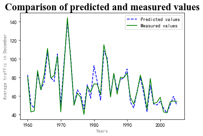
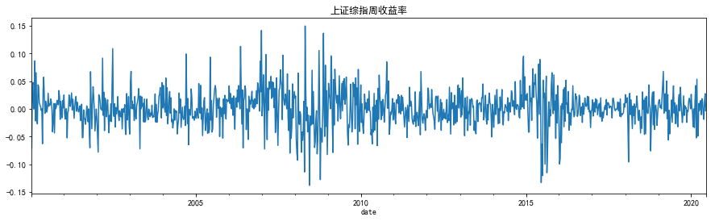
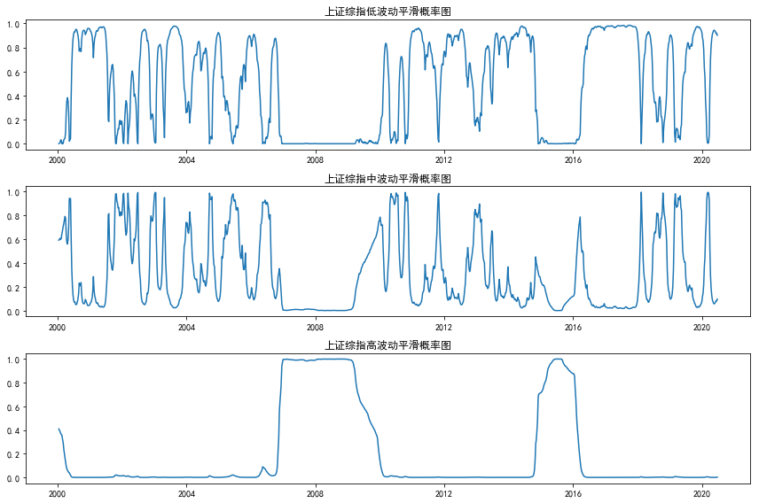
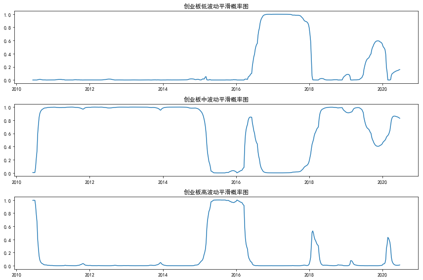
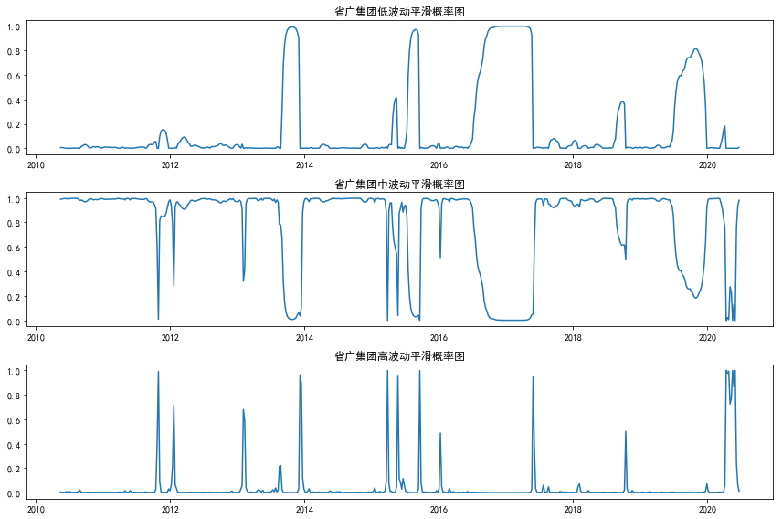

# 第十章 ARCH&GARCH

## **自回归条件异方差模型(ARCH)**

### 波动率的特征

对于金融时间序列，波动率往往具有以下特征：

（1）存在**波动率聚集**现象。 即波动率在一段时间上高，一段时间上低。

（2）波动率以连续时间变化，很少发生跳跃

（3）波动率不会发散到无穷，波动率往往是**平稳**的

（4）波动率对价格大幅上升和大幅下降的反应是不同的，这个现象为**杠杆效应**


### ARCH的基本原理

在传统计量经济学模型中，干扰项的方差被假设为常数。但是许多经济时间序列呈现出波动的集聚性，在这种情况下假设方差为常数是不恰当的。

ARCH模型将当前一切可利用信息作为条件，并采用某种自回归形式来刻划方差的变异，对于一个时间序列而言，在不同时刻可利用的信息不同，而相应的条件方差也不同，利用ARCH 模型，可以刻划出随时间而变异的条件方差。


### ARCH模型思想

1. 资产收益率序列的扰动 {![[公式]](https://www.zhihu.com/equation?tex=a_%7Bt%7D+)} 是序列不相关的，但是不独立。

2. {![[公式]](https://www.zhihu.com/equation?tex=a_%7Bt%7D+)}的不独立性可以用其延迟值的简单二次函数来描述。具体而言，一个ARCH(m)模型为：

$a_{t}=\sigma_{t} \varepsilon_{t} \sigma_{t}^{2}=\alpha_{0}+\alpha_{1} a_{t-1}^{2}+\cdots+\alpha_{m} a_{t-m}^{2} \alpha_{0}>0 ; \forall i>0, \alpha_{i} \geqslant 0$

其中，{![[公式]](https://www.zhihu.com/equation?tex=%5Cvarepsilon+_%7Bt%7D+)}为 **均值为0，方差为1的独立同分布（iid）随机变量序列。**通常假定其服从标准正态分布。![[公式]](https://www.zhihu.com/equation?tex=%5Csigma+_%7Bt%7D%5E%7B2%7D+)为条件异方差。


### ARCH模型效应

从上面模型的结构看，大的过去的平方“扰动”会导致信息![[公式]](https://www.zhihu.com/equation?tex=a_%7Bt%7D+)大的条件异方差。从而at有取绝对值较大的值的倾向。这意味着：**在ARCH的框架下，大的"扰动"会倾向于紧接着出现另一个大的"扰动"。这与波动率聚集的现象相似。**

所谓ARCH模型效应，也就是**条件异方差序列的序列相关性**


### 例1：以沪深300指数为例，考察其收益率时间的分布和统计特性。


```python
import pandas as pd
import numpy as np
import statsmodels.tsa.api as smt
#tsa为Time Series analysis缩写
import statsmodels.api as sm
import scipy.stats as scs
from arch import arch_model
#画图
import matplotlib.pyplot as plt
import tushare as ts
import matplotlib as mpl

#正常显示画图时出现的中文和负号
from pylab import mpl
mpl.rcParams['font.sans-serif']=['SimHei']
mpl.rcParams['axes.unicode_minus']=False

# 定义画图函数
def ts_plot(data, lags=None,title=''):
    if not isinstance(data, pd.Series):
        data = pd.Series(data)
    with plt.style.context('ggplot'):
        fig = plt.figure(figsize=(10, 8))
        layout = (3, 2)
        ts_ax = plt.subplot2grid(layout, (0, 0))
        acf_ax = plt.subplot2grid(layout, (1, 0))
        pacf_ax = plt.subplot2grid(layout, (1, 1))
        qq_ax = plt.subplot2grid(layout, (2, 0))
        pp_ax = plt.subplot2grid(layout, (2, 1))
        data.plot(ax=ts_ax)
        ts_ax.set_title(title+'时序图')
        smt.graphics.plot_acf(data, lags=lags,
              ax=acf_ax, alpha=0.5)
        acf_ax.set_title('自相关系数')
        smt.graphics.plot_pacf(data, lags=lags,
             ax=pacf_ax, alpha=0.5)
        pacf_ax.set_title('偏自相关系数')
        sm.qqplot(data, line='s', ax=qq_ax)
        qq_ax.set_title('QQ 图')
        scs.probplot(data, sparams=(data.mean(),
          data.std()), plot=pp_ax)
        pp_ax.set_title('PP 图')
        plt.tight_layout()
    return

# 使用tushare获取沪深300交易数据
token='此处输入个人token接口号'
pro=ts.pro_api(token)
df=pro.index_daily(ts_code='000300.SH')
df.index=pd.to_datetime(df.trade_date)
del df.index.name
df=df.sort_index()
df['ret']=np.log(df.close/df.close.shift(1))
#df.head()
ts_plot(df.ret.dropna(),lags=30,title='沪深300收益率')
```

**ARCH模型的建模步骤：**

1. 检验收益序列是否平稳，根据自相关性建立合适的均值方程，如ARMA模型，描述收益率如何随时间变化，根据拟合的模型和实际值，得到残差序列。
2. 对拟合的均值方程得到的残差序列进行ARCH效应检验，即检验收益率围绕均值的偏差是否时大时小。检验序列是否具有ARCH效应的方法有两种：Ljung-Box检验和LM检验。
3. 若ARCH效应在统计上显著，则需要再设定一个波动率模型来刻画波动率的动态变化。
4. 对均值方差和波动率方差进行联合估计，即假设实际数据服从前面设定的均值方差和波动率方差后，对均值方差和波动率方差中的参数进行估计，并得到估计的误差。
5. 对拟合的模型进行检验。如果估计结果（残差项）不满足模型本身的假设，则模型的可用性较差。


```python
# 模拟ARCH时间序列，对沪深300收益率的ARCH效应进行统计检验
np.random.seed(2)
a0 = 2
a1 = .5
y = w = np.random.normal(size=1000)
Y = np.empty_like(y)
for t in range(1,len(y)):
    Y[t] = w[t] * np.sqrt((a0 + a1*y[t-1]**2))
ts_plot(Y, lags=30,title='模拟ARCH')

def ret_plot(ts, title=''):
    ts1=ts**2
    ts2=np.abs(ts)
    with plt.style.context('ggplot'):
        fig = plt.figure(figsize=(12, 6))
        layout = (2, 1)
        ts1_ax = plt.subplot2grid(layout, (0, 0), colspan=2)
        ts2_ax = plt.subplot2grid(layout, (1, 0))
        ts1.plot(ax=ts1_ax)
        ts1_ax.set_title(title+'日收益率平方')
        ts2.plot(ax=ts2_ax)
        ts2_ax.set_title(title+'日收益率绝对值')
        plt.tight_layout()
    return

ret_plot(df.ret.dropna(), title='沪深300')

# 使用Ljung-Box统计量对收益率平方的自相关性进行统计检验
def whitenoise_test(ts):
    '''计算box pierce 和 box ljung统计量'''
    from statsmodels.stats.diagnostic import acorr_ljungbox
    q,p=acorr_ljungbox(ts)
    with plt.style.context('ggplot'):
        fig = plt.figure(figsize=(10, 4))
        axes = fig.subplots(1,2)
        axes[0].plot(q, label='Q统计量')
        axes[0].set_ylabel('Q')
        axes[1].plot(p, label='p值')
        axes[1].set_ylabel('P')
        axes[0].legend()
        axes[1].legend()
        plt.tight_layout()
    return

ret=df.ret.dropna()
whitenoise_test(ret**2)
```


## **GARCH模型与波动率预测**

虽然ARCH模型简单，但为了充分刻画收益率的波动率过程，往往需要很多参数，例如上面用到ARCH(4)模型，有时会有更高的ARCH(m)模型。因此，Bollerslev(1986)年提出了一个推广形式，称为**广义的ARCH模型（GARCH）**。另$a_{t}=r_{t}-\mu_{t}$，为t时刻的信息。若at满足下式：

$a_{t}=\sigma_{t} \varepsilon_{t} \sigma_{t}^{2}=\alpha_{0}+\sum_{i=1}^{m} \alpha_{i} a_{t-i}^{2}+\sum_{j=1}^{s} \beta_{j} \sigma_{t-j}^{2} \alpha_{0}>0 ; \forall i>0, \alpha_{i} \geqslant 0, \beta_{i} \geqslant 0,\left(\alpha_{i}+\beta_{i}\right)<1$

其中，$\varepsilon_{t}$为**均值为0，方差为1的独立同分布（iid）随机变量序列**。通常假定其服从**标准正态分布**或**标准化学生-t分布**。$\sigma_{t}^{2}$为条件异方差。则称$a_{t}$服从GARCH(m,s)模型。

### GARCH模型建立

与之前的ARCH模型建立过程类似，不过GARCH(m,s)的定阶较难，一般使用低阶模型如GARCH(1,1),GARCH(2,1),GARCH(1,2)等。实际应用中，GARCH(1,1)和GARCH(2,1)一般可以满足对自回归条件异方差的描述。下面使用Python对GARCH(1,1)模型进行模拟和估计

### 例2：模拟GARCH（1,1）过程


```python
# 模拟GARCH(1, 1) 过程
np.random.seed(1)
a0 = 0.2
a1 = 0.5
b1 = 0.3
n = 10000
w = np.random.normal(size=n)
garch = np.zeros_like(w)
sigsq = np.zeros_like(w)
for i in range(1, n):
    sigsq[i] = a0 + a1*(garch[i-1]**2) + b1*sigsq[i-1]
    garch[i] = w[i] * np.sqrt(sigsq[i])
_ = ts_plot(garch, lags=30,title='模拟GARCH')
# 使用模拟的数据进行 GARCH(1, 1) 模型拟合
#arch_model默认建立GARCH（1,1）模型
am = arch_model(garch)
res = am.fit(update_freq=0)

print(res.summary())

res.resid.plot(figsize=(12,5))
plt.title('沪深300收益率拟合GARCH(1,1)残差',size=15)
plt.show()
res.conditional_volatility.plot(figsize=(12,5),color='r')
plt.title('沪深300收益率条件方差',size=15)
plt.show()

```


# 第十一章 非线性随机过程

## 双线性模型（Bilinear Model）

称[随机序列](https://baike.baidu.com/item/随机序列)$\left\{x_{i}\right\}$ 服从双线性模型，如果：

$x_{i}=\sum_{j=1}^{p} \varphi_{j} x_{i-j}+\sum_{j=0}^{q} \theta_{j} a_{i-j}+\sum_{k=0}^{Q} \sum_{l=1}^{P} \beta_{k l} x_{i-l} a_{i-k}$

其中$a_{i}$为i.i.d.随机序列，$E a_{i}=0, E a_{i}^{2}=\sigma^{2}$，当$\beta_{k l}=0(k=0,1, \ldots, Q, l=1, \ldots, P)$

则(1)式成为ARMA（p，q）模型，因此双线性模型是线性模型的直接推广。

## 门限平滑移动自回归模型（Threshold and Smooth Transition Autoregressions）

门限自回归模型(threshold autoregressive model)，又称阈模型，简称TAR模型，它是一种[非线性模型](https://baike.baidu.com/item/非线性模型/10463547)。门限自回归模型的模型形式与分段线性模型形式非常相似。门限或阈（Threshold）的概念是指高于或低于门限值（阈值）的自回归过程不同，因此，可以捕捉到一个过程下降和上升模式中的非对称性。

### 思路及定义

TAR的基本思路：在观测时序$\left\{x_{i}\right\}$ 的取值范围内引入L-1个门限值$r_{j}=(j=1,2, \ldots, L-1)$ ，将该范围分成 L个区间，并根据延迟步数d将$\left\{x_{i}\right\}$按$\left\{x_{i-d}\right\}$值的大小分配到不同的门限区间内，再对不同区间内的$x_{i}$采用不同的自回归模型来描述，这些自回归模型的总和完成了对时序$\left\{x_{i}\right\}$整个非线性动态系统的描述。其一般形式为：

$x_{i}=\sum_{i=1}^{n_{j}} \varphi_{i}^{(j)} \alpha_{i}^{(j)}, r_{j-1}<x_{i-d} \leq r_{j}, j=1,2, \ldots, L$

其中，$r_{j}=(j=1,2, \ldots, L-1)$为门限值，L为门限期间的个数；d为延迟步数；$\left\{\alpha_{t}^{(j)}\right\}$对每一固定的j是方差为$\sigma_{t}^{2}$的白噪声系列，各$\left\{\alpha_{t}^{(j)}\right\}(j=1,2, \ldots, L-1)$之间是相互独立的；$\varphi^{(j)}$为第j个门限区间自回归系数；$n_{j}$为第j个门限区间模型的阶数。由于TAR模型实质是分区间的AR模型，建模时沿用AR模型的参数估计方法和模型检验准则，如最小二乘法与AIC准则。其建模过程实质上是一个对d，L，$r_{j}(j=1,2, \ldots, L-1), n_{j}(j=1,2, \ldots, L-1)$和$\varphi^{(j)}(j=1,2, \ldots, L-1)$ 的多维寻优问题。

### 建模步骤

1. 确实门限变量
2. 确定率定门限数L
3. 确定门限值
4. 确定回归系数的过程

为了计算方便，这里采用二分割（即L=2）说明模型的建模步骤。

### 例1：


```python
from sklearn.linear_model import LinearRegression
import pandas as pd
# 利用pandas读取csv，读取的数据为DataFrame对象
data = pd.read_csv('jl.csv')
# 将DataFrame对象转化为数组,数组的第一列为数据序号，最后一列为预报对象，中间各列为预报因子
data= data.values.copy()
# print(data)
# 计算互相关系数，参数为预报因子序列和滞时k
def get_regre_coef(X,Y,k):
    S_xy=0
    S_xx=0
    S_yy=0
    # 计算预报因子和预报对象的均值
    X_mean = np.mean(X)
    Y_mean = np.mean(Y)
    for i in  range(len(X)-k):
        S_xy += (X[i] - X_mean) * (Y[i+k] - Y_mean)
    for i in range(len(X)):
        S_xx += pow(X[i] - X_mean, 2)
        S_yy += pow(Y[i] - Y_mean, 2)
    return S_xy/pow(S_xx*S_yy,0.5)
#计算相关系数矩阵
def regre_coef_matrix(data):
    row=data.shape[1]#列数
    r_matrix=np.ones((1,row-2))
    # print(row)
    for i in range(1,row-1):
        r_matrix[0,i-1]=get_regre_coef(data[:,i],data[:,row-1],1)#滞时为1
    return r_matrix
r_matrix=regre_coef_matrix(data)
# print(r_matrix)
###输出###
#[[0.048979   0.07829989 0.19005705 0.27501209 0.28604638]]

#对相关系数进行排序找到相关系数最大者作为门限元
def get_menxiannum(r_matrix):
    row=r_matrix.shape[1]#列数
    for i in range(row):
        if r_matrix.max()==r_matrix[0,i]:
            return i+1
    return -1
m=get_menxiannum(r_matrix)
# print(m)
##输出##第五个因子的互相关系数最大

#根据门限元对因子序列进行排序,m为门限变量的序号
def resort_bymenxian(data,m):
    data=data.tolist()#转化为列表
    data.sort(key=lambda x: x[m])#列表按照m+1列进行排序(升序)
    data=np.array(data)
    return data
data=resort_bymenxian(data,m)#得到排序后的序列数组

# 将排序后的序列按照门限元分割序列为两段，第一分割第一段1个数据，第二段n-1（n为样本容量）个数据；第二次分割第一段2个数据，第二段n-2个数据，一次类推，分别计算出分割后的F统计量并选出最大统计量对应的门限元的分割点作为门限值
def get_var(x):
    return x.std() ** 2 * x.size  # 计算总方差
#统计量F的计算,输入数据为按照门限元排序后的预报对象数据
def get_F(Y):
    col=Y.shape[0]#行数，样本容量
    FF=np.ones((1,col-1))#存储不同分割点的统计量
    V=get_var(Y)#计算总方差
    for i in range(1,col):#1到col-1
        S=get_var(Y[0:i])+get_var(Y[i:col])#计算两段的组内方差和
        F=(V-S)*(col-2)/S
        FF[0,i-1]=F#此步需要判断是否通过F检验，通过了才保留F统计量
    return FF
y=data[:,data.shape[1]-1]
FF=get_F(y)
def get_index(FF,element):#获取element在一维数组FF中第一次出现的索引
    i=-1
    for item in FF.flat:
        i+=1
        if item==element:
            return i
f_index=get_index(FF,np.max(FF))#获取统计量F的最大索引
# print(data[f_index,m-1])#门限元为第五个因子，代入索引得门限值 121

# 以门限值为分割点将数据序列分割为两段，分别进行多元线性回归，此处利用sklearn.linear_model模块中的线性回归模块。再代入预报因子分别计算两段的预测值
#以门限值为分割点将新data序列分为两部分，分别进行多元回归计算
def data_excision(data,f_index):
    f_index=f_index+1
    data1=data[0:f_index,:]
    data2=data[f_index:data.shape[0],:]
    return data1,data2
data1,data2=data_excision(data,f_index)
# 第一段
def get_XY(data):
    # 数组切片对变量进行赋值
    Y = data[:, data.shape[1] - 1]  # 预报对象位于最后一列
    X = data[:, 1:data.shape[1] - 1]#预报因子从第二列到倒数第二列
    return X, Y
X,Y=get_XY(data1)
regs=LinearRegression()
regs.fit(X,Y)
# print('第一段')
# print(regs.coef_)#输出回归系数
# print(regs.score(X,Y))#输出相关系数
#计算预测值
Y1=regs.predict(X)
# print('第二段')
X,Y=get_XY(data2)
regs.fit(X,Y)
# print(regs.coef_)#输出回归系数
# print(regs.score(X,Y))#输出相关系数
#计算预测值
Y2=regs.predict(X)
Y=np.column_stack((data[:,0],np.hstack((Y1,Y2)))).copy()
Y=np.column_stack((Y,data[:,data.shape[1]-1]))
Y=resort_bymenxian(Y,0)

# 将预测值和实际值按照年份序号从新排序，恢复其顺序，利用matplotlib模块做出预测值与实际值得对比图
#恢复顺序
Y=resort_bymenxian(Y,0)
# print(Y.shape)
# 预测结果可视化
plt.plot(Y[:,0],Y[:,1],'b--',Y[:,0],Y[:,2],'g')
plt.title('Comparison of predicted and measured values',fontsize=20,fontname='Times New Roman')#添加标题
plt.xlabel('Years',color='gray')#添加x轴标签
plt.ylabel('Average traffic in December',color='gray')#添加y轴标签
plt.legend(['Predicted values','Measured values'])#添加图例
plt.show()

```




## 马尔可夫转换模型（Markov Switching Model）

时间序列建模的最简单方法是线性自回归模型。自回归模型指定输出变量线性地取决于其自身的先前值和随机项，即假定时间序列的均值和方差在所考虑的整个时间段内保持不变，但现实数据往往很难满足这样的条件。由于某些结构上的变化，时间序列可以从一个时期到下一个时期完全改变。区制转移模型（Regime shift models，简称RSM）通过将时间序列分为不同的“状态”，来解决基本时间序列建模中的不足。

作者：CuteHand
链接：https://zhuanlan.zhihu.com/p/149180436
来源：知乎
著作权归作者所有。商业转载请联系作者获得授权，非商业转载请注明出处。

### 基本思路

 时间序列存在于两个或多个状态，每个状态都有自己的概率分布，并且一个状态到另一个状态的转换由另一个过程或变量控制。区制转移模型有三种类型：阈值模型（Threshold models）、预测模型（Predictive models）和马尔科夫转换自回归模型（Markov switching autoregressive models）。

阈值模型观察到的变量超过阈值会触发状态转换。马尔科夫转换自回归模型（MSAM），假定状态为“隐藏状态”，并假定潜在状态的的转换遵循同质一阶马尔可夫链，而下一个状态的概率仅取决于当前状态。可以通过最大似然法来估计从一个状态到下一个状态的转移概率，通过使似然函数最大化来估计参数值。

### 例2：对上证综指的周收益率时间序列进行建模分析


```python
import pandas as pd
import statsmodels.api as sm
import matplotlib.pyplot as plt

#正常显示画图时出现的中文和负号
from pylab import mpl
mpl.rcParams['font.sans-serif']=['SimHei']
mpl.rcParams['axes.unicode_minus']=False
import tushare as ts
df=ts.get_k_data('sh',start='2000-01-01',end='2020-06-16')
df.index=pd.to_datetime(df.date)
df.head()
```

<div>
<style scoped>
    .dataframe tbody tr th:only-of-type {
        vertical-align: middle;
    }

<table border="1" class="dataframe">
  <thead>
    <tr style="text-align: right;">
      <th></th>
      <th>date</th>
      <th>open</th>
      <th>close</th>
      <th>high</th>
      <th>low</th>
      <th>volume</th>
      <th>code</th>
    </tr>
    <tr>
      <th>date</th>
      <th></th>
      <th></th>
      <th></th>
      <th></th>
      <th></th>
      <th></th>
      <th></th>
    </tr>
  </thead>
  <tbody>
    <tr>
      <th>2000-01-04</th>
      <td>2000-01-04</td>
      <td>1368.69</td>
      <td>1406.37</td>
      <td>1407.52</td>
      <td>1361.21</td>
      <td>9034020.0</td>
      <td>sh</td>
    </tr>
    <tr>
      <th>2000-01-05</th>
      <td>2000-01-05</td>
      <td>1407.83</td>
      <td>1409.68</td>
      <td>1433.78</td>
      <td>1398.32</td>
      <td>10580000.0</td>
      <td>sh</td>
    </tr>
    <tr>
      <th>2000-01-06</th>
      <td>2000-01-06</td>
      <td>1406.04</td>
      <td>1463.94</td>
      <td>1463.95</td>
      <td>1400.25</td>
      <td>13480500.0</td>
      <td>sh</td>
    </tr>
    <tr>
      <th>2000-01-07</th>
      <td>2000-01-07</td>
      <td>1477.15</td>
      <td>1516.60</td>
      <td>1522.82</td>
      <td>1477.15</td>
      <td>34515700.0</td>
      <td>sh</td>
    </tr>
    <tr>
      <th>2000-01-10</th>
      <td>2000-01-10</td>
      <td>1531.71</td>
      <td>1545.11</td>
      <td>1546.72</td>
      <td>1506.40</td>
      <td>31253500.0</td>
      <td>sh</td>
    </tr>
  </tbody>
</table>


对收益率数据进行建模。此外，日收益率包含的噪声较大，将其转换为周收益率在进行建模


```python
#上证综指周收益率
df_ret=df.close.resample('W').last().pct_change().dropna()
df_ret.plot(title='上证综指周收益率',figsize=(15,4))
plt.show()
```




**平稳性检验**


```python
#使用arch包中的单位根检验unitroot导入ADF
from arch.unitroot import ADF
ADF(df_ret)

#模型拟合
mod = sm.tsa.MarkovRegression(df_ret.dropna(), 
k_regimes=3, trend='nc', switching_variance=True)
 
res = mod.fit()
res.summary()
```


<table class="simpletable">
<caption>Markov Switching Model Results</caption>
<tr>
  <th>Dep. Variable:</th>         <td>close</td>      <th>  No. Observations:  </th>   <td>1067</td>   
</tr>
<tr>
  <th>Model:</th>           <td>MarkovRegression</td> <th>  Log Likelihood     </th> <td>2262.191</td> 
</tr>
<tr>
  <th>Date:</th>            <td>Tue, 11 Aug 2020</td> <th>  AIC                </th> <td>-4506.382</td>
</tr>
<tr>
  <th>Time:</th>                <td>23:52:21</td>     <th>  BIC                </th> <td>-4461.628</td>
</tr>
<tr>
  <th>Sample:</th>             <td>01-16-2000</td>    <th>  HQIC               </th> <td>-4489.426</td>
</tr>
<tr>
  <th></th>                   <td>- 06-21-2020</td>   <th>                     </th>     <td> </td>    
</tr>
<tr>
  <th>Covariance Type:</th>      <td>approx</td>      <th>                     </th>     <td> </td>    
</tr>
</table>
<table class="simpletable">
<caption>Regime 0 parameters</caption>
<tr>
     <td></td>       <th>coef</th>     <th>std err</th>      <th>z</th>      <th>P>|z|</th>  <th>[0.025</th>    <th>0.975]</th>  
</tr>
<tr>
  <th>sigma2</th> <td>    0.0003</td> <td> 4.07e-05</td> <td>    8.235</td> <td> 0.000</td> <td>    0.000</td> <td>    0.000</td>
</tr>
</table>
<table class="simpletable">
<caption>Regime 1 parameters</caption>
<tr>
     <td></td>       <th>coef</th>     <th>std err</th>      <th>z</th>      <th>P>|z|</th>  <th>[0.025</th>    <th>0.975]</th>  
</tr>
<tr>
  <th>sigma2</th> <td>    0.0012</td> <td>    0.000</td> <td>    9.557</td> <td> 0.000</td> <td>    0.001</td> <td>    0.001</td>
</tr>
</table>
<table class="simpletable">
<caption>Regime 2 parameters</caption>
<tr>
     <td></td>       <th>coef</th>     <th>std err</th>      <th>z</th>      <th>P>|z|</th>  <th>[0.025</th>    <th>0.975]</th>  
</tr>
<tr>
  <th>sigma2</th> <td>    0.0027</td> <td>    0.000</td> <td>    5.334</td> <td> 0.000</td> <td>    0.002</td> <td>    0.004</td>
</tr>
</table>
<table class="simpletable">
<caption>Regime transition parameters</caption>
<tr>
     <td></td>        <th>coef</th>     <th>std err</th>      <th>z</th>      <th>P>|z|</th>  <th>[0.025</th>    <th>0.975]</th>  
</tr>
<tr>
  <th>p[0->0]</th> <td>    0.9370</td> <td>    0.022</td> <td>   42.312</td> <td> 0.000</td> <td>    0.894</td> <td>    0.980</td>
</tr>
<tr>
  <th>p[1->0]</th> <td>    0.1029</td> <td>    0.052</td> <td>    1.965</td> <td> 0.049</td> <td>    0.000</td> <td>    0.206</td>
</tr>
<tr>
  <th>p[2->0]</th> <td> 6.929e-74</td> <td>    0.068</td> <td> 1.03e-72</td> <td> 1.000</td> <td>   -0.132</td> <td>    0.132</td>
</tr>
<tr>
  <th>p[0->1]</th> <td>    0.0604</td> <td>    0.007</td> <td>    8.350</td> <td> 0.000</td> <td>    0.046</td> <td>    0.075</td>
</tr>
<tr>
  <th>p[1->1]</th> <td>    0.8925</td> <td>    0.025</td> <td>   36.046</td> <td> 0.000</td> <td>    0.844</td> <td>    0.941</td>
</tr>
<tr>
  <th>p[2->1]</th> <td>    0.0127</td> <td>    0.042</td> <td>    0.300</td> <td> 0.764</td> <td>   -0.070</td> <td>    0.096</td>
</tr>
</table><br/><br/>

**对上证综指波动性状态的平滑概率进行可视化**


```python
fig, axes = plt.subplots(3, figsize=(12,8))
ax = axes[0]
ax.plot(res.smoothed_marginal_probabilities[0])
ax.set(title='上证综指低波动平滑概率图')
ax = axes[1]
ax.plot(res.smoothed_marginal_probabilities[1])
ax.set(title='上证综指中波动平滑概率图')
ax = axes[2]
ax.plot(res.smoothed_marginal_probabilities[2])
ax.set(title='上证综指高波动平滑概率图')
fig.tight_layout()
```




**具体情况**


```python
# 为了分析更多的指数或个股，下面将上述分析过程使用函数表示
def plot_rsm(code,title,start='2010-01-01',end='2020-06-17'):
    df=ts.get_k_data(code,start=start,end=end)
    df.index=pd.to_datetime(df.date)
    df_ret=df.close.resample('w').last().pct_change().dropna()
    #模型拟合
    mod = sm.tsa.MarkovRegression(df_ret.dropna(), k_regimes=3, trend='nc', switching_variance=True)
    res = mod.fit()
    fig, axes = plt.subplots(3, figsize=(12,8))
    ax = axes[0]
    ax.plot(res.smoothed_marginal_probabilities[0])
    ax.set(title=title+'低波动平滑概率图')
    ax = axes[1]
    ax.plot(res.smoothed_marginal_probabilities[1])
    ax.set(title=title+'中波动平滑概率图')
    ax = axes[2]
    ax.plot(res.smoothed_marginal_probabilities[2])
    ax.set(title=title+'高波动平滑概率图')
    fig.tight_layout()
    
plot_rsm('cyb','创业板')
plot_rsm('002400','省广集团')
```







## 非线性检测（BDS Test）

但是一个变量到底应该建立线性模型还是应该建立非线性模型，需要有相应的检验标准来判断序列的性质。

它们可以大致分成两类：一类是混合检验，另一类检验是针对某些特定的备择假设模型所设计的。

（1）混合检验，即没有指定的备择假设模型，主要是检验对线性模型的偏离。关于混合检验，早期的有Ramsey (1969)提出的基于拉格朗日乘子原理的RESET检验、McLeod和Li (1983)关于模型残差ARCH效应的检验以及Broock和Scheinkman等(1996)提出的检验残差独立性的**BDS检验**。

（2）针对某些特定的备择假设模型所设计的检验。关于这类检验，备择假设模型可以是平滑转移自回归模型((STAR)或门限自回归模型(TAR)等。例如，Terasvirta (1994)研究了用Taylor展开式对LSTAR和ESTAR模型效应进行检验的方法。

### 例3：bds检验函数


```python
import numpy as np
from scipy import stats
from statsmodels.tools.validation import array_like

def distance_indicators(x, epsilon=None, distance=1.5):
    x = array_like(x, 'x')

    if epsilon is not None and epsilon <= 0:
        raise ValueError("Threshold distance must be positive if specified."
                         " Got epsilon of %f" % epsilon)
    if distance <= 0:
        raise ValueError("Threshold distance must be positive."
                         " Got distance multiplier %f" % distance)
    if epsilon is None:
        epsilon = distance * x.std(ddof=1)

    return np.abs(x[:, None] - x) < epsilon


def correlation_sum(indicators, embedding_dim):
    if not indicators.ndim == 2:
        raise ValueError('Indicators must be a matrix')
    if not indicators.shape[0] == indicators.shape[1]:
        raise ValueError('Indicator matrix must be symmetric (square)')

    if embedding_dim == 1:
        indicators_joint = indicators
    else:
        corrsum, indicators = correlation_sum(indicators, embedding_dim - 1)
        indicators_joint = indicators[1:, 1:]*indicators[:-1, :-1]

    nobs = len(indicators_joint)
    corrsum = np.mean(indicators_joint[np.triu_indices(nobs, 1)])
    return corrsum, indicators_joint


def correlation_sums(indicators, max_dim):
    corrsums = np.zeros((1, max_dim))

    corrsums[0, 0], indicators = correlation_sum(indicators, 1)
    for i in range(1, max_dim):
        corrsums[0, i], indicators = correlation_sum(indicators, 2)

    return corrsums

def _var(indicators, max_dim):
   
    nobs = len(indicators)
    corrsum_1dim, _ = correlation_sum(indicators, 1)
    k = ((indicators.sum(1)**2).sum() - 3*indicators.sum() +
         2*nobs) / (nobs * (nobs - 1) * (nobs - 2))

    variances = np.zeros((1, max_dim - 1))

    for embedding_dim in range(2, max_dim + 1):
        tmp = 0
        for j in range(1, embedding_dim):
            tmp += (k**(embedding_dim - j))*(corrsum_1dim**(2 * j))
        variances[0, embedding_dim-2] = 4 * (
            k**embedding_dim +
            2 * tmp +
            ((embedding_dim - 1)**2) * (corrsum_1dim**(2 * embedding_dim)) -
            (embedding_dim**2) * k * (corrsum_1dim**(2 * embedding_dim - 2)))

    return variances, k

# 定义bds函数，非线性检验
def bds(x, max_dim=2, epsilon=None, distance=1.5):
    x = array_like(x, 'x', ndim=1)
    nobs_full = len(x)

    if max_dim < 2 or max_dim >= nobs_full:
        raise ValueError("Maximum embedding dimension must be in the range"
                         " [2,len(x)-1]. Got %d." % max_dim)

    indicators = distance_indicators(x, epsilon, distance)
    corrsum_mdims = correlation_sums(indicators, max_dim)

    variances, k = _var(indicators, max_dim)
    stddevs = np.sqrt(variances)

    bds_stats = np.zeros((1, max_dim - 1))
    pvalues = np.zeros((1, max_dim - 1))
    for embedding_dim in range(2, max_dim+1):
        ninitial = (embedding_dim - 1)
        nobs = nobs_full - ninitial

        corrsum_1dim, _ = correlation_sum(indicators[ninitial:, ninitial:], 1)
        corrsum_mdim = corrsum_mdims[0, embedding_dim - 1]

        effect = corrsum_mdim - (corrsum_1dim**embedding_dim)
        sd = stddevs[0, embedding_dim - 2]

        bds_stats[0, embedding_dim - 2] = np.sqrt(nobs) * effect / sd

        pvalue = 2*stats.norm.sf(np.abs(bds_stats[0, embedding_dim - 2]))
        pvalues[0, embedding_dim - 2] = pvalue

    return np.squeeze(bds_stats), np.squeeze(pvalues)
```


