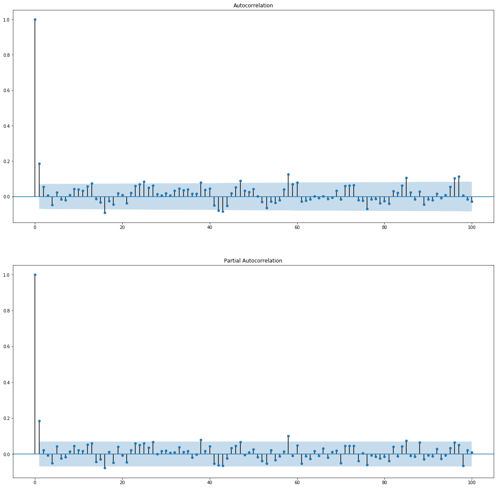
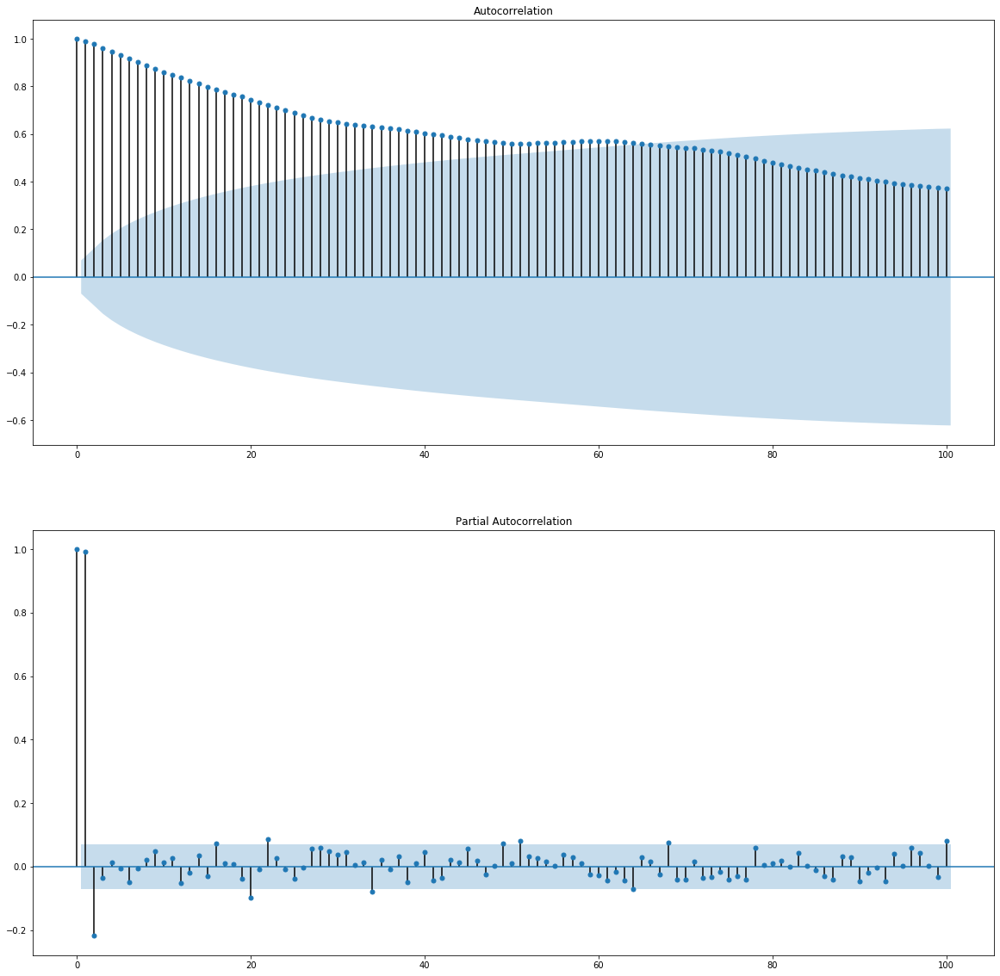
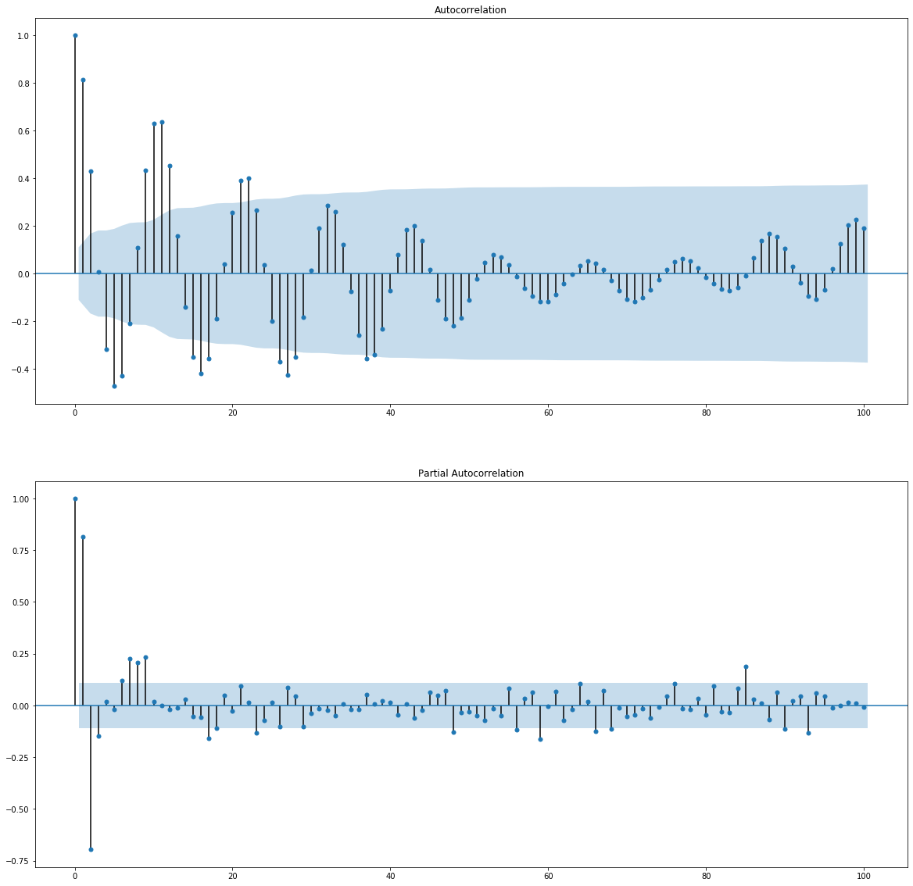

# 第三章

### example 3.1


```python
from statsmodels.tsa.arima_model import ARMA
from datetime import datetime
from itertools import product
import pandas as pd
import numpy as np
from statsmodels.tsa.stattools import acf,pacf
from statsmodels.graphics.tsaplots import plot_acf, plot_pacf
import matplotlib.pyplot as plt

#读取NAO的数据
df = pd.read_excel('nao.xlsx')
data1=df.iloc[3:]
data=data1['Unnamed: 1'].tolist()
data=np.array(data)
# 求出序列的ACF and PACF
lag_acf = acf(data, nlags=20)
lag_pacf = pacf(data, nlags=20, method='ols')
fig, axes = plt.subplots(2,1, figsize=(20,20))
plot_acf(data, lags=100, ax=axes[0])
plot_pacf(data, lags=100, ax=axes[1])
plt.show()
##这里定阶p和q都是1
##编写AR(1)模型
order = (1,0)
tempModel = ARMA(data,order).fit(ic='aic', method='mle', trend='nc')
print(tempModel.summary())
##进行R2检验
delta = tempModel.fittedvalues - data # 残差
score = 1 - delta.var()/data.var()
print(score)
#这里编写MA(1)
order2 = (0,1)
tempModel2 = ARMA(data,order2).fit(ic='aic', method='mle', trend='nc')
print(tempModel.summary())
##进行R2检验
delta2 = tempModel2.fittedvalues - data # 残差
score2 = 1 - delta2.var()/data.var()
print(score2)
```





                                  ARMA Model Results                              
    ==============================================================================
    Dep. Variable:                      y   No. Observations:                  815
    Model:                     ARMA(1, 0)   Log Likelihood               -1151.312
    Method:                           mle   S.D. of innovations              0.994
    Date:                Fri, 14 Aug 2020   AIC                           2306.625
    Time:                        15:57:30   BIC                           2316.031
    Sample:                             0   HQIC                          2310.235
                                                                                  
    ==============================================================================
                     coef    std err          z      P>|z|      [0.025      0.975]
    ------------------------------------------------------------------------------
    ar.L1.y        0.1860      0.034      5.404      0.000       0.119       0.253
                                        Roots                                    
    =============================================================================
                      Real          Imaginary           Modulus         Frequency
    -----------------------------------------------------------------------------
    AR.1            5.3771           +0.0000j            5.3771            0.0000
    -----------------------------------------------------------------------------
    0.03454268126958926
                                  ARMA Model Results                              
    ==============================================================================
    Dep. Variable:                      y   No. Observations:                  815
    Model:                     ARMA(1, 0)   Log Likelihood               -1151.312
    Method:                           mle   S.D. of innovations              0.994
    Date:                Fri, 14 Aug 2020   AIC                           2306.625
    Time:                        15:57:30   BIC                           2316.031
    Sample:                             0   HQIC                          2310.235
                                                                                  
    ==============================================================================
                     coef    std err          z      P>|z|      [0.025      0.975]
    ------------------------------------------------------------------------------
    ar.L1.y        0.1860      0.034      5.404      0.000       0.119       0.253
                                        Roots                                    
    =============================================================================
                      Real          Imaginary           Modulus         Frequency
    -----------------------------------------------------------------------------
    AR.1            5.3771           +0.0000j            5.3771            0.0000
    -----------------------------------------------------------------------------
    0.03222459882982298
    

### example 3.2


```python
df = pd.read_excel('interest_rates.xlsx')
data1=df.iloc[3:788]
data=data1['Unnamed: 1'].tolist()
data=np.array(data)
print(data)
# 求出序列的ACF and PACF
lag_acf = acf(data, nlags=20)
lag_pacf = pacf(data, nlags=20, method='ols')
fig, axes = plt.subplots(2,1, figsize=(20,20))
plot_acf(data, lags=100, ax=axes[0])
plot_pacf(data, lags=100, ax=axes[1])
plt.show()
##这里定阶p和q都是1
##编写AR(1)模型
order = (1,0)
tempModel = ARMA(data,order).fit(ic='aic', method='mle', trend='nc')
print(tempModel.summary())
##进行R2检验
delta = tempModel.fittedvalues - data # 残差
score = 1 - delta.var()/data.var()
print(score)
```

    [ 1.02825     2.36504167  2.3175      2.35083333  2.45183333  2.46616667
      2.46841667  2.48558333  2.415125    2.389875    2.41816667  2.39604167
      2.40104167  2.40083333  2.3835      2.36670833  2.365625    2.34858333
      2.334375    2.13354167  2.097375    2.09770833  2.13058333  2.096
      2.06404167  2.11508333  2.04733333  1.713875    1.60616667  1.56166667
      1.61329167  1.62108333  1.58766667  1.63779167  1.86591667  2.35641667
      3.81        3.797       3.906       3.937       3.969       3.971
      4.005       4.072       4.071       4.104       4.072       4.071
      5.218       5.165       5.008       4.955       5.136       4.977
      4.027       5.091       4.991       5.02        4.858       4.553
      4.148       4.099       3.914       3.921       3.854       3.845
      4.121       6.605       6.603       6.459       6.375       6.127
      6.014       5.523       5.179       4.816       4.294       4.159
      3.76        3.625       3.584       3.305       3.152       3.107
      3.276       3.287       3.283       3.382       3.452       3.484
      3.488       3.472       3.386       3.4         3.687       4.538
      4.554       4.621       4.652       4.556       5.681       5.546
      5.588       5.565       5.09        4.639       4.349       4.165
      4.399       4.485       4.407       4.436       4.537       6.688
      6.7         6.552       5.727       5.389       5.403       5.242
      5.531       4.405       4.052       3.816       3.921       3.887
      3.752       3.635       3.858       3.689       3.717       3.491
      3.426       3.756       3.709       3.635       3.702       3.761
      3.723       3.674       3.745       3.739       3.721       3.758
      4.307       4.302       4.302       4.384       4.464       4.654
      4.656       4.703       4.698       6.63        6.627       6.543
      6.442       6.549       6.375       6.364       5.542       5.63
      5.559       5.559       5.44        5.395       5.521       5.483
      5.62        5.604       5.638       5.659       5.728       6.679
      6.726       6.747       6.513       6.738       6.527       6.08
      6.035       5.495       5.412       5.248       5.275       5.345
      5.291       5.475       5.726       7.553       7.484       7.52
      7.374       7.108       7.08        7.241       7.242       7.059
      6.945       6.577       6.493       6.789       6.777       6.728
      7.711       7.782       7.798       7.85        7.88        7.83
      7.79        7.811       7.743       7.738       7.65        7.55
      7.6         7.27        6.94        6.19        6.87        6.85
      6.82        6.82        6.81        6.81        6.82        6.79
      6.75        6.66        5.92        5.65        5.59        5.57
      5.75        4.83        4.63        4.48        4.36        4.36
      4.37        4.34        4.3         4.27        5.21        5.6
      5.79        6.44        6.74        6.88        7.76        8.21
      8.08        8.07        7.67        7.33        7.06        8.27
     10.91       10.97       10.77       11.73       12.46       12.09
     11.92       11.95       11.52       11.36       11.23       11.2
     11.24       11.06       10.93       10.98       10.99       10.59
      9.88        9.5         9.26        9.47        9.43        9.71
     10.43       10.36       11.42       11.1        10.82        9.99
      8.76        8.46        9.06       10.44       10.96       10.87
     10.88       12.05       14.         14.14       13.78       12.73
     11.02        9.92        8.24        7.4         7.45        7.43
      6.54        5.68        4.53        4.96        6.37        5.81
      5.96        5.93        6.73        8.4         9.17        9.22
      8.9         8.98        9.86       11.51       11.57       11.86
     12.63       11.35       11.32       11.35       12.57       13.32
     13.32       13.38       13.38       15.33       15.9        15.79
     16.14       16.18       16.17       16.09       15.8        14.55
     14.86       14.4        14.29       13.95       13.07       12.82
     12.09       11.53       11.33       11.35       12.09       13.15
     13.42       13.96       15.55       14.08       14.51       14.16
     13.3        12.48       12.89       12.53       12.23       11.28
     10.08        9.91        8.91        9.22        9.96       10.59
     10.74       10.47        9.84        9.7         9.47        9.37
      9.34        9.16        8.84        8.84        8.87        8.87
      8.85        8.43        8.38        8.82        8.86       10.97
     10.21       10.02        9.85        9.23        9.1        10.55
     12.69       12.93       11.93       11.94       11.89       11.39
     10.96       11.06       11.05       11.11       11.15       11.98
     12.02       11.06        9.99        9.7         9.32        9.45
      9.39        9.61       10.25       10.63       10.66       10.52
     10.29        9.35        9.43        8.46        8.54        8.84
      9.79        9.69        9.45        8.43        8.19        8.37
      8.79        8.27        7.74        7.54        8.88       10.05
     11.13       11.53       11.54       12.07       12.54       12.45
     12.39       12.41       12.47       12.54       13.59       13.29
     13.32       13.44       14.46       14.45       14.5        14.5
     14.45       14.57       14.59       14.5        14.38       14.32
     14.31       14.26       13.37       12.92       12.96       13.
     12.39       11.64       11.25       10.84       10.72       10.52
     10.2         9.66        9.86        9.98       10.1         9.97
      9.8        10.1         9.97        9.43        9.42        9.43
      9.65        9.16        7.47        6.49        6.39        6.05
      5.37        5.38        5.33        5.3         5.19        5.13
      5.06        5.17        5.15        4.95        4.87        4.89
      4.76        4.83        4.88        4.81        4.88        5.09
      5.34        5.39        5.44        5.63        5.87        5.93
      6.16        6.09        6.3         6.2         6.37        6.62
      6.59        6.52        6.53        6.38        6.22        6.01
      5.93        5.8         5.79        5.83        5.53        5.51
      5.51        5.55        5.63        6.13        6.16        5.93
      5.76        6.04        6.13        6.21        6.42        6.64
      6.92        6.9         6.9         7.13        7.01        6.73
      6.97        7.09        7.          7.06        7.36        7.17
      7.24        6.75        6.56        6.24        5.56        5.29
      5.01        4.83        4.88        4.88        4.66        4.82
      4.8         5.14        5.22        5.18        5.6         5.75
      5.83        5.83        5.95        5.94        5.83        5.83
      5.8         5.75        5.71        5.72        5.69        5.57
      5.46        5.29        5.11        5.02        5.1         5.04
      4.71        4.33        4.16        3.81        3.87        3.9
      3.91        4.04        3.98        4.04        3.97        3.75
      3.86        3.81        3.73        3.86        3.92        3.79
      3.49        3.51        3.47        3.44        3.5         3.32
      3.53        3.59        3.81        3.86        3.9         4.
      4.11        4.24        4.31        4.54        4.65        4.8
      4.77        4.73        4.73        4.69        4.75        4.71
      4.79        4.82        4.75        4.7         4.57        4.48
      4.43        4.45        4.47        4.46        4.48        4.45
      4.44        4.47        4.5         4.56        4.59        4.63
      4.82        4.93        5.04        5.11        5.17        5.44
      5.39        5.42        5.54        5.67        5.79        5.83
      5.83        5.72        5.65        5.51        5.31        5.07
      5.43        4.83        4.61        5.06        5.24        5.15
      4.99        4.56        3.51        1.69        1.24        0.91
      0.66        0.62        0.57        0.53        0.5         0.44
      0.38        0.39        0.46        0.46        0.49        0.49
      0.48        0.51        0.5         0.5         0.49        0.5
      0.49        0.5         0.51        0.49        0.49        0.51
      0.54        0.56        0.57        0.53        0.52        0.5
      0.45        0.46        0.46        0.44        0.3         0.32
      0.39        0.42        0.42        0.36        0.34        0.29
      0.24        0.25        0.24        0.22        0.25        0.27
      0.31        0.34        0.34        0.31        0.31        0.31
      0.28        0.29        0.31        0.29        0.26        0.32
      0.36        0.39        0.37        0.28        0.36        0.43
      0.4         0.44        0.4         0.41        0.41        0.38
      0.34        0.43        0.43        0.45        0.47        0.49
      0.46        0.45        0.48        0.48        0.46        0.48
      0.47        0.45        0.45        0.44        0.4         0.37
      0.23        0.21        0.17        0.14        0.05        0.14
      0.11        0.02        0.07        0.06        0.08      ]
    





                                  ARMA Model Results                              
    ==============================================================================
    Dep. Variable:                      y   No. Observations:                  785
    Model:                     ARMA(1, 0)   Log Likelihood                -498.259
    Method:                           mle   S.D. of innovations              0.455
    Date:                Thu, 13 Aug 2020   AIC                           1000.519
    Time:                        13:24:35   BIC                           1009.850
    Sample:                             0   HQIC                          1004.107
                                                                                  
    ==============================================================================
                     coef    std err          z      P>|z|      [0.025      0.975]
    ------------------------------------------------------------------------------
    ar.L1.y        0.9972      0.002    512.190      0.000       0.993       1.001
                                        Roots                                    
    =============================================================================
                      Real          Imaginary           Modulus         Frequency
    -----------------------------------------------------------------------------
    AR.1            1.0028           +0.0000j            1.0028            0.0000
    -----------------------------------------------------------------------------
    0.985893989308828
    

### example 3.3


```python
#读取sunspots的数据
df = pd.read_excel('sunspots.xlsx')
data1=df.iloc[3:321]
data=data1['Unnamed: 1'].tolist()
data=np.array(data)
print(data)
# 求出序列的ACF and PACF
lag_acf = acf(data, nlags=20)
lag_pacf = pacf(data, nlags=20, method='ols')
fig, axes = plt.subplots(2,1, figsize=(20,20))
plot_acf(data, lags=100, ax=axes[0])
plot_pacf(data, lags=100, ax=axes[1])
plt.show()
##这里定阶p和q都是1
##编写AR(9)模型
order = (9,0)
tempModel = ARMA(data,order).fit(ic='aic', method='mle', trend='nc')
print(tempModel.summary())
##进行R2检验
delta = tempModel.fittedvalues - data # 残差
score = 1 - delta.var()/data.var()
print(score)
##编写AR(2)模型
order = (2,0)
tempModel = ARMA(data,order).fit(ic='aic', method='mle', trend='nc')
print(tempModel.summary())
##进行R2检验
delta = tempModel.fittedvalues - data # 残差
score = 1 - delta.var()/data.var()
print(score)
```

    [ 18.3  26.7  38.3  60.   96.7  48.3  33.3  16.7  13.3   5.    0.    0.
       3.3  18.3  45.   78.3 105.  100.   65.   46.7  43.3  36.7  18.3  35.
      66.7 130.  203.3 171.7 121.7  78.3  58.3  18.3   8.3  26.7  56.7 116.7
     135.  185.  168.3 121.7  66.7  33.3  26.7   8.3  18.3  36.7  66.7 100.
     134.8 139.   79.5  79.7  51.2  20.3  16.   17.   54.   79.3  90.  104.8
     143.2 102.   75.2  60.7  34.8  19.   63.  116.3 176.8 168.  136.  110.8
      58.   51.   11.7  33.  154.2 257.3 209.8 141.3 113.5  64.2  38.   17.
      40.2 138.2 220.  218.2 196.8 149.8 111.  100.   78.2  68.3  35.5  26.7
      10.7   6.8  11.3  24.2  56.7  75.   71.8  79.2  70.3  46.8  16.8  13.5
       4.2   0.    2.3   8.3  20.3  23.2  59.   76.3  68.3  52.9  38.5  24.2
       9.2   6.3   2.2  11.4  28.2  59.9  83.  108.5 115.2 117.4  80.8  44.3
      13.4  19.5  85.8 192.7 227.3 168.7 143.  105.5  63.3  40.3  18.1  25.1
      65.8 102.7 166.3 208.3 182.5 126.3 122.  102.7  74.1  39.   12.7   8.2
      43.4 104.4 178.3 182.2 146.6 112.1  83.5  89.2  57.8  30.7  13.9  62.8
     123.6 232.  185.3 169.2 110.1  74.5  28.3  18.9  20.7   5.7  10.   53.7
      90.5  99.  106.1 105.8  86.3  42.4  21.8  11.2  10.4  11.8  59.5 121.7
     142.  130.  106.6  69.4  43.8  44.4  20.2  15.7   4.6   8.5  40.8  70.1
     105.5  90.1 102.8  80.9  73.2  30.9   9.5   6.    2.4  16.1  79.   95.
     173.6 134.6 105.7  62.7  43.5  23.7   9.7  27.9  74.  106.5 114.7 129.7
     108.2  59.4  35.1  18.6   9.2  14.6  60.2 132.8 190.6 182.6 148.  113.
      79.2  50.8  27.1  16.1  55.3 154.3 214.7 193.  190.7 118.9  98.3  45.
      20.1   6.6  54.2 200.7 269.3 261.7 225.1 159.   76.4  53.4  39.9  15.
      22.   66.8 132.9 150.  149.4 148.   94.4  97.6  54.1  49.2  22.5  18.4
      39.3 131.  220.1 218.9 198.9 162.4  91.   60.5  20.6  14.8  33.9 123.
     211.1 191.8 203.3 133.   76.1  44.9  25.1  11.6  28.9  88.3 136.3 173.9
     170.4 163.6  99.3  65.3  45.8  24.7  12.6   4.2   4.8  24.9  80.8  84.5
      94.  113.3  69.8  39.8  21.7]
    





                                  ARMA Model Results                              
    ==============================================================================
    Dep. Variable:                      y   No. Observations:                  317
    Model:                     ARMA(9, 0)   Log Likelihood               -1456.982
    Method:                           mle   S.D. of innovations             23.777
    Date:                Thu, 13 Aug 2020   AIC                           2933.965
    Time:                        13:25:27   BIC                           2971.554
    Sample:                             0   HQIC                          2948.980
                                                                                  
    ==============================================================================
                     coef    std err          z      P>|z|      [0.025      0.975]
    ------------------------------------------------------------------------------
    ar.L1.y        1.1929      0.054     22.016      0.000       1.087       1.299
    ar.L2.y       -0.4067      0.086     -4.724      0.000      -0.575      -0.238
    ar.L3.y       -0.1238      0.089     -1.389      0.166      -0.298       0.051
    ar.L4.y        0.1188      0.090      1.320      0.188      -0.058       0.295
    ar.L5.y       -0.0593      0.091     -0.650      0.516      -0.238       0.119
    ar.L6.y        0.0227      0.091      0.250      0.803      -0.156       0.201
    ar.L7.y        0.0340      0.091      0.373      0.709      -0.144       0.212
    ar.L8.y       -0.0536      0.088     -0.609      0.543      -0.226       0.119
    ar.L9.y        0.2550      0.055      4.661      0.000       0.148       0.362
                                        Roots                                    
    =============================================================================
                      Real          Imaginary           Modulus         Frequency
    -----------------------------------------------------------------------------
    AR.1            1.0079           -0.0000j            1.0079           -0.0000
    AR.2            0.8499           -0.5756j            1.0265           -0.0948
    AR.3            0.8499           +0.5756j            1.0265            0.0948
    AR.4            0.4154           -1.0894j            1.1659           -0.1920
    AR.5            0.4154           +1.0894j            1.1659            0.1920
    AR.6           -1.1962           -0.4580j            1.2809           -0.4418
    AR.7           -1.1962           +0.4580j            1.2809            0.4418
    AR.8           -0.4680           -1.1985j            1.2866           -0.3093
    AR.9           -0.4680           +1.1985j            1.2866            0.3093
    -----------------------------------------------------------------------------
    0.8517151228852998
                                  ARMA Model Results                              
    ==============================================================================
    Dep. Variable:                      y   No. Observations:                  317
    Model:                     ARMA(2, 0)   Log Likelihood               -1525.319
    Method:                           mle   S.D. of innovations             29.615
    Date:                Thu, 13 Aug 2020   AIC                           3056.638
    Time:                        13:25:28   BIC                           3067.915
    Sample:                             0   HQIC                          3061.143
                                                                                  
    ==============================================================================
                     coef    std err          z      P>|z|      [0.025      0.975]
    ------------------------------------------------------------------------------
    ar.L1.y        1.4793      0.045     32.914      0.000       1.391       1.567
    ar.L2.y       -0.5907      0.045    -13.149      0.000      -0.679      -0.503
                                        Roots                                    
    =============================================================================
                      Real          Imaginary           Modulus         Frequency
    -----------------------------------------------------------------------------
    AR.1            1.2521           -0.3537j            1.3011           -0.0438
    AR.2            1.2521           +0.3537j            1.3011            0.0438
    -----------------------------------------------------------------------------
    0.7910567584643853
    
