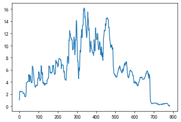
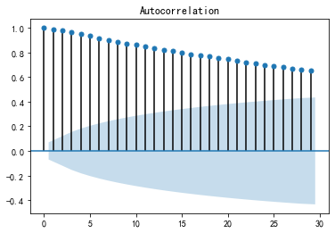
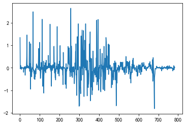
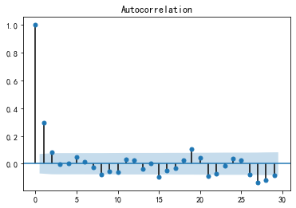
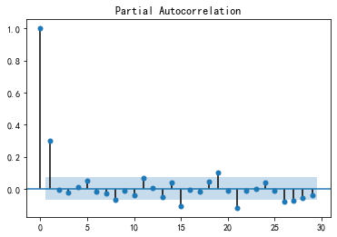
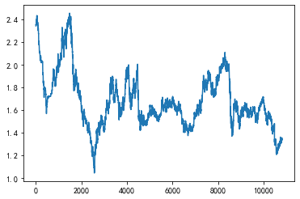
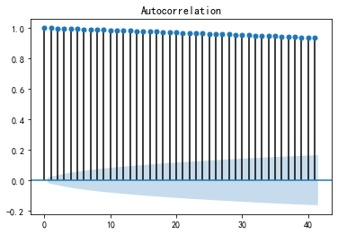
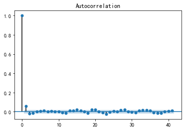
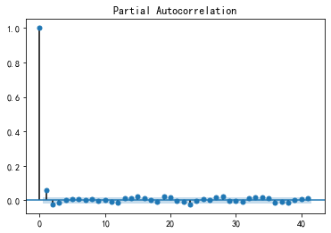
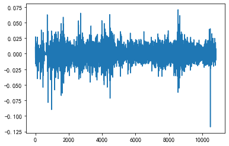

## 第四章

### example 4.1


```python
import pandas as pd
import numpy as np
import matplotlib.pyplot as plt
from statsmodels.tsa.arima_model import ARIMA
```


```python
##这里开始读取数据
df = pd.read_excel('interest_rates.xlsx')
data1=df.iloc[3:788]
data=data1['Unnamed: 1'].tolist()
data=np.array(data)
print(data)
#画出时序图
plt.rcParams['font.sans-serif'] = ['SimHei']    #定义使其正常显示中文字体黑体
plt.rcParams['axes.unicode_minus'] = False      #用来正常显示表示负号
plt.plot(data)
plt.show()
#画出自相关性图
from statsmodels.graphics.tsaplots import plot_acf, plot_pacf
plot_acf(data)
plt.show()
```

    [ 1.02825     2.36504167  2.3175      2.35083333  2.45183333  2.46616667
      2.46841667  2.48558333  2.415125    2.389875    2.41816667  2.39604167
      2.40104167  2.40083333  2.3835      2.36670833  2.365625    2.34858333
      2.334375    2.13354167  2.097375    2.09770833  2.13058333  2.096
      2.06404167  2.11508333  2.04733333  1.713875    1.60616667  1.56166667
      1.61329167  1.62108333  1.58766667  1.63779167  1.86591667  2.35641667
      3.81        3.797       3.906       3.937       3.969       3.971
      4.005       4.072       4.071       4.104       4.072       4.071
      5.218       5.165       5.008       4.955       5.136       4.977
      4.027       5.091       4.991       5.02        4.858       4.553
      4.148       4.099       3.914       3.921       3.854       3.845
      4.121       6.605       6.603       6.459       6.375       6.127
      6.014       5.523       5.179       4.816       4.294       4.159
      3.76        3.625       3.584       3.305       3.152       3.107
      3.276       3.287       3.283       3.382       3.452       3.484
      3.488       3.472       3.386       3.4         3.687       4.538
      4.554       4.621       4.652       4.556       5.681       5.546
      5.588       5.565       5.09        4.639       4.349       4.165
      4.399       4.485       4.407       4.436       4.537       6.688
      6.7         6.552       5.727       5.389       5.403       5.242
      5.531       4.405       4.052       3.816       3.921       3.887
      3.752       3.635       3.858       3.689       3.717       3.491
      3.426       3.756       3.709       3.635       3.702       3.761
      3.723       3.674       3.745       3.739       3.721       3.758
      4.307       4.302       4.302       4.384       4.464       4.654
      4.656       4.703       4.698       6.63        6.627       6.543
      6.442       6.549       6.375       6.364       5.542       5.63
      5.559       5.559       5.44        5.395       5.521       5.483
      5.62        5.604       5.638       5.659       5.728       6.679
      6.726       6.747       6.513       6.738       6.527       6.08
      6.035       5.495       5.412       5.248       5.275       5.345
      5.291       5.475       5.726       7.553       7.484       7.52
      7.374       7.108       7.08        7.241       7.242       7.059
      6.945       6.577       6.493       6.789       6.777       6.728
      7.711       7.782       7.798       7.85        7.88        7.83
      7.79        7.811       7.743       7.738       7.65        7.55
      7.6         7.27        6.94        6.19        6.87        6.85
      6.82        6.82        6.81        6.81        6.82        6.79
      6.75        6.66        5.92        5.65        5.59        5.57
      5.75        4.83        4.63        4.48        4.36        4.36
      4.37        4.34        4.3         4.27        5.21        5.6
      5.79        6.44        6.74        6.88        7.76        8.21
      8.08        8.07        7.67        7.33        7.06        8.27
     10.91       10.97       10.77       11.73       12.46       12.09
     11.92       11.95       11.52       11.36       11.23       11.2
     11.24       11.06       10.93       10.98       10.99       10.59
      9.88        9.5         9.26        9.47        9.43        9.71
     10.43       10.36       11.42       11.1        10.82        9.99
      8.76        8.46        9.06       10.44       10.96       10.87
     10.88       12.05       14.         14.14       13.78       12.73
     11.02        9.92        8.24        7.4         7.45        7.43
      6.54        5.68        4.53        4.96        6.37        5.81
      5.96        5.93        6.73        8.4         9.17        9.22
      8.9         8.98        9.86       11.51       11.57       11.86
     12.63       11.35       11.32       11.35       12.57       13.32
     13.32       13.38       13.38       15.33       15.9        15.79
     16.14       16.18       16.17       16.09       15.8        14.55
     14.86       14.4        14.29       13.95       13.07       12.82
     12.09       11.53       11.33       11.35       12.09       13.15
     13.42       13.96       15.55       14.08       14.51       14.16
     13.3        12.48       12.89       12.53       12.23       11.28
     10.08        9.91        8.91        9.22        9.96       10.59
     10.74       10.47        9.84        9.7         9.47        9.37
      9.34        9.16        8.84        8.84        8.87        8.87
      8.85        8.43        8.38        8.82        8.86       10.97
     10.21       10.02        9.85        9.23        9.1        10.55
     12.69       12.93       11.93       11.94       11.89       11.39
     10.96       11.06       11.05       11.11       11.15       11.98
     12.02       11.06        9.99        9.7         9.32        9.45
      9.39        9.61       10.25       10.63       10.66       10.52
     10.29        9.35        9.43        8.46        8.54        8.84
      9.79        9.69        9.45        8.43        8.19        8.37
      8.79        8.27        7.74        7.54        8.88       10.05
     11.13       11.53       11.54       12.07       12.54       12.45
     12.39       12.41       12.47       12.54       13.59       13.29
     13.32       13.44       14.46       14.45       14.5        14.5
     14.45       14.57       14.59       14.5        14.38       14.32
     14.31       14.26       13.37       12.92       12.96       13.
     12.39       11.64       11.25       10.84       10.72       10.52
     10.2         9.66        9.86        9.98       10.1         9.97
      9.8        10.1         9.97        9.43        9.42        9.43
      9.65        9.16        7.47        6.49        6.39        6.05
      5.37        5.38        5.33        5.3         5.19        5.13
      5.06        5.17        5.15        4.95        4.87        4.89
      4.76        4.83        4.88        4.81        4.88        5.09
      5.34        5.39        5.44        5.63        5.87        5.93
      6.16        6.09        6.3         6.2         6.37        6.62
      6.59        6.52        6.53        6.38        6.22        6.01
      5.93        5.8         5.79        5.83        5.53        5.51
      5.51        5.55        5.63        6.13        6.16        5.93
      5.76        6.04        6.13        6.21        6.42        6.64
      6.92        6.9         6.9         7.13        7.01        6.73
      6.97        7.09        7.          7.06        7.36        7.17
      7.24        6.75        6.56        6.24        5.56        5.29
      5.01        4.83        4.88        4.88        4.66        4.82
      4.8         5.14        5.22        5.18        5.6         5.75
      5.83        5.83        5.95        5.94        5.83        5.83
      5.8         5.75        5.71        5.72        5.69        5.57
      5.46        5.29        5.11        5.02        5.1         5.04
      4.71        4.33        4.16        3.81        3.87        3.9
      3.91        4.04        3.98        4.04        3.97        3.75
      3.86        3.81        3.73        3.86        3.92        3.79
      3.49        3.51        3.47        3.44        3.5         3.32
      3.53        3.59        3.81        3.86        3.9         4.
      4.11        4.24        4.31        4.54        4.65        4.8
      4.77        4.73        4.73        4.69        4.75        4.71
      4.79        4.82        4.75        4.7         4.57        4.48
      4.43        4.45        4.47        4.46        4.48        4.45
      4.44        4.47        4.5         4.56        4.59        4.63
      4.82        4.93        5.04        5.11        5.17        5.44
      5.39        5.42        5.54        5.67        5.79        5.83
      5.83        5.72        5.65        5.51        5.31        5.07
      5.43        4.83        4.61        5.06        5.24        5.15
      4.99        4.56        3.51        1.69        1.24        0.91
      0.66        0.62        0.57        0.53        0.5         0.44
      0.38        0.39        0.46        0.46        0.49        0.49
      0.48        0.51        0.5         0.5         0.49        0.5
      0.49        0.5         0.51        0.49        0.49        0.51
      0.54        0.56        0.57        0.53        0.52        0.5
      0.45        0.46        0.46        0.44        0.3         0.32
      0.39        0.42        0.42        0.36        0.34        0.29
      0.24        0.25        0.24        0.22        0.25        0.27
      0.31        0.34        0.34        0.31        0.31        0.31
      0.28        0.29        0.31        0.29        0.26        0.32
      0.36        0.39        0.37        0.28        0.36        0.43
      0.4         0.44        0.4         0.41        0.41        0.38
      0.34        0.43        0.43        0.45        0.47        0.49
      0.46        0.45        0.48        0.48        0.46        0.48
      0.47        0.45        0.45        0.44        0.4         0.37
      0.23        0.21        0.17        0.14        0.05        0.14
      0.11        0.02        0.07        0.06        0.08      ]
    








```python
#平稳性检测
from statsmodels.tsa.stattools import adfuller
print('原始序列的检验结果为：',adfuller(data))
#原始序列的检验结果为： (1.8137710150945268, 0.9983759421514264, 10, 26, {'1%': -3.7112123008648155,
#  '10%': -2.6300945562130176, '5%': -2.981246804733728}, 299.46989866024177)
#返回值依次为：adf, pvalue p值， usedlag, nobs, critical values临界值 , icbest, regresults, resstore
#adf 分别大于3中不同检验水平的3个临界值，单位检测统计量对应的p 值显著大于 0.05 ， 说明序列可以判定为 非平
#对数据进行差分后得到 自相关图和 偏相关图

D_data = np.diff(data)
print(D_data)
plt.plot(D_data)
plt.show()
##这里可以看到一阶差分之后效果就很好了
plot_acf(D_data)    #画出自相关图
# plt.show()
plot_pacf(D_data)   #画出偏相关图
plt.show()
print(u'差分序列的ADF 检验结果为： ', adfuller(D_data))   #平稳性检验
from statsmodels.stats.diagnostic import acorr_ljungbox
print(u'差分序列的白噪声检验结果：',acorr_ljungbox(D_data, lags= 1)) #返回统计量和 p 值
# 差分序列的白噪声检验结果：p值为第二项， 远小于 0.05

model = ARIMA(data, (0,1,1)).fit()
print(model.summary() )       #生成一份模型报告
model.forecast(5)   #为未来5天进行预测， 返回预测结果， 标准误差， 和置信区间
```

    原始序列的检验结果为： (-1.7537748552113088, 0.4036404438743394, 21, 763, {'1%': -3.4389495235166416, '5%': -2.8653354363373253, '10%': -2.56879107669766}, 902.7421499838515)
    [ 1.33679167e+00 -4.75416667e-02  3.33333333e-02  1.01000000e-01
      1.43333333e-02  2.25000000e-03  1.71666667e-02 -7.04583333e-02
     -2.52500000e-02  2.82916667e-02 -2.21250000e-02  5.00000000e-03
     -2.08333340e-04 -1.73333333e-02 -1.67916667e-02 -1.08333333e-03
     -1.70416667e-02 -1.42083333e-02 -2.00833333e-01 -3.61666667e-02
      3.33333330e-04  3.28750000e-02 -3.45833333e-02 -3.19583333e-02
      5.10416667e-02 -6.77500000e-02 -3.33458333e-01 -1.07708333e-01
     -4.45000000e-02  5.16250000e-02  7.79166666e-03 -3.34166667e-02
      5.01250000e-02  2.28125000e-01  4.90500000e-01  1.45358333e+00
     -1.30000000e-02  1.09000000e-01  3.10000000e-02  3.20000000e-02
      2.00000000e-03  3.40000000e-02  6.70000000e-02 -1.00000000e-03
      3.30000000e-02 -3.20000000e-02 -1.00000000e-03  1.14700000e+00
     -5.30000000e-02 -1.57000000e-01 -5.30000000e-02  1.81000000e-01
     -1.59000000e-01 -9.50000000e-01  1.06400000e+00 -1.00000000e-01
      2.90000000e-02 -1.62000000e-01 -3.05000000e-01 -4.05000000e-01
     -4.90000000e-02 -1.85000000e-01  7.00000000e-03 -6.70000000e-02
     -9.00000000e-03  2.76000000e-01  2.48400000e+00 -2.00000000e-03
     -1.44000000e-01 -8.40000000e-02 -2.48000000e-01 -1.13000000e-01
     -4.91000000e-01 -3.44000000e-01 -3.63000000e-01 -5.22000000e-01
     -1.35000000e-01 -3.99000000e-01 -1.35000000e-01 -4.10000000e-02
     -2.79000000e-01 -1.53000000e-01 -4.50000000e-02  1.69000000e-01
      1.10000000e-02 -4.00000000e-03  9.90000000e-02  7.00000000e-02
      3.20000000e-02  4.00000000e-03 -1.60000000e-02 -8.60000000e-02
      1.40000000e-02  2.87000000e-01  8.51000000e-01  1.60000000e-02
      6.70000000e-02  3.10000000e-02 -9.60000000e-02  1.12500000e+00
     -1.35000000e-01  4.20000000e-02 -2.30000000e-02 -4.75000000e-01
     -4.51000000e-01 -2.90000000e-01 -1.84000000e-01  2.34000000e-01
      8.60000000e-02 -7.80000000e-02  2.90000000e-02  1.01000000e-01
      2.15100000e+00  1.20000000e-02 -1.48000000e-01 -8.25000000e-01
     -3.38000000e-01  1.40000000e-02 -1.61000000e-01  2.89000000e-01
     -1.12600000e+00 -3.53000000e-01 -2.36000000e-01  1.05000000e-01
     -3.40000000e-02 -1.35000000e-01 -1.17000000e-01  2.23000000e-01
     -1.69000000e-01  2.80000000e-02 -2.26000000e-01 -6.50000000e-02
      3.30000000e-01 -4.70000000e-02 -7.40000000e-02  6.70000000e-02
      5.90000000e-02 -3.80000000e-02 -4.90000000e-02  7.10000000e-02
     -6.00000000e-03 -1.80000000e-02  3.70000000e-02  5.49000000e-01
     -5.00000000e-03  0.00000000e+00  8.20000000e-02  8.00000000e-02
      1.90000000e-01  2.00000000e-03  4.70000000e-02 -5.00000000e-03
      1.93200000e+00 -3.00000000e-03 -8.40000000e-02 -1.01000000e-01
      1.07000000e-01 -1.74000000e-01 -1.10000000e-02 -8.22000000e-01
      8.80000000e-02 -7.10000000e-02  0.00000000e+00 -1.19000000e-01
     -4.50000000e-02  1.26000000e-01 -3.80000000e-02  1.37000000e-01
     -1.60000000e-02  3.40000000e-02  2.10000000e-02  6.90000000e-02
      9.51000000e-01  4.70000000e-02  2.10000000e-02 -2.34000000e-01
      2.25000000e-01 -2.11000000e-01 -4.47000000e-01 -4.50000000e-02
     -5.40000000e-01 -8.30000000e-02 -1.64000000e-01  2.70000000e-02
      7.00000000e-02 -5.40000000e-02  1.84000000e-01  2.51000000e-01
      1.82700000e+00 -6.90000000e-02  3.60000000e-02 -1.46000000e-01
     -2.66000000e-01 -2.80000000e-02  1.61000000e-01  1.00000000e-03
     -1.83000000e-01 -1.14000000e-01 -3.68000000e-01 -8.40000000e-02
      2.96000000e-01 -1.20000000e-02 -4.90000000e-02  9.83000000e-01
      7.10000000e-02  1.60000000e-02  5.20000000e-02  3.00000000e-02
     -5.00000000e-02 -4.00000000e-02  2.10000000e-02 -6.80000000e-02
     -5.00000000e-03 -8.80000000e-02 -1.00000000e-01  5.00000000e-02
     -3.30000000e-01 -3.30000000e-01 -7.50000000e-01  6.80000000e-01
     -2.00000000e-02 -3.00000000e-02  0.00000000e+00 -1.00000000e-02
      0.00000000e+00  1.00000000e-02 -3.00000000e-02 -4.00000000e-02
     -9.00000000e-02 -7.40000000e-01 -2.70000000e-01 -6.00000000e-02
     -2.00000000e-02  1.80000000e-01 -9.20000000e-01 -2.00000000e-01
     -1.50000000e-01 -1.20000000e-01  0.00000000e+00  1.00000000e-02
     -3.00000000e-02 -4.00000000e-02 -3.00000000e-02  9.40000000e-01
      3.90000000e-01  1.90000000e-01  6.50000000e-01  3.00000000e-01
      1.40000000e-01  8.80000000e-01  4.50000000e-01 -1.30000000e-01
     -1.00000000e-02 -4.00000000e-01 -3.40000000e-01 -2.70000000e-01
      1.21000000e+00  2.64000000e+00  6.00000000e-02 -2.00000000e-01
      9.60000000e-01  7.30000000e-01 -3.70000000e-01 -1.70000000e-01
      3.00000000e-02 -4.30000000e-01 -1.60000000e-01 -1.30000000e-01
     -3.00000000e-02  4.00000000e-02 -1.80000000e-01 -1.30000000e-01
      5.00000000e-02  1.00000000e-02 -4.00000000e-01 -7.10000000e-01
     -3.80000000e-01 -2.40000000e-01  2.10000000e-01 -4.00000000e-02
      2.80000000e-01  7.20000000e-01 -7.00000000e-02  1.06000000e+00
     -3.20000000e-01 -2.80000000e-01 -8.30000000e-01 -1.23000000e+00
     -3.00000000e-01  6.00000000e-01  1.38000000e+00  5.20000000e-01
     -9.00000000e-02  1.00000000e-02  1.17000000e+00  1.95000000e+00
      1.40000000e-01 -3.60000000e-01 -1.05000000e+00 -1.71000000e+00
     -1.10000000e+00 -1.68000000e+00 -8.40000000e-01  5.00000000e-02
     -2.00000000e-02 -8.90000000e-01 -8.60000000e-01 -1.15000000e+00
      4.30000000e-01  1.41000000e+00 -5.60000000e-01  1.50000000e-01
     -3.00000000e-02  8.00000000e-01  1.67000000e+00  7.70000000e-01
      5.00000000e-02 -3.20000000e-01  8.00000000e-02  8.80000000e-01
      1.65000000e+00  6.00000000e-02  2.90000000e-01  7.70000000e-01
     -1.28000000e+00 -3.00000000e-02  3.00000000e-02  1.22000000e+00
      7.50000000e-01  0.00000000e+00  6.00000000e-02  0.00000000e+00
      1.95000000e+00  5.70000000e-01 -1.10000000e-01  3.50000000e-01
      4.00000000e-02 -1.00000000e-02 -8.00000000e-02 -2.90000000e-01
     -1.25000000e+00  3.10000000e-01 -4.60000000e-01 -1.10000000e-01
     -3.40000000e-01 -8.80000000e-01 -2.50000000e-01 -7.30000000e-01
     -5.60000000e-01 -2.00000000e-01  2.00000000e-02  7.40000000e-01
      1.06000000e+00  2.70000000e-01  5.40000000e-01  1.59000000e+00
     -1.47000000e+00  4.30000000e-01 -3.50000000e-01 -8.60000000e-01
     -8.20000000e-01  4.10000000e-01 -3.60000000e-01 -3.00000000e-01
     -9.50000000e-01 -1.20000000e+00 -1.70000000e-01 -1.00000000e+00
      3.10000000e-01  7.40000000e-01  6.30000000e-01  1.50000000e-01
     -2.70000000e-01 -6.30000000e-01 -1.40000000e-01 -2.30000000e-01
     -1.00000000e-01 -3.00000000e-02 -1.80000000e-01 -3.20000000e-01
      0.00000000e+00  3.00000000e-02  0.00000000e+00 -2.00000000e-02
     -4.20000000e-01 -5.00000000e-02  4.40000000e-01  4.00000000e-02
      2.11000000e+00 -7.60000000e-01 -1.90000000e-01 -1.70000000e-01
     -6.20000000e-01 -1.30000000e-01  1.45000000e+00  2.14000000e+00
      2.40000000e-01 -1.00000000e+00  1.00000000e-02 -5.00000000e-02
     -5.00000000e-01 -4.30000000e-01  1.00000000e-01 -1.00000000e-02
      6.00000000e-02  4.00000000e-02  8.30000000e-01  4.00000000e-02
     -9.60000000e-01 -1.07000000e+00 -2.90000000e-01 -3.80000000e-01
      1.30000000e-01 -6.00000000e-02  2.20000000e-01  6.40000000e-01
      3.80000000e-01  3.00000000e-02 -1.40000000e-01 -2.30000000e-01
     -9.40000000e-01  8.00000000e-02 -9.70000000e-01  8.00000000e-02
      3.00000000e-01  9.50000000e-01 -1.00000000e-01 -2.40000000e-01
     -1.02000000e+00 -2.40000000e-01  1.80000000e-01  4.20000000e-01
     -5.20000000e-01 -5.30000000e-01 -2.00000000e-01  1.34000000e+00
      1.17000000e+00  1.08000000e+00  4.00000000e-01  1.00000000e-02
      5.30000000e-01  4.70000000e-01 -9.00000000e-02 -6.00000000e-02
      2.00000000e-02  6.00000000e-02  7.00000000e-02  1.05000000e+00
     -3.00000000e-01  3.00000000e-02  1.20000000e-01  1.02000000e+00
     -1.00000000e-02  5.00000000e-02  0.00000000e+00 -5.00000000e-02
      1.20000000e-01  2.00000000e-02 -9.00000000e-02 -1.20000000e-01
     -6.00000000e-02 -1.00000000e-02 -5.00000000e-02 -8.90000000e-01
     -4.50000000e-01  4.00000000e-02  4.00000000e-02 -6.10000000e-01
     -7.50000000e-01 -3.90000000e-01 -4.10000000e-01 -1.20000000e-01
     -2.00000000e-01 -3.20000000e-01 -5.40000000e-01  2.00000000e-01
      1.20000000e-01  1.20000000e-01 -1.30000000e-01 -1.70000000e-01
      3.00000000e-01 -1.30000000e-01 -5.40000000e-01 -1.00000000e-02
      1.00000000e-02  2.20000000e-01 -4.90000000e-01 -1.69000000e+00
     -9.80000000e-01 -1.00000000e-01 -3.40000000e-01 -6.80000000e-01
      1.00000000e-02 -5.00000000e-02 -3.00000000e-02 -1.10000000e-01
     -6.00000000e-02 -7.00000000e-02  1.10000000e-01 -2.00000000e-02
     -2.00000000e-01 -8.00000000e-02  2.00000000e-02 -1.30000000e-01
      7.00000000e-02  5.00000000e-02 -7.00000000e-02  7.00000000e-02
      2.10000000e-01  2.50000000e-01  5.00000000e-02  5.00000000e-02
      1.90000000e-01  2.40000000e-01  6.00000000e-02  2.30000000e-01
     -7.00000000e-02  2.10000000e-01 -1.00000000e-01  1.70000000e-01
      2.50000000e-01 -3.00000000e-02 -7.00000000e-02  1.00000000e-02
     -1.50000000e-01 -1.60000000e-01 -2.10000000e-01 -8.00000000e-02
     -1.30000000e-01 -1.00000000e-02  4.00000000e-02 -3.00000000e-01
     -2.00000000e-02  0.00000000e+00  4.00000000e-02  8.00000000e-02
      5.00000000e-01  3.00000000e-02 -2.30000000e-01 -1.70000000e-01
      2.80000000e-01  9.00000000e-02  8.00000000e-02  2.10000000e-01
      2.20000000e-01  2.80000000e-01 -2.00000000e-02  0.00000000e+00
      2.30000000e-01 -1.20000000e-01 -2.80000000e-01  2.40000000e-01
      1.20000000e-01 -9.00000000e-02  6.00000000e-02  3.00000000e-01
     -1.90000000e-01  7.00000000e-02 -4.90000000e-01 -1.90000000e-01
     -3.20000000e-01 -6.80000000e-01 -2.70000000e-01 -2.80000000e-01
     -1.80000000e-01  5.00000000e-02  0.00000000e+00 -2.20000000e-01
      1.60000000e-01 -2.00000000e-02  3.40000000e-01  8.00000000e-02
     -4.00000000e-02  4.20000000e-01  1.50000000e-01  8.00000000e-02
      0.00000000e+00  1.20000000e-01 -1.00000000e-02 -1.10000000e-01
      0.00000000e+00 -3.00000000e-02 -5.00000000e-02 -4.00000000e-02
      1.00000000e-02 -3.00000000e-02 -1.20000000e-01 -1.10000000e-01
     -1.70000000e-01 -1.80000000e-01 -9.00000000e-02  8.00000000e-02
     -6.00000000e-02 -3.30000000e-01 -3.80000000e-01 -1.70000000e-01
     -3.50000000e-01  6.00000000e-02  3.00000000e-02  1.00000000e-02
      1.30000000e-01 -6.00000000e-02  6.00000000e-02 -7.00000000e-02
     -2.20000000e-01  1.10000000e-01 -5.00000000e-02 -8.00000000e-02
      1.30000000e-01  6.00000000e-02 -1.30000000e-01 -3.00000000e-01
      2.00000000e-02 -4.00000000e-02 -3.00000000e-02  6.00000000e-02
     -1.80000000e-01  2.10000000e-01  6.00000000e-02  2.20000000e-01
      5.00000000e-02  4.00000000e-02  1.00000000e-01  1.10000000e-01
      1.30000000e-01  7.00000000e-02  2.30000000e-01  1.10000000e-01
      1.50000000e-01 -3.00000000e-02 -4.00000000e-02  0.00000000e+00
     -4.00000000e-02  6.00000000e-02 -4.00000000e-02  8.00000000e-02
      3.00000000e-02 -7.00000000e-02 -5.00000000e-02 -1.30000000e-01
     -9.00000000e-02 -5.00000000e-02  2.00000000e-02  2.00000000e-02
     -1.00000000e-02  2.00000000e-02 -3.00000000e-02 -1.00000000e-02
      3.00000000e-02  3.00000000e-02  6.00000000e-02  3.00000000e-02
      4.00000000e-02  1.90000000e-01  1.10000000e-01  1.10000000e-01
      7.00000000e-02  6.00000000e-02  2.70000000e-01 -5.00000000e-02
      3.00000000e-02  1.20000000e-01  1.30000000e-01  1.20000000e-01
      4.00000000e-02  0.00000000e+00 -1.10000000e-01 -7.00000000e-02
     -1.40000000e-01 -2.00000000e-01 -2.40000000e-01  3.60000000e-01
     -6.00000000e-01 -2.20000000e-01  4.50000000e-01  1.80000000e-01
     -9.00000000e-02 -1.60000000e-01 -4.30000000e-01 -1.05000000e+00
     -1.82000000e+00 -4.50000000e-01 -3.30000000e-01 -2.50000000e-01
     -4.00000000e-02 -5.00000000e-02 -4.00000000e-02 -3.00000000e-02
     -6.00000000e-02 -6.00000000e-02  1.00000000e-02  7.00000000e-02
      0.00000000e+00  3.00000000e-02  0.00000000e+00 -1.00000000e-02
      3.00000000e-02 -1.00000000e-02  0.00000000e+00 -1.00000000e-02
      1.00000000e-02 -1.00000000e-02  1.00000000e-02  1.00000000e-02
     -2.00000000e-02  0.00000000e+00  2.00000000e-02  3.00000000e-02
      2.00000000e-02  1.00000000e-02 -4.00000000e-02 -1.00000000e-02
     -2.00000000e-02 -5.00000000e-02  1.00000000e-02  0.00000000e+00
     -2.00000000e-02 -1.40000000e-01  2.00000000e-02  7.00000000e-02
      3.00000000e-02  0.00000000e+00 -6.00000000e-02 -2.00000000e-02
     -5.00000000e-02 -5.00000000e-02  1.00000000e-02 -1.00000000e-02
     -2.00000000e-02  3.00000000e-02  2.00000000e-02  4.00000000e-02
      3.00000000e-02  0.00000000e+00 -3.00000000e-02  0.00000000e+00
      0.00000000e+00 -3.00000000e-02  1.00000000e-02  2.00000000e-02
     -2.00000000e-02 -3.00000000e-02  6.00000000e-02  4.00000000e-02
      3.00000000e-02 -2.00000000e-02 -9.00000000e-02  8.00000000e-02
      7.00000000e-02 -3.00000000e-02  4.00000000e-02 -4.00000000e-02
      1.00000000e-02  0.00000000e+00 -3.00000000e-02 -4.00000000e-02
      9.00000000e-02  0.00000000e+00  2.00000000e-02  2.00000000e-02
      2.00000000e-02 -3.00000000e-02 -1.00000000e-02  3.00000000e-02
      0.00000000e+00 -2.00000000e-02  2.00000000e-02 -1.00000000e-02
     -2.00000000e-02  0.00000000e+00 -1.00000000e-02 -4.00000000e-02
     -3.00000000e-02 -1.40000000e-01 -2.00000000e-02 -4.00000000e-02
     -3.00000000e-02 -9.00000000e-02  9.00000000e-02 -3.00000000e-02
     -9.00000000e-02  5.00000000e-02 -1.00000000e-02  2.00000000e-02]
    











    差分序列的ADF 检验结果为：  (-6.591050104448264, 7.113180208123616e-09, 20, 763, {'1%': -3.4389495235166416, '5%': -2.8653354363373253, '10%': -2.56879107669766}, 903.5811535071566)
    差分序列的白噪声检验结果： (array([69.8147034]), array([6.51454612e-17]))
                                 ARIMA Model Results                              
    ==============================================================================
    Dep. Variable:                    D.y   No. Observations:                  784
    Model:                 ARIMA(0, 1, 1)   Log Likelihood                -462.056
    Method:                       css-mle   S.D. of innovations              0.436
    Date:                Thu, 13 Aug 2020   AIC                            930.111
    Time:                        13:40:36   BIC                            944.105
    Sample:                             1   HQIC                           935.492
                                                                                  
    ==============================================================================
                     coef    std err          z      P>|z|      [0.025      0.975]
    ------------------------------------------------------------------------------
    const         -0.0007      0.020     -0.036      0.971      -0.040       0.038
    ma.L1.D.y      0.2778      0.032      8.705      0.000       0.215       0.340
                                        Roots                                    
    =============================================================================
                      Real          Imaginary           Modulus         Frequency
    -----------------------------------------------------------------------------
    MA.1           -3.5993           +0.0000j            3.5993            0.5000
    -----------------------------------------------------------------------------
    


    (array([0.08727113, 0.0865506 , 0.08583006, 0.08510953, 0.08438899]),
     array([0.43620933, 0.70779517, 0.90092698, 1.05941722, 1.19710496]),
     array([[-0.76768344,  0.94222571],
            [-1.30070245,  1.47380364],
            [-1.67995438,  1.8516145 ],
            [-1.99131007,  2.16152913],
            [-2.26189361,  2.43067159]]))


### example 4.2


```python
df = pd.read_excel('dollar.xlsx')
data1=df.iloc[3:10822
      ]
data=data1['Unnamed: 1'].tolist()
data=np.array(data)
print(data)
#画出时序图
plt.rcParams['font.sans-serif'] = ['SimHei']    #定义使其正常显示中文字体黑体
plt.rcParams['axes.unicode_minus'] = False      #用来正常显示表示负号
plt.plot(data)
plt.show()
#画出自相关性图
from statsmodels.graphics.tsaplots import plot_acf, plot_pacf
plot_acf(data)
plt.show()

#平稳性检测
from statsmodels.tsa.stattools import adfuller
print('原始序列的检验结果为：',adfuller(data))
#原始序列的检验结果为： (1.8137710150945268, 0.9983759421514264, 10, 26, {'1%': -3.7112123008648155,
#  '10%': -2.6300945562130176, '5%': -2.981246804733728}, 299.46989866024177)
#返回值依次为：adf, pvalue p值， usedlag, nobs, critical values临界值 , icbest, regresults, resstore
#adf 分别大于3中不同检验水平的3个临界值，单位检测统计量对应的p 值显著大于 0.05 ， 说明序列可以判定为 非平
#对数据进行差分后得到 自相关图和 偏相关图

D_data = np.diff(data)
print(D_data)
plt.plot(D_data)
plt.show()
##这里可以看到一阶差分之后效果就很好了
plot_acf(D_data)    #画出自相关图
# plt.show()
plot_pacf(D_data)   #画出偏相关图
plt.show()
print(u'差分序列的ADF 检验结果为： ', adfuller(D_data))   #平稳性检验
from statsmodels.stats.diagnostic import acorr_ljungbox
print(u'差分序列的白噪声检验结果：',acorr_ljungbox(D_data, lags= 1)) #返回统计量和 p 值
# 差分序列的白噪声检验结果：p值为第二项， 远小于 0.05

model = ARIMA(data, (0,1,1)).fit()
print(model.summary() )       #生成一份模型报告
model.forecast(5)   #为未来5天进行预测， 返回预测结果， 标准误差， 和置信区间
##进行R2检验
delta = model.fittedvalues - np.diff(data) # 残差
score = 1 - delta.var()/np.diff(data).var()
print(score)
```

    [2.3414 2.3518 2.3552 ... 1.3399 1.3436 1.351 ]
    








    原始序列的检验结果为： (-2.955203324315912, 0.03929493905922501, 2, 10815, {'1%': -3.43095479452452, '5%': -2.8618072854216945, '10%': -2.566912270895225}, -68222.84876939279)
    [ 0.0104  0.0034 -0.0067 ...  0.0012  0.0037  0.0074]
    








    差分序列的ADF 检验结果为：  (-72.95091248782758, 0.0, 1, 10815, {'1%': -3.43095479452452, '5%': -2.8618072854216945, '10%': -2.566912270895225}, -68207.29138388563)
    差分序列的白噪声检验结果： (array([39.22151123]), array([3.78348752e-10]))
                                 ARIMA Model Results                              
    ==============================================================================
    Dep. Variable:                    D.y   No. Observations:                10817
    Model:                 ARIMA(0, 1, 1)   Log Likelihood               34238.095
    Method:                       css-mle   S.D. of innovations              0.010
    Date:                Thu, 13 Aug 2020   AIC                         -68470.189
    Time:                        13:42:53   BIC                         -68448.323
    Sample:                             1   HQIC                        -68462.816
                                                                                  
    ==============================================================================
                     coef    std err          z      P>|z|      [0.025      0.975]
    ------------------------------------------------------------------------------
    const      -9.146e-05      0.000     -0.876      0.381      -0.000       0.000
    ma.L1.D.y      0.0627      0.010      6.425      0.000       0.044       0.082
                                        Roots                                    
    =============================================================================
                      Real          Imaginary           Modulus         Frequency
    -----------------------------------------------------------------------------
    MA.1          -15.9442           +0.0000j           15.9442            0.5000
    -----------------------------------------------------------------------------
    0.003779701178606043
    


```python
from statsmodels.graphics.tsaplots import plot_acf, plot_pacf
plot_acf(data)
plt.show()

#平稳性检测
from statsmodels.tsa.stattools import adfuller
print('原始序列的检验结果为：',adfuller(data))
#原始序列的检验结果为： (1.8137710150945268, 0.9983759421514264, 10, 26, {'1%': -3.7112123008648155,
#  '10%': -2.6300945562130176, '5%': -2.981246804733728}, 299.46989866024177)
#返回值依次为：adf, pvalue p值， usedlag, nobs, critical values临界值 , icbest, regresults, resstore
#adf 分别大于3中不同检验水平的3个临界值，单位检测统计量对应的p 值显著大于 0.05 ， 说明序列可以判定为 非平
#对数据进行差分后得到 自相关图和 偏相关图

D_data = np.diff(data)
print(D_data)
plt.plot(D_data)
plt.show()
##这里可以看到一阶差分之后效果就很好了
plot_acf(D_data)    #画出自相关图
# plt.show()
plot_pacf(D_data)   #画出偏相关图
plt.show()
print(u'差分序列的ADF 检验结果为： ', adfuller(D_data))   #平稳性检验
from statsmodels.stats.diagnostic import acorr_ljungbox
print(u'差分序列的白噪声检验结果：',acorr_ljungbox(D_data, lags= 1)) #返回统计量和 p 值
# 差分序列的白噪声检验结果：p值为第二项， 远小于 0.05

model = ARIMA(data, (0,1,3)).fit()
print(model.summary() )       #生成一份模型报告
model.forecast(5)   #为未来5天进行预测， 返回预测结果， 标准误差， 和置信区间
##进行R2检验
delta = model.fittedvalues - np.diff(data) # 残差
score = 1 - delta.var()/np.diff(data).var()
print(score)
```


    原始序列的检验结果为： (-2.955203324315912, 0.03929493905922501, 2, 10815, {'1%': -3.43095479452452, '5%': -2.8618072854216945, '10%': -2.566912270895225}, -68222.84876939279)
    [ 0.0104  0.0034 -0.0067 ...  0.0012  0.0037  0.0074]
    





    差分序列的ADF 检验结果为：  (-72.95091248782758, 0.0, 1, 10815, {'1%': -3.43095479452452, '5%': -2.8618072854216945, '10%': -2.566912270895225}, -68207.29138388563)
    差分序列的白噪声检验结果： (array([39.22151123]), array([3.78348752e-10]))
                                 ARIMA Model Results                              
    ==============================================================================
    Dep. Variable:                    D.y   No. Observations:                10817
    Model:                 ARIMA(0, 1, 3)   Log Likelihood               34240.883
    Method:                       css-mle   S.D. of innovations              0.010
    Date:                Thu, 13 Aug 2020   AIC                         -68471.766
    Time:                        13:43:23   BIC                         -68435.321
    Sample:                             1   HQIC                        -68459.477
                                                                                  
    ==============================================================================
                     coef    std err          z      P>|z|      [0.025      0.975]
    ------------------------------------------------------------------------------
    const      -9.153e-05      0.000     -0.906      0.365      -0.000       0.000
    ma.L1.D.y      0.0614      0.010      6.386      0.000       0.043       0.080
    ma.L2.D.y     -0.0184      0.010     -1.912      0.056      -0.037       0.000
    ma.L3.D.y     -0.0140      0.010     -1.475      0.140      -0.033       0.005
                                        Roots                                    
    =============================================================================
                      Real          Imaginary           Modulus         Frequency
    -----------------------------------------------------------------------------
    MA.1            4.0697           -0.0000j            4.0697           -0.0000
    MA.2           -2.6896           -3.2065j            4.1852           -0.3611
    MA.3           -2.6896           +3.2065j            4.1852            0.3611
    -----------------------------------------------------------------------------
    0.0042932001696438515
    
